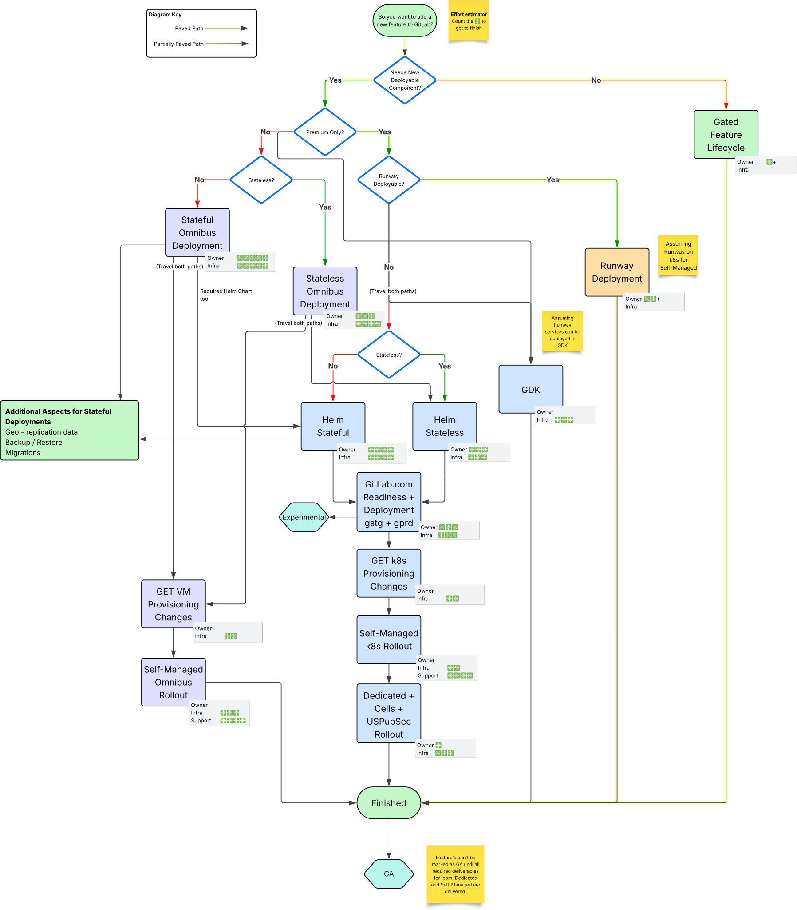
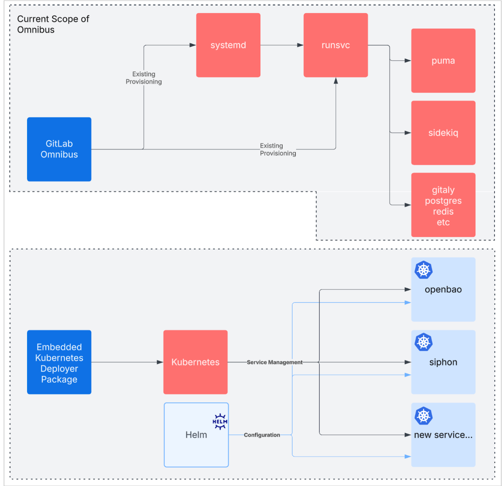

---
# This is the title of your design document. Keep it short, simple, and descriptive. A
# good title can help communicate what the design document is and should be considered
# as part of any review.
title: Self-Managed Basic and Advanced
status: proposed
creation-date: "2025-06-24"
authors: [ "@WarheadsSE" ]
coaches: [ "@andrewn" ]
dris: [ "@WarheadsSE", "@mbruemmer", "@mbursi", "@nolith" ]
owning-stage: "~devops::gitlab delivery"
participating-stages: []
# Hides this page in the left sidebar. Recommended so we don't pollute it.
toc_hide: true
---

<!--
Before you start:

- Copy this file to a sub-directory and call it `_index.md` for it to appear in
  the design documents list.
- Remove comment blocks for sections you've filled in.
  When your document ready for review, all of these comment blocks should be
  removed.

To get started with a document you can use this template to inform you about
what you may want to document in it at the beginning. This content will change
/ evolve as you move forward with the proposal.  You are not constrained by the
content in this template. If you have a good idea about what should be in your
document, you can ignore the template, but if you don't know yet what should
be in it, this template might be handy.

- **Fill out this file as best you can.** At minimum, you should fill in the
  "Summary", and "Motivation" sections.  These can be brief and may be a copy
  of issue or epic descriptions if the initiative is already on Product's
  roadmap.
- **Create a MR for this document.** Assign it to an Architecture Evolution
  Coach (i.e. a Principal+ engineer).
- **Merge early and iterate.** Avoid getting hung up on specific details and
  instead aim to get the goals of the document clarified and merged quickly.
  The best way to do this is to just start with the high-level sections and fill
  out details incrementally in subsequent MRs.

Just because a document is merged does not mean it is complete or approved.
Any document is a working document and subject to change at any time.

When editing documents, aim for tightly-scoped, single-topic MRs to keep
discussions focused. If you disagree with what is already in a document, open a
new MR with suggested changes.

If there are new details that belong in the document, edit the document. Once
a feature has become "implemented", major changes should get new blueprints.

The canonical place for the latest set of instructions (and the likely source
of this file) is
[content/handbook/engineering/architecture/design-documents/_template.md](https://gitlab.com/gitlab-com/content-sites/handbook/-/blob/main/content/handbook/engineering/architecture/design-documents/_template.md).

Document statuses you can use:

- "proposed"
- "accepted"
- "ongoing"
- "implemented"
- "postponed"
- "rejected"

-->

<!-- Design Documents often contain forward-looking statements -->
<!-- vale gitlab.FutureTense = NO -->



## Summary

<!--
This section is very important, because very often it is the only section that
will be read by team members. We sometimes call it an "Executive summary",
because executives usually don't have time to read entire documents like this.
Focus on writing this section in a way that anyone can understand what it says,
the audience here is everyone: executives, product managers, engineers, wider
community members.

A good summary is probably at least a paragraph in length.
-->

This proposal recommends segmenting our current Self-Managed deployment option into two distinct tiers: Self-Managed Basic (`SMB`) and Self-Managed Advanced (`SMA`),
and modifying the requirement for a GA features launch to include all deployment options in a single milestone to SaaS, Dedicated, and Self-Managed Advanced.
Launching new features on Self-Managed Basic would become optional.

The current approach to adding components for consumption by Self-Managed customers is hindering the rate at which we can deliver features to our customers.
This is made clear by the current and growing backlog of new components that are yet to be supported by our current Omnibus + Cloud Native GitLab architecture.
We must consider what methods are available to us today which provide us a means to accelerate and unplug the backlog of inbound components in service of feature delivery.
A strategic segmentation will enable us to deliver cutting-edge features to customers with modern infrastructure needs on SMA while maintaining support for current customers with traditional deployment requirements through SMB.

We do not aim to deprecate the Omnibus or Premium/Ultimate via Omnibus, but require cloud-native for future new, optional components of Premium/Ultimate.

This proposal describes implementing a form of [Option 2: Prioritize/favour Hybrid Kubernetes Going Forward](https://docs.google.com/document/d/1f8Ty_AE9IX2cawkyCLsEy7DkjD9zIgcifN7yQBgs2Uo/edit?tab=t.0#bookmark=id.cke52h57bu0i)
of the Cloud Native GitLab session from FY26 CTO Summit, while facilitating faster delivery through focused priority on cloud-native implementations of
supplemental enterprise feature requirements. It is focused on the [Omnibus-Adjacent Cluster](https://docs.google.com/document/d/1agZVZkbDrL8Zocp-PLiunQHFNWedEErUy_-fNEAeD2Y/edit?tab=t.0#heading=h.ro7ivridf2pb)
described in "Navigating a route towards cloud native".

_"Great Momentum requires Gradual Change"_

## Motivation

<!--
This section is for explicitly listing the motivation, goals and non-goals of
this document. Describe why the change is important, all the opportunities,
and the benefits to users.

The motivation section can optionally provide links to issues that demonstrate
interest in a document within the wider GitLab community. Links to
documentation for competing products and services is also encouraged in cases
where they demonstrate clear gaps in the functionality GitLab provides.

For concrete proposals we recommend laying out goals and non-goals explicitly,
but this section may be framed in terms of problem statements, challenges, or
opportunities. The latter may be a more suitable framework in cases where the
problem is not well-defined or design details not yet established.
-->

The current Self-Managed option attempts to serve all infrastructure designs under a single feature launch umbrella.
This creates significant engineering complexity as we try to deliver advanced features (for example: Security features as part of Ultimate) across vastly different infrastructure environments.
As a specific example, we have several features in the pipeline that will require ClickHouse being available, which is not available in Omnibus, and would be a complex component to implement via Omnibus.

Cloud-native deployments enable critical capabilities that traditional OS-level installations cannot efficiently support, or that we do not have the engineering bandwidth to deliver to all deployment methods at the expected quality within an appropriate span of time.
Additionally, our current Omnibus Reference Architectures employ a node-per-component strategy, dedicating separate nodes (or VMs) to each service—consul nodes for consul, pgbouncer nodes for pgbouncer, and so on.
In HA environments requiring a minimum of three nodes per component, this approach quickly escalates infrastructure requirements: even modest deployments can demand 20-30+ VMs, doubling with Geo DR.
As the number of components continues to grow, this architecture proves inefficient and costly, as many nodes remain largely idle with minimal workloads, while also complicating maintenance and expanding the security attack surface. Most critically, this static allocation model fails to scale dynamically with actual load patterns.
That scaling, or lack thereof, is a common focal point in customer conversations.

We can already demonstrate that cloud-native deployments enable customers to scale GitLab with significantly more efficiency.
To service customers of higher complexity and larger scale, we should look to focusing our release to SMA as cloud-native first.

### Goals

<!--
List the specific goals / opportunities of the document.

- What is it trying to achieve?
- How will we know that this has succeeded?
- What are other less tangible opportunities here?
-->

Provide a means to accelerate delivery of components and features, especially to cloud native capable Self-Managed users.
Do this, while not forcing excessive change or pressure upon our existing customer install base which demonstrably favors
some variation of Omnibus-based architecture on traditional infrastructure as a percentage of total paid and unpaid install base.

In particular, this aims to:

- **Accelerate Innovation** by facilitating the integration of supplemental components to the overall [GitLab architecture](https://docs.gitlab.com/development/architecture/#component-diagram) in a streamlined manner.
- Provide **Clear Expectations** through transparent differentiation between deployment methods.
- Increase **Engineering Efficiency** by reducing the complexity of maintaining compatibility across disparate environments.
- Improve the **Upgrade Path** by providing a clear path for customers seeking advanced capabilities.
- Ultimately, reduce the number of deployment configuration permutations which GitLab needs to support. Over time, encouraging new Premium/Ultimate installations in cloud native environments.

We aim to explicitly avoid:

- Deprecating Premium/Ultimate GitLab running on Omnibus. This product will remain for the foreseeable future. However, new optional SMA components, such as Data Insights Platform, ClickHouse Cloud, would not be supported in Omnibus, only as cloud native components.
- Forcibly converting traditional Omnibus into cloud native "under the hood". We would rather encourage consumers to expand their skillsets.
- Unexpectedly increase customer infrastructure costs and consumption. We must communicate these changes well.
- Alienate consumers of any kind, by forcing large architectural refactors upon them. We should rather show them the value of the shift to cloud-native.

### Non-Goals

<!--
Listing non-goals helps to focus discussion and make progress. This section is
optional.

- What is out of scope for this document?
-->

#### Orthogonal Topics

There are several topics that are related to, or intersect with those of this proposal.
We intend to keep those separate, as they are important but not directly impacted by or impactful to this proposal.

- Discussion of [air-gapped](https://en.wikipedia.org/wiki/Air_gap_(networking)) vs non-air-gapped environments.
- Omnibus GitLab meta-packaging initiatives.
- Per-component versioning, and tracking of align versions.
- Discussions about new Premium/Ultimate components as separate paid SKUs are out of scope for this proposal.

## Proposal

<!--
This is where we get down to the specifics of what the proposal actually is,
but keep it simple!  This should have enough detail that reviewers can
understand exactly what you're proposing, but should not include things like
API designs or implementation. The "Design Details" section below is for the
real nitty-gritty.

You might want to consider including the pros and cons of the proposed solution so that they can be
compared with the pros and cons of alternatives.
-->

The implementation of this segmentation has practical implications. We do not aim to enfoce
cloud native deployments in order for SMA to have value. In order to address this concern,
we must faciliate mixed environments, where the existing monolith provides services already
present, and can be attached to supplemental components deployed in Kubernetes. This would
serve as a bridge between SMB and SMA, such that a customer can expand their existing SMB into
an SMA capable environment by providing necessary platform access, and deploying the extended
feature components.

Segment the Self-Managed option into two distinct tiers:

|    | Self-Managed Basic (SMB) | Self-Managed Advanced (SMA) |
| :- | :---------------------- | :-------------------------- |
| Technology Base | Operating system packages | Containerized cloud native deployment architecture. |
| Target Customer | CE/EE Free; Premium and Ultimate with limited feature set | Free with technical skills for cloud native; Premium and Ultimate. |
| Target Environment | Traditional infrastructure (bare metal, VMs) | Containerized infrastructure with Kubernetes, IaaS cloud (such as GCP, AWS) or on-prem. Driven by Helm and possibly Operator in future. |
| Value Proposition | Core product capabilities with essential features, existing Ultimate features available. | Full access to all product capabilities, current and future, as well as significantly better scaling. |
| Feature Guarantee | New Ultimate features are not guaranteed. Required components may be unavailable in Omnibus. | All new Ultimate functionality guaranteed. |

It should be noted that no part of this proposal prevents features being added within existing components from being delivered to either tier.

Here is an outline of a potential workflow for new features, considering an assumption that Runway can operate on Kubernetes for Self-Managed:

{width=50%}

## Design and implementation details

<!--
This section should contain enough information that the specifics of your
change are understandable. This may include API specs (though not always
required) or even code snippets. If there's any ambiguity about HOW your
proposal will be implemented, this is the place to discuss them.

If you are not sure how many implementation details you should include in the
document, the rule of thumb here is to provide enough context for people to
understand the proposal. As you move forward with the implementation, you may
need to add more implementation details to the document, as those may become
valuable context for important technical decisions made along the way. A
document is also a register of such technical decisions. If a technical
decision requires additional context before it can be made, you probably should
document this context in a document. If it is a small technical decision that
can be made in a merge request by an author and a maintainer, you probably do
not need to document it here. The impact a technical decision will have is
another helpful information - if a technical decision is very impactful,
documenting it, along with associated implementation details, is advisable.

If it's helpful to include workflow diagrams or any other related images.
Diagrams authored in GitLab flavored markdown are preferred. In cases where
that is not feasible, images should be placed under `images/` in the same
directory as the `index.md` for the proposal.
-->

### Omnibus-Adjacent Kubernetes (OAK)

We explored several paths after the discussions of the FY26 CTO Summit, within [Navigating a route towards cloud native](https://docs.google.com/document/d/1agZVZkbDrL8Zocp-PLiunQHFNWedEErUy_-fNEAeD2Y/) (future, `NRTCN`).
That exploration facilitated our poposal here, to present a distinct plan to expect a Kubernetes cluster adjacent to the existing Omnibus functionality. We believe that this pattern can form the basis of
the Self-Managed Advanced for customers not yet operating their instances with cloud native patterns.

Essentially, existing functionality and core features will be easily available to these customers in their current infrastructure design.
As they seek to consume new Ultimate features, they will implement and familiarize themselves with cloud native infrastructure as they bring Kubernetes into play for the auxilliary services of GitLab.
Over time, they will see the benefits to cloud native infrastructure and begin to transition away from the Omnibus entirely.

For those customers who are already operating with cloud native patterns, but are not operating their GitLab instance(s) within them, this will encourage them to transition their GitLab instances to cloud native.

OAK can be effectivel visualized as below:

Omnibus's existing scope grows in an an extremely limited fashion, while new services and functionality are added primarily via Kubernetes deployments.

In the future, we can investigating moving High Availability, Geo, and Zero Downtime deployments from Omnibus to cloud-native methods, with the intent
to simplify the Omnibus' feature set to the SMB ideal of smaller, less complex instances.
This is in alignmenment with [Project Flow](https://docs.google.com/document/d/10f7i-y9aJKo1Lo1IW106ov-OuUXAywNGQg7uPYGOP44/edit?tab=t.0#heading=h.rci2kr8welcp),
aiming to drive the Reference Architectures to a simplified, cloud-native first future.

An important note: Features delivered to SMA will often require configuration of clients within Omnibus.
Implementation of that configuration will still occur, as that facilitates the use of the feature, not the operation of the feature itself.

### Interconnection of mixed environments

A consequence of implementing OAK will be the need to futher ensure inter-component communication is easy to configure, and properly secured.

Current implementaions include support inter-component TLS, though a significant portion of this manual.
This is relatively easy, when a minimal number of components to live outside of Kubernetes.
It would be valuable to investigate appropriate auto-configuration of TLS via an mTLS coordination service.

Configuring the many components of GitLab to speak to each other is a very manual process today, that is facilitated greatly by the GitLab Helm chart and GitLab Environment Toolkit.
With the implementation of SMA, there are likely to be many services within the Omnibus which need to reach into the OAK.
We know that services deployed into OAK will likely need to reach services on the Omnibus.
Not all of these services from either mechanism are naturally exposed via an Ingress model, and some may not be HTTPS/gRPC.
We should look to provide a means to configure through service discovery, with both mechanisms implementing the integration of this feature.

There are several other works ongoing at GitLab, such as Cells and "CYCP", which are likely to involve mTLS and service discovery.
Perhaps this work would be best left to those projects, and observe closely by this proposal.

### Consistency across GitLab produced Helm charts

The Helm ecosystem is flexible, but rife with disparities. We should settle on, and converge towards a set of patterns to be expected across all Helm charts produced and maintained by GitLab.
We must implement guidelines and best practices across all our works. These should be informed by maintainability, flexibility, and customer experience.

Many of these the immediate concerns can be implemented through [a set of standardized tooling for Helm charts](https://gitlab.com/gitlab-com/gl-infra/mstaff/-/issues/460), and implementaiton of automation through CI components. We will also need to lay out a set of style guides and patterns for components to follow, with the existing GitLab Helm chart
[development documentation](https://docs.gitlab.com/charts/development/) being a reasonable start.

### Considerations of GET and Dedicated

[GitLab Dedicated](https://docs.gitlab.com/subscriptions/gitlab_dedicated/) operates upon GET as a stepping stone, deploying cloud-native hybrid environments.
These Dedicated environments can quickly implement supplemental functionality through the use of cloud-native components, provided that the support for them has been integrated into GET.
Generally speaking, Dedicated can enabled and scale components in alignment with customer usage. It is important to the Dedicated use case that cloud-native is a distinct focus of product delivery.

[GitLab Dedicated for Government]9https://docs.gitlab.com/subscriptions/gitlab_dedicated_for_government/) takes this one step further,
by implementing controls and configuration appropriate to operating within our FedRAMP certification. Some components may not meet the
criteria for operating within this environment upon their initial inclusion as a part of a GitLab release.

### Definition of supported Kuberentes versions

We will need to define a company-wide description of supported versions on which the components of GitLab are expected to operate well.
We should be careful to note the difference between support by components and the support of operating the application itself.
In order to examine what that timeline should be, we must first look to the customer experience of Kubernetes as a platform.

Kubernetes releases happen [3 times per year](https://kubernetes.io/releases/release/#the-release-cycle), and offically recieve [1 year of patch support](https://kubernetes.io/releases/).

Major cloud providers often support K8s versions for another year beyond the official release of the Kubernetes project itself:

- GKE [describes release channels](https://cloud.google.com/kubernetes-engine/docs/release-schedule) for GKE, including the "Extended" channel which adds approximately 1 year.
- AWS [delineates](https://docs.aws.amazon.com/eks/latest/userguide/kubernetes-versions.html) "standard support" and "extended support", which adds 1 year.
- Azure [specifically describes](https://learn.microsoft.com/en-us/azure/aks/supported-kubernetes-versions) their [Long Term Support](https://learn.microsoft.com/en-us/azure/aks/supported-kubernetes-versions?tabs=azure-cli#long-term-support-lts) https://learn.microsoft.com/en-us/azure/aks/supported-kubernetes-versions) as adding 1 year.

Helm v3 [defines `n-3`](https://helm.sh/docs/topics/version_skew/) as their supported Kubernetes versions.

The current tooling to deploy cloud-native GitLab, via Helm through various means, [prefers the use of Helm v3.17](https://docs.gitlab.com/charts/installation/tools/#helm).
This indicates support for Kubernetes `1.29` through `1.32`, though we know that some customers are operating on older versions on Kubernetes successfully.
This indicates 1-2 years of Kubernetes releases are currently to be supported, in some degree.

GitLab components such as GitLab Agent for Kubernetes ("KAS") clearly define [their supported versions](https://docs.gitlab.com/user/clusters/agent/#supported-kubernetes-versions-for-gitlab-features)
as aligned with the upstream Kubernetes release cycle, though slightly behind for the sake of testing.

The above points indicate that our customers may expect GitLab to function on a Kubernetes version for _up to_ 2 years, but to function against any Kubernetes version for just over 1 year.

### Upskill needs of the Support and Customer Success Organiztions

Our Support Engineers, CSM teams, and possibly thousands of third-party consultancies in the wider GitLab ecosystem, have intricate knowledge using Omnibus.
We know that we and our partners need to be able to provide the same level of support that our customers have come to expect when using the Omnibus GitLab.
We, the whole of GitLab, will need to ensure that our documentation is expanded to include the appropriate information required for installing, operating,
debugging and supporting all components as cloud-native. We must build and disseminate new runbooks and guides for existing components, and ensure that all
new features and components meet this need as a part of their readiness work.

The expansion will be necessary to develop in parallel to the engineering work, but _must_ be executed on for product success.

## Alternative Solutions

<!--
It might be a good idea to include a list of alternative solutions or paths considered, although it is not required. Include pros and cons for
each alternative solution/path.

"Do nothing" and its pros and cons could be included in the list too.
-->

### Strangler Fig

In FY26Q1's CTO Summit, we considered the possibility of slowly converting the Omnibus into a
means of deploying all items within Kubernetes. This could have been accomplished in a number
of possible ways. We looked specifically into a [strangler fig pattern](https://en.wikipedia.org/wiki/Strangler_fig_pattern)
by way of packaging a micro-distribution of Kubernetes into the Omnibus, then slowly switching
all components to be deployed into that cluster. While this was a worthwhile exercise, we acknowledge
that the impact on complexity, resource requirements, and supplemental customer experience
requirements give us pause. Implementing a strangler fig pattern into the Omnibus GitLab in this
way would certianly specifically cause several of the problems that this proposal aims to prevent.

Instead of pursuing this route, we aim to use a similar concept to _encourage_ customers to
migrate their architecture over time, providing incentive for building or obtaining experience
in operating Cloud Native environments for GitLab to operate within. That can be done through the use
of Omnibus-Adjacent Kubernetes cluster, as a goal of this proposal.

### Change nothing

Continuing as-is with our current behaviors and the challenges they present, would leave us
open to stagnation of a growing backlog. While we have several ongoing efforts to streamline the means
to include functionality into the Omnibus GitLab and the Cloud Native GitLab methods, there
remains the simple fact that including new features via Kubernetes deployment methodologies
is simpler for our wider organization. Making Cloud Native the first priority does not negate the
concerns of stateful data services and requirements that we face today. We must remain
vigilant of the customer SRE experience and do our best to ensure data security.
