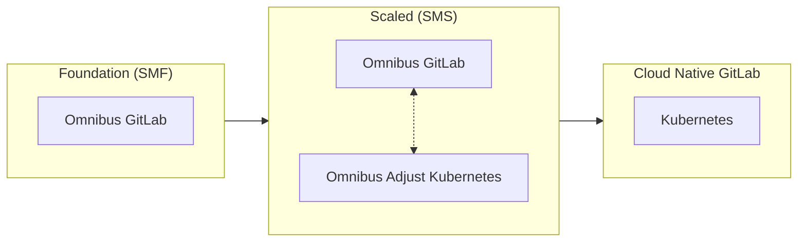
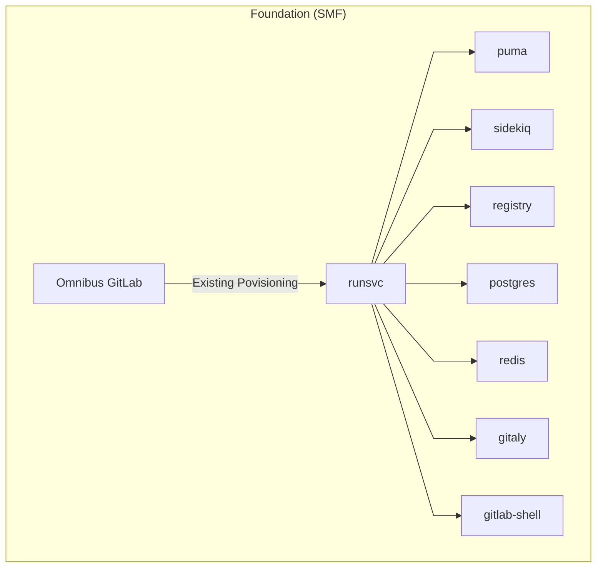
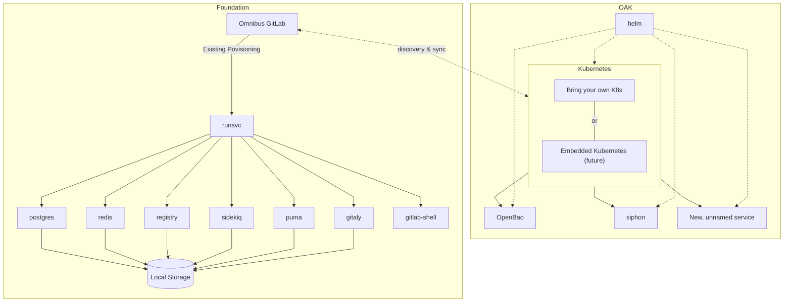
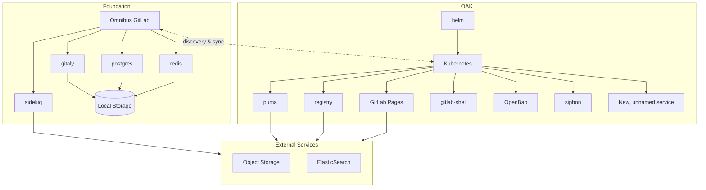
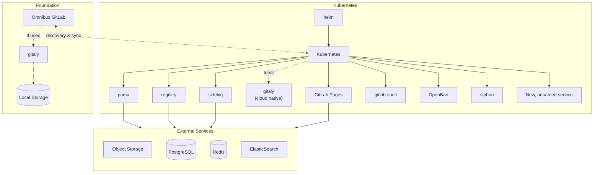

<!--
Document statuses you can use:

- "proposed"
- "accepted"
- "ongoing"
- "implemented"
- "postponed"
- "rejected"

-->

<!-- Design Documents often contain forward-looking statements -->
<!-- vale gitlab.FutureTense = NO -->



## Summary

This proposal recommends segmenting our current Self-Managed deployment offerings into two distinct tiers: Self-Managed Foundation (`SMF`) and Self-Managed Scaled (`SMS`),
and modifying the requirement for a General Availabitiy features launch to include all deployment options in a single milestone to SaaS, Dedicated, and Self-Managed Scaled.
Launching new features on Self-Managed Foundation would become conditional, as SMF would not receive further service components a feature might require.

Any future path for Self-Managed must retain a simple initial adoption, which has built our customer base so successfully over time.
[Analysis of Usage Ping data](https://docs.google.com/presentation/d/1iIDrMYXrw48A6Kj3PK9AeZ6x3YKYmes4mu2jXm5H8us/edit?slide=id.g35e93cc924b_0_58#slide=id.g35e93cc924b_0_58)
clearly shows GitLab's customer base has grown very accustomed to the reliability and consistency of the Omnibus experience, which has earned a reputation of reliable simplicity.
The Omnibus GitLab has succeeded in its mission, however that massive success has directly delivered us a challenge.

The customer, paid or unpaid, experience of simplistic but efficacious instances is the origin of our current juxtaposition: balancing reliable simplicity against the architectural complexity required to deliver our current roadmap.

> _"Great Momentum requires Gradual Change"_

The current approach to adding components for consumption by Self-Managed customers is hindering the rate at which we can deliver features to our customers.
This is made clear by the current backlog of components that are yet to be supported by our current Omnibus + Cloud Native GitLab architecture.
While we do not expect our components to expand indefinitely, the backlog is highly impacted by the complexity of the services which need to be configured, and the highly manual nature of configurations and inter-connections.
We must consider what methods are available to us today which provide us a means to accelerate and unplug the backlog of inbound components in service of feature delivery.
A strategic segmentation will enable us to deliver cutting-edge features to customers with modern infrastructure on SMS, while maintaining support for current customers with traditional deployment requirements through SMF.

Throughout this proposal, we describe implementing a form of [Option 2: Prioritize/favour Hybrid Kubernetes Going Forward](https://docs.google.com/document/d/1f8Ty_AE9IX2cawkyCLsEy7DkjD9zIgcifN7yQBgs2Uo/edit?tab=t.0#bookmark=id.cke52h57bu0i)
of the Cloud Native GitLab session from FY26 CTO Summit, while facilitating faster delivery through focused priority on cloud-native implementations of
supplemental enterprise feature requirements. It is focused on the [Omnibus-Adjacent Cluster](https://docs.google.com/document/d/1agZVZkbDrL8Zocp-PLiunQHFNWedEErUy_-fNEAeD2Y/edit?tab=t.0#heading=h.ro7ivridf2pb)
described in "Navigating a route towards cloud native".

The Omnibus GitLab package will not be abandoned, but we will require cloud-native implementation for future optional components of Premium/Ultimate.

## Motivation

The current Self-Managed option has been built and perfected to lower the entry point of operating GitLab. All optimisations over the past 10 years have been done in order to serve all infrastructure designs under a single feature launch umbrella.
This creates significant engineering complexity as we try to deliver advanced features (for example: Security features as part of Ultimate) across vastly different infrastructure environments.
As a specific example, we have several features in the pipeline that will require ClickHouse being available. ClickHouse is not implemented within the Omnibus today due to inherent complexities of scale.
Our customers love the simplicity of Omnibus, but this has started to impede our ability to drive change quickly and cohesively. All this in an effort to integrate and manage everything in service to our customers' experience.

Cloud-native deployments enable critical capabilities we desire: auto-scaling, self-healing, and efficient resource sharing. These are not efficiently supported by traditional OS-level installations. We do not have the engineering bandwidth to deliver to all deployment methods, at the expected quality, within an appropriate span of time.

Traditional Omnibus-based architectures face fundamental scalability challenges, requiring dedicated system resources and separate process management for each component.
Unlike modern containerized workloads that efficiently share resources and scale dynamically, the Linux package model forces static resource allocation and cannot adapt well to load patterns.
We saw these challenges with the implementation of GitLab.com, and we have seen it again across the implementation of the Reference Architectures.
Basing a scaled instance upon the Omnibus, we are forced to make use of a node-per-component strategy with dedicated nodes for each core service.
Providing High Availability for components further multiplies the resource consumption, resulting in even modest deployments demanding over 20 VMs. Enabling Geo for Disaster Recovery doubles this, with a full mirror infrastructure for each supplemental region.
As the number of components continues to grow, the Omnibus-based approach further proves to be unsustainable and costly, consuming excess resources.
These limitations and efficiency concerns have become a common focal point in customer conversations.

GitLab.com has already demonstrated that cloud-native deployments enable scaling GitLab with significantly more efficiency.
Our customers that are making use of the Reference Architectures in the Cloud Native Hybrid forms have experienced this first-hand.
To service our customers of higher complexity and larger scale, we should focus our Premium/Ultimate feature releases to SMS, which is cloud-native first.
To service our customers who continue to thrive with the Omnibus, we must continue to support them through SMF, while also providing evidence of the value-add SMS brings.
Through SMS, we incentivise a conversion of all customers to fully cloud native architectures.

### Goals

Provide a means to accelerate delivery of components and features, especially to cloud native capable Self-Managed users.
Do this, while not forcing excessive change or pressure upon our existing customer install base which demonstrably favors
some variation of Omnibus-based architecture on traditional infrastructure, as a percentage of total paid and unpaid install base.

In particular, this aims to:

- **Accelerate Innovation** by facilitating the integration of supplemental components to the overall [GitLab architecture](https://docs.gitlab.com/development/architecture/#component-diagram) in a streamlined manner.
- Provide **Clear Expectations** through transparent differentiation between deployment methods.
- Increase **Engineering Efficiency** by reducing the complexity of maintaining compatibility across disparate environments.
- Improve the **Upgrade Path** by providing a clear path for customers seeking advanced capabilities.
- Ultimately, reduce the number of deployment configuration permutations which GitLab needs to support. Over time, encouraging new Premium/Ultimate installations in cloud native environments.

We aim to explicitly avoid:

- Deprecating Premium/Ultimate GitLab running on Omnibus. This product will remain for the foreseeable future, and the only reason to revisit the existing functionality is to ensure that it can scale effectively. However, new optional SMS components, such as Data Insights Platform and ClickHouse, would not be supported in Omnibus, only as cloud native components.
- Forcibly converting traditional Omnibus into cloud native "under the hood". We would rather encourage consumers to expand their skillsets by incentivising internal transformation to cloud-native.
- Unexpectedly increase customer infrastructure costs and consumption. We must communicate these changes well.
- Alienate consumers of any kind, by forcing large architectural refactors upon them. We should rather show them the value of the shift to cloud-native instead.

### Non-Goals

#### Orthogonal Topics

There are several topics that are related to, or intersect with those of this proposal.
We intend to keep those separate, as they are important but not directly impacted by or impactful to this proposal.

- Discussion of [air-gapped](https://en.wikipedia.org/wiki/Air_gap_(networking)) vs non-air-gapped environments.
- Omnibus GitLab meta-packaging initiatives.
- Per-component versioning, and tracking of aligned versions.
- Discussions about new Premium/Ultimate components as separate paid SKUs are out of scope for this proposal.

## Proposal

The implementation of this segmentation has practical implications. We do not aim to enfoce
cloud native deployments in order for SMS to have value. In order to address this concern,
we must faciliate mixed environments, where the existing monolith provides services already
present and can be attached to supplemental components deployed in Kubernetes. This would
serve as a bridge between SMF and SMS, such that a customer can expand their existing SMF into
an SMS capable environment by providing necessary platform access, and deploying the extended
feature components.

Segment the Self-Managed option into two distinct tiers:

|    | Self-Managed Foundation (SMF) | Self-Managed Scaled (SMS) |
| :- | :---------------------- | :-------------------------- |
| Technology Base | Operating system packages | Containerized cloud native deployment architecture. |
| Target Customer | CE/EE Free; Foundational feature set | Free with technical skills for cloud native; Premium and Ultimate. |
| Target Environment | Traditional infrastructure (bare metal, VMs) | Containerized infrastructure with Kubernetes, IaaS cloud (such as GCP, AWS) or on-prem. Driven by Helm and possibly Operator in future. |
| Value Proposition | Foundational product capabilities with essential features, existing Ultimate features available. | Full access to all product capabilities, current and future, as well as significantly better scaling. |
| Feature Guarantee | New Ultimate features are not guaranteed. Components required for new features may be unavailable in Omnibus. | All new Ultimate functionality guaranteed. |

It should be noted that no part of this proposal prevents features being added within existing components from being delivered to either tier.
If a new feature requires no changes or additions to components, such as some combination of Rails, frontend, and Sidekiq jobs, there will be no blocking these rollouts.
If a new component is required to be deployed in GitLab Core, then it will still be required to be included in Omnibus packaging, GET and Cloud Native GitLab.

Here is an outline of a potential workflow for new features, considering an assumption that Runway can operate on Kubernetes for Self-Managed.
Until that is possible, a similar flow will be described around the choices of "Premium only?" and "Stateless?", as applicable to SMF/SMS.

## Design and implementation details

We explored several paths after the discussions of the FY26 CTO Summit, within [Navigating a route towards cloud native](https://docs.google.com/document/d/1agZVZkbDrL8Zocp-PLiunQHFNWedEErUy_-fNEAeD2Y/) (future, `NRTCN`).
[That exploration](https://docs.google.com/document/d/1a_3GAdXnCB0l8f6OR-bSft6BPZ5pWuCyw76ShsKpgfM/edit?tab=t.0)
facilitated this proposal, presenting a plan to expect a single tenant Kubernetes cluster adjacent to an existing Omnibus.
We believe that this pattern can form the basis of the Self-Managed Scaled for customers not yet operating their instances with cloud native patterns.

Essentially, existing functionality and core features will be easily available to these customers in their current infrastructure design.
As they seek to consume new Premium and Ultimate features, they will implement and familiarize themselves with cloud native infrastructure as they bring Kubernetes into play for the auxiliary services of GitLab.
Over time, they will see the benefits to cloud native infrastructure and begin to transition away from the Omnibus entirely.

For those customers who are already operating with cloud native patterns, but are not operating their GitLab instance(s) within them, this will encourage them to transition their GitLab instances to cloud native.

In practical summary we use SMF and SMS to transition customers to fully cloud-native over time, incentivizing the transition while simplifying our engineering and support experience.

### Omnibus (SMF)

Omnibus's existing scope should grow in an an extremely limited fashion, while new services and functionality are added primarily via Kubernetes deployments.

In the future, we will investigate moving advanced set ups such as High Availability, Geo, and Zero Downtime deployments from Omnibus to cloud-native methods, with the intent
to significantly simplify the Omnibus' feature set to the SMF ideal of smaller, less complex instances.
This is in alignment with [Project Flow](https://docs.google.com/document/d/10f7i-y9aJKo1Lo1IW106ov-OuUXAywNGQg7uPYGOP44/edit?tab=t.0#heading=h.rci2kr8welcp),
aiming to drive the Reference Architectures to a simplified, cloud-native first future.

An important note: Features delivered to SMS will often require configuration of clients within Omnibus.
Implementation of that configuration will still occur, as that facilitates the use of the feature, not the operation of the feature itself.

### Omnibus-Adjacent Kubernetes (OAK)

Omnibus-Adjacent Kubernetes (OAK) is a _single tenant, single application_ Kubernetes cluster, intended for the exclusive use by the GitLab intance.
We strongly recommend the separation of concerns, as GitLab is often a tier-0 service used to manage and deploy workloads to Kubernetes environments.
By separating GitLab from clusters it may control, we prevent circular dependencies and possible catastrophic complications to customers' production environments.

This Kubernetes cluster could be facilitated by an embedded distribution such as k3s or k0s, or a customer provided cluster from any origin.

If GitLab chooses to implement a meta-package capable of deploying an embedded distribution of Kubernetes, we need to take great care in considering such a choice.
By bundling Kubernetes, our Build and Self Managed team will effectively become Kubernetes distributors.
This creates ongoing maintenance responsibilities including testing Kubernetes upgrades, applying security patches, and ensuring compatibility across different deployment environments.
Meeting these requirements will demand staff with specialized Kubernetes expertise.
Further, the primary candidates for embedded Kubernetes do not provide any FIPS certifications, which would be of significant concern.

### Illustrated Stages of Transition to Cloud Native, via Segmentation

The stages presented below are based upon our current application components, and those known to be on the roadmap as of today.

#### Self-Managed Foundation

The simplest form, as experienced today, is Foundation based on Omnibus.

#### Early Self-Managed Scaled (SMS)

In the earliest stages and simplest forms of Scaled, all foundational services are operated within the Omnibus
while all supplemental services are operated within the OAK.
All inbound, web-based services come through Foundation _exclusively_ and are directed into OAK.

#### Transitioning to Cloud Native GitLab

Transitional phase where most client-accessible services have been moved into the OAK.
Disk based storage has been transitioned to object storage, as necessitated.
We move all inbound, web-based services to OAK _exclusively_.
Demonstrated here is keeping Sidekiq, a known noisy-neighbor workload within Foundation until customers understand their load well.

#### Cloud Native Scalability

The final stage is the Cloud Native Hybrid Reference Architecture deployments of today.
All state is on the Omnibus and/or external provider, and all stateless services are operated in Kubernetes.
Future: Gitaly is also within Kubernetes, pending GA of Gitaly on Kubernetes.

### Interconnection of Mixed Environments

A consequence of implementing OAK will be the need to further ensure inter-component communication is easy to configure, and properly secured.
Care must be taken in the architecture and design to facilitate reducing the load of both of these concerns.

Configuring the many components of GitLab to speak to each other is a very manual process today which is facilitated greatly for Omnibus based architecture by the GitLab Environment Toolkit (GET), and highly simplified by the Kubernetes platform on which Cloud Native GitLab operates.
We must solve these problems at a lower level than GET, knowing that not all customer instances make use of GET and many customers *will not* make use of GET for various reasons.

When all components are in Kubernetes, we simply configure all endpoints to consume the Service object names and rely upon DNS within the Kubernetes cluster to "solve" this problem for us.
Securing the connections between components remains a complex task today, even within a Kubernetes cluster.

The combination of concerns could be addressed by a service mesh and proxy orchestration tool, capable of automated mTLS.
We have many customers who have implemented these, and several that can example their use with our Cloud Native GitLab today.
One such option, which customers sought explicit support for was [Istio](https://istio.io/latest/docs/).
It can [blend the two deployment types](https://istio.io/latest/docs/ops/deployment/vm-architecture/), facilitate the interconnection, and secure the communication as described within the projects documentation.

There are several other works ongoing at GitLab, such as Cells and "CYCP", which are likely to involve mTLS and service discovery.
This work may be best left to those projects, and observed closely by this proposal.

#### Service Endpoint Configuration

GitLab's architecture is often described in a [greatly simplified](https://docs.gitlab.com/development/architecture/#simplified-component-overview) manner.
In reality, the size and complexity of our total application stack is [large](https://docs.gitlab.com/development/architecture/#component-diagram).
A common complexity across GitLab instances is the need to configure endpoints across scaled, distributed architectures.
This is quite simple on a single node Omnibus, where all services could talk over localhost or even UNIX sockets.
The complexity of the interconnections grows with the size of the instance, complicating the configuration.
GET handles a signficant on behalf of consumers, masking this complexity through automation.

We can greatly simplify the complexity if we implemented a service discovery mechanism for all components of GitLab.
The approach we take to implementing such mechanism should intend to support both unintelligent clients who are only informed via DNS,
as well as those components capable of dynamic reconfiguration.
Any such mechanism should not become a mandatory implementation item, without careful evaluation of impact on performance and maintenance complexity.

#### Securing Communications

Current implementations include support inter-component TLS, though a significant portion of this manual.
This is [relatively easy](https://docs.gitlab.com/charts/advanced/internal-tls/) when a minimal number of components live
outside of Kubernetes, but it does still require manual action.
It would be valuable to investigate appropriate auto-configuration of TLS via an mTLS coordination service, but this
should not be considered a blocking item, due to available existing documentation.
Any option which is investigated must be evaluated by our security teams, and for usability within FIPS and FedRAMP environments.

### Consistency Across GitLab Produced Helm Charts

The Helm ecosystem is flexible, but rife with disparities. We should settle on, and converge towards a set of patterns to be expected across all Helm charts produced and maintained by GitLab.
We must implement guidelines and best practices across all our works.
These should be informed by maintainability, flexibility, and customer experience.

Many of these immediate concerns can be implemented through [a set of standardized tooling for Helm charts](https://gitlab.com/gitlab-com/gl-infra/mstaff/-/issues/460), and implementaiton of automation through CI components.
We will also need to lay out a set of style guides and patterns for components to follow, with the existing GitLab Helm chart
[development documentation](https://docs.gitlab.com/charts/development/) being a reasonable start.

### Considerations of GET and Dedicated

[GitLab Dedicated](https://docs.gitlab.com/subscriptions/gitlab_dedicated/) operates upon GET as a stepping stone, deploying cloud-native hybrid environments.
These Dedicated environments can quickly implement supplemental functionality through the use of cloud-native components, provided that the support for them has been integrated into GET.
Generally speaking, Dedicated can enabled and scale components in alignment with customer usage. It is important to the Dedicated use case that cloud-native is a distinct focus of product delivery.

[GitLab Dedicated for Government](https://docs.gitlab.com/subscriptions/gitlab_dedicated_for_government/) takes this one step further,
by implementing controls and configuration appropriate to operating within our FedRAMP certification.
Some components may not meet the criteria for operating within this environment upon their initial inclusion as a part of a GitLab release.

### Definition of Supported Kubernetes Versions

We will need to define a company-wide description of supported versions on which the components of GitLab are expected to operate well.
We should be careful to note the difference between support by components and the support of operating the application itself.
In order to examine what that timeline should be, we must first look to the customer experience of Kubernetes as a platform.

Kubernetes releases happen [3 times per year](https://kubernetes.io/releases/release/#the-release-cycle), and offically receive [1 year of patch support](https://kubernetes.io/releases/).

Major cloud providers often support K8s versions for another year beyond the official release of the Kubernetes project itself:

- GKE [describes release channels](https://cloud.google.com/kubernetes-engine/docs/release-schedule) for GKE, including the "Extended" channel which adds approximately 1 year.
- AWS [delineates](https://docs.aws.amazon.com/eks/latest/userguide/kubernetes-versions.html) "standard support" and "extended support", which adds 1 year.
- Azure [specifically describes](https://learn.microsoft.com/en-us/azure/aks/supported-kubernetes-versions) their [Long Term Support](https://learn.microsoft.com/en-us/azure/aks/supported-kubernetes-versions?tabs=azure-cli#long-term-support-lts) https://learn.microsoft.com/en-us/azure/aks/supported-kubernetes-versions) as adding 1 year.

Helm v3 [defines `n-3`](https://helm.sh/docs/topics/version_skew/) as their supported Kubernetes versions.

The current tooling to deploy cloud-native GitLab, via Helm through various means, [prefers the use of Helm v3.17](https://docs.gitlab.com/charts/installation/tools/#helm).
This indicates support for Kubernetes `1.29` through `1.32`, though we know that some customers are operating on older versions on Kubernetes successfully.
This indicates 1-2 years of Kubernetes releases are currently to be supported, in some degree.

GitLab components such as GitLab Agent for Kubernetes ("KAS") clearly define [their supported versions](https://docs.gitlab.com/user/clusters/agent/#supported-kubernetes-versions-for-gitlab-features)
as aligned with the upstream Kubernetes release cycle, though slightly behind for the sake of testing.

The above points indicate that our customers may expect GitLab to function on a Kubernetes version for _up to_ 2 years, but to function against any Kubernetes version for just over 1 year.

### Upskill needs of the Support and Customer Success Organizations

Our Support Engineers, CSM teams, and possibly thousands of third-party consultancies in the wider GitLab ecosystem, have intricate knowledge using Omnibus.
We know that we and our partners need to be able to provide the same level of support that our customers have come to expect when using the Omnibus GitLab.
We, the whole of GitLab, will need to ensure that our documentation is expanded to include the appropriate information required for installing, operating,
debugging and supporting all components as cloud-native. We must build and disseminate new runbooks and guides for existing components, and ensure that all
new features and components meet this need as a part of their readiness work.

The expansion will be necessary to develop in parallel to the engineering work, but _must_ be executed on for product success.

## Alternative Solutions

### Strangler Fig

In FY26Q1's CTO Summit, we considered the possibility of slowly converting the Omnibus into a
means of deploying all items within Kubernetes. This could have been accomplished in a number
of possible ways. We looked specifically into a [strangler fig pattern](https://en.wikipedia.org/wiki/Strangler_fig_pattern)
by way of packaging a micro-distribution of Kubernetes into the Omnibus, then slowly switching
all components to be deployed into that cluster. While this was a worthwhile exercise, we acknowledge
that the impact on complexity, resource requirements, and supplemental customer experience
requirements give us pause. Implementing a strangler fig pattern into the Omnibus GitLab in this
way would certainly specifically cause several of the problems that this proposal aims to prevent.

Instead of pursuing this route, we aim to use a similar concept to _encourage_ customers to
migrate their architecture over time, providing incentive for building or obtaining experience
in operating Cloud Native environments for GitLab to operate within. That can be done through the use
of Omnibus-Adjacent Kubernetes cluster, as a goal of this proposal.

> TODO: Expand with details and concerns from investigation.

### Change nothing

Continuing as-is with our current behaviors and the challenges they present, would leave us
open to stagnation of a growing backlog. While we have several ongoing efforts to streamline the means
to include functionality into the Omnibus GitLab and the Cloud Native GitLab methods, there
remains the simple fact that including new features via Kubernetes deployment methodologies
is simpler for our wider organization. Making Cloud Native the first priority does not negate the
concerns of stateful data services and requirements that we face today. We must remain
vigilant of the customer SRE experience and do our best to ensure data security.
