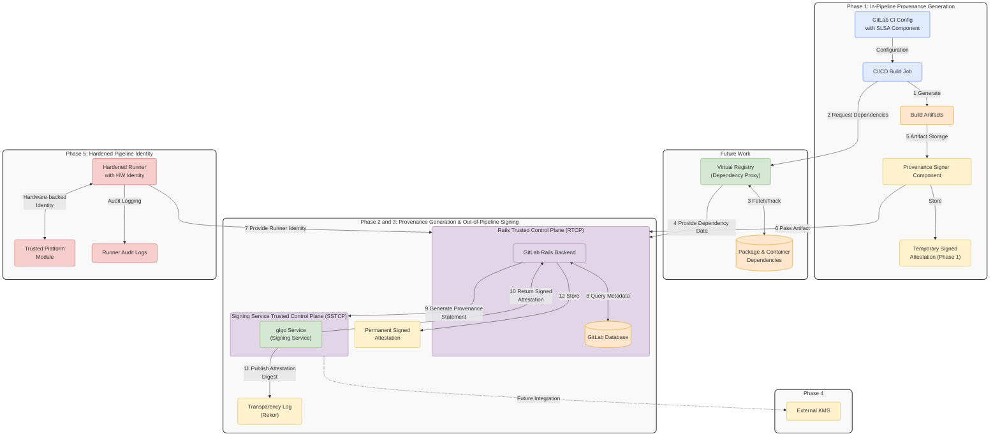



## Summary

This document outlines the technical vision, principles, and key architectural decisions for implementing SLSA Level 3 compliance within GitLab CI/CD pipelines. The solution will provide a reusable, modular, and secure way to generate, sign, and verify provenance for artifacts while hardening pipeline identity and build infrastructure.

## Proposal

We propose a phased implementation of SLSA Level 3 compliance across GitLab CI/CD pipelines using modular and reusable components. Each phase addresses a critical step:

1. In-Pipeline Provenance Generation and Verification using Sigstore (Phase 1): Generate and verify provenance attestation within the pipeline.
1. Generate Provenance Statement in Control Plane (Phase 2): Shift provenance generation from Runner to GitLab Rails backend to enhance trust.
1. Sign Provenance Statement in Control Plane (Phase 3): Move signing operations to dedicated service for better security.
1. KMS Integration for Out-of-Pipeline Signing (Phase 4): Enable external, KMS-based artifact signing for enhanced security and compliance.
1. Hardening Pipeline Identity (Phase 5): Strengthen runner identity and build trust into the infrastructure.

This phased approach ensures an MVP can be delivered early, with incremental security and compliance enhancements added over time.

## Goals

1. Provide modular and reusable GitLab CI components for generating and verifying SLSA provenance attestations.
1. Collect detailed build metadata for supported ecosystems (e.g., containers, Go, Maven).
1. Embed GitLab-specific platform data (e.g., pipeline variables, commit IDs) into provenance for traceability.
1. Support out-of-pipeline signing via secure KMS or HSM, isolating signing keys from build environments.
1. Strengthen runner identity to provide trustworthy attestation of build provenance.
1. Align with SLSA Level 3 compliance requirements while minimizing disruption to existing workflows.
1. Ensure security, scalability, and ease of adoption across GitLab environments.

## Non-Goals

1. Achieving SLSA Level 4 compliance, which requires isolated and verifiable builds (future consideration).
1. Supporting all possible programming ecosystems or artifact types in Phase 1–5 (focus on key ecosystems first).
1. Replacing GitLab’s existing artifact storage and distribution mechanisms.
1. Building a fully integrated GitLab-native provenance signing mechanism (external tools like Sigstore will be used).

## Terminology/Glossary

1. SLSA: Supply-chain Levels for Software Artifacts, a framework for improving supply chain security.
1. Provenance predicate: Metadata that describes how an artifact was built, including the source code, dependencies, and environment.
1. Provenance statement: Document that binds a provenance predicate to a software artifact.
1. Provenance attestation: Envelope that combines a provenance statement with a signature.
1. Sigstore: An open-source tool for signing, verifying, and storing software artifacts securely (e.g., cosign and gitsign).
1. OIDC Token: Short-lived, identity-based tokens issued by GitLab CI for secure signing.
1. Runner: A build agent that executes GitLab CI/CD pipeline jobs.
1. KMS: Key Management Service, an external system to securely manage cryptographic keys.
1. HSM: Hardware Security Module, hardware-based systems for secure key storage and signing.
1. VSA: Verification Summary Attestation, an attestation that an artifact has been verified to meet certain requirements.
1. Rails Trusted Control Plane (RTCP): The GitLab Rails backend that provides a trusted environment for security-critical operations, separate from the build environment.
1. Signing Service Trusted Control Plane (SSTCP): A dedicated service within the GitLab infrastructure responsible for secure artifact signing operations, isolated from the CI/CD execution environment.

## Assumptions

1. Provenance Generation: Use Sigstore tools (cosign) to generate provenance attestations.
1. Reusable Components: Build modular GitLab CI components for easy adoption across projects.
1. Data Collection: Use both build-specific tools (e.g. go, maven) and GitLab platform metadata for provenance enrichment.
1. Signing Methods:
   1. In-pipeline signing via OIDC-based short-lived credentials for fast MVP.
   1. Out-of-pipeline signing via KMS for long-term secure artifact signing.
1. Runner Hardening: Explore options for strong runner identity using hardware-based solutions (e.g., TPM, secure enclaves).
1. Focus Ecosystems: Prioritize containers, Go, and Maven ecosystems in early phases.

## Decisions

## Design Details

### High Level Architecture



### Phase 1: In-Pipeline Provenance Generation and Verification using Sigstore

1. Generate provenance attestations using Sigstore tools (cosign).
1. Leverage GitLab CI’s OIDC tokens for secure and short-lived credentials.
1. Verify provenance attestations and generate Verification Summary Attestations (VSA).
1. Build reusable GitLab CI components that can be easily included in pipelines.

### Phase 2: Generate Provenance Statement in Control Plane

1. Move provenance statement generation to GitLab's control plane
2. Establish secure communication between runner environment and control plane
3. Collect and validate build metadata from secure sources
4. Generate provenance statements with enhanced integrity guarantees

### Phase 3: Out-of-Pipeline Signing

1. Move signing operations from the pipeline to GitLab control plane
2. Enhance security by isolating signing operations from build environment
3. Provide centralized management of signing processes
4. Ensure clean separation between build and signing trust boundaries

### Phase 4: KMS Integration for Out-of-Pipeline Signing

1. Enable integration with external KMS (e.g., AWS KMS, Google KMS) or HSM solutions.
1. Use long-term signing keys stored securely outside the pipeline.
1. Provide an optional component to sign artifacts after the build completes.
1. Support multiple key management solutions to accommodate various enterprise environments

### Phase 4: Out-of-Pipeline Signing

1. Enable integration with external KMS (e.g., AWS KMS, Google KMS) or HSM solutions.
1. Use long-term signing keys stored securely outside the pipeline.
1. Provide an optional component to sign artifacts after the build completes.

### Phase 5: Hardening Pipeline Identity

1. Introduce strong runner identity using secure hardware (e.g., TPM, HSM, secure boot).
1. Embed runner identity into the provenance metadata.
1. Ensure that the runner environment can be verified and trusted.

## Implementation Plan

### Reusable GitLab CI Components

1. Define the structure of the components (e.g., input/output variables, artifact paths).
1. Create templates for users to integrate the components into their .gitlab-ci.yml files.

### Key Implementation Projects

Note: the projects listed below are note dependent on each other and can be done in parallel.

#### Provenance Generation

1. Phase 1: Develop and validate the provenance generation component using Sigstore.
1. Phase 2: Create control plane integration for secure provenance statement generation.

#### KMS Integration

1. Phase 1: Integrate KMS-based out-of-pipeline signing and ensure key isolation.

#### Runner Identity Enhancements

1. Phase 1: Design runner identity enhancements and explore hardware-based solutions.

### Follow-up Work: Enhanced Data Collection

1. Integrate tools to collect granular build metadata (e.g., go mod graph for Go, Maven dependency trees for Java).
1. Use GitLab's Virtual Registry (formerly Dependency Proxy) to track resolved dependencies requested by CI/CD build jobs
1. Update provenance structure to include enriched metadata.

### Deliverables

1. Reusable GitLab CI components (published and documented).
1. Integration guides for teams to adopt the components.
1. Test coverage to validate SLSA Level 3 compliance.

## Implementation Details

### Sigstore and GitLab OIDC Integration

1. How Sigstore Will Be Used:
   1. Sigstore tools, specifically cosign, will be leveraged to sign and verify provenance.
   1. cosign can utilize GitLab CI’s OIDC integration to securely authenticate the job and issue short-lived credentials. These credentials will sign the provenance file.
   1. The OIDC token provided by GitLab is scoped to the running pipeline job, making it ephemeral and secure.
1. GitLab OIDC Integration Workflow:
   1. GitLab generates an OIDC token in the CI component and exposes it as an environment variable.
   1. Sigstore’s cosign uses the OIDC token to authenticate the GitLab CI job with Sigstore’s transparency log (Rekor).
   1. Sigstore validates the identity and grants signing capability for the duration of the job.
   1. cosign generates a signed provenance file (JSON format) and uploads it to GitLab’s artifacts store.
1. OIDC Configuration in GitLab:
   1. Enable GitLab OIDC support by using the existing ID Token feature.
   1. Use GitLab CI/CD’s environment variables to expose tokens and necessary metadata.

### GitLab CI Components

#### Provenance Signer Component

The provenance signer component will abstract away the complexity of provenance generation and signing. It will be implemented as a GitLab CI Component using a template YAML file.

##### Component Overview

1. Input Variables:
   1. TARGET_ARTIFACT: Path to the artifact or build output.
   1. BUNDLE_FILE: Path to generate the bundle file. This contains everything needed to verify the artifact.
   1. RUNNER_METADATA_FILE: This is the default filename when artifacts aren't explicitly named.
1. Output:
   1. Signed provenance file uploaded as a pipeline artifact.

##### Example reusable Component YAML

```yaml
# .gitlab/components/provenance-signer.yml
component:
  inputs:
    variables:
      TARGET_ARTIFACT: ""  # Path to the artifact
      BUNDLE_FILE: "provenance.json" # Output bundle file
      RUNNER_METADATA_FILE: "artifacts-metadata.json" # This is the default filename when artifacts aren't explicitly named

  id_tokens:
    GITLAB_OIDC_TOKEN:
      aud: sigstore

  variables:
    REKOR_SERVER: "https://rekor.sigstore.dev"
    FULCIO_SERVER: "https://fulcio.sigstore.dev"

  image: alpine:latest

  before_script:
    - apk add --update cosign jq

  script:
    - echo "Fetching GitLab Runner metadata..."
    - export RUNNER_METADATA=$(jq -c . ${RUNNER_METADATA_FILE})

    - echo "Generating predicate for ${TARGET_ARTIFACT}..."
    - echo "${RUNNER_METADATA}" | jq -c .predicate > predicate.json

    - echo "Attesting provenance for ${TARGET_ARTIFACT}..."
    - cosign attest-blob --predicate predicate.json \
        --type slsaprovenance1 \
        --oidc-issuer "${CI_SERVER_HOST}" \
        --fulcio-url "${FULCIO_SERVER}" \
        --rekor-url "${REKOR_SERVER}" \
        --identity-token "${GITLAB_OIDC_TOKEN}" \
        --bundle "${BUNDLE_FILE}" \
        "${TARGET_ARTIFACT}"

    - echo "Performing self-verification to ensure provenance is valid..."
    - cosign verify-blob-attestation --type slsaprovenance1 \
        --bundle "${BUNDLE_FILE}" \
        --certificate-identity-regexp ".*" \
        --certificate-oidc-issuer "${CI_SERVER_URL}" \
        "${TARGET_ARTIFACT}"
    - echo "Self-verification successful! Provenance is valid."

  artifacts:
    paths:
      - ${BUNDLE_FILE}
    expire_in: 7d
```

#### Provenance Verifier Component

The provenance verifier component verifies attestations and generates VSAs. It will be implemented as a GitLab CI Component using a template YAML file.

##### Component Overview

1. Input Variables:
   1. BUNDLE_FILE: Path to the bundle file that contains the provenance.
   1. VERIFICATION_SUMMARY_FILE: Path to generate the verification summary attestation.
   1. RESOURCE_URL: Full URL to the published artifact.
   1. POLICY_URL: URL to the policy used for verification.
1. Output:
   1. Verification summary attestation uploaded as a pipeline artifact.

##### Example reusable Component YAML

```yaml
# .gitlab/components/provenance-verifier.yml
component:
  inputs:
    variables:
      BUNDLE_FILE: "cosign-bundle.json" # Path to the bundle file
      VERIFICATION_SUMMARY_FILE: "verification_summary.json" # Output verification summary file
      RESOURCE_URL: "" # Full URL to the published artifact
      POLICY_URL: "https://gitlab.com/slsa-vsa-policy/v1" # Default policy URL

  id_tokens:
    GITLAB_OIDC_TOKEN:
      aud: sigstore

  variables:
    REKOR_SERVER: "https://rekor.sigstore.dev"
    FULCIO_SERVER: "https://fulcio.sigstore.dev"
    VERIFIER_ID: "https://gitlab.com/verifier"
    VERIFIER_NAME: "GitLab Verification Pipeline"
    DOWNLOADED_ARTIFACT: ".tmp/downloaded_artifact"

  image: alpine:latest

  before_script:
    - apk add --update cosign jq curl
    - mkdir -p .tmp

  script:
    - echo "Downloading artifact from ${RESOURCE_URL}..."
    - mkdir -p $(dirname ${DOWNLOADED_ARTIFACT})
    - curl -L -o ${DOWNLOADED_ARTIFACT} ${RESOURCE_URL}

    - echo "Calculating artifact digest..."
    - ARTIFACT_DIGEST=$(sha256sum ${DOWNLOADED_ARTIFACT} | cut -d ' ' -f 1)

    - echo "Downloading policy from ${POLICY_URL}..."
    - POLICY_FILE=".tmp/policy.json"
    - |
      if ! curl -L -f -o ${POLICY_FILE} ${POLICY_URL}; then
        echo "ERROR: Failed to download policy file from ${POLICY_URL}"
        exit 1
      fi

    - echo "Calculating policy digest..."
    - POLICY_DIGEST=$(sha256sum ${POLICY_FILE} | cut -d ' ' -f 1)
    - echo "Policy digest: ${POLICY_DIGEST}"

    - echo "Verifying signed provenance against downloaded artifact..."
    - cosign verify-blob-attestation --type slsaprovenance1 \
        --bundle ${BUNDLE_FILE} \
        --certificate-identity-regexp ".*" \
        --certificate-oidc-issuer ${CI_SERVER_URL} \
        ${DOWNLOADED_ARTIFACT}
    - RESULT="PASSED" # TODO: verify the provenance against the policies

    - echo "Generating verification summary for artifact..."
    - mkdir -p $(dirname ${VERIFICATION_SUMMARY_FILE})
    - jq -n --arg policyUrl "${POLICY_URL}" --arg result "${RESULT}" \
          --arg verifierId "${VERIFIER_ID}" \
          --arg timeVerified "$(date -u +'%Y-%m-%dT%H:%M:%SZ')" --arg resourceUri "${RESOURCE_URL}" \
          --argjson verifiedLevels '["SLSA_L3"]' --arg sha256 "${ARTIFACT_DIGEST}" \
          --arg bundleFilePath "${BUNDLE_FILE}" --arg bundleFileHash "$(sha256sum ${BUNDLE_FILE} | cut -d ' ' -f 1)" \
          --arg policyDigest "${POLICY_DIGEST}" \
          --arg slsaVersion "1.0" '{
        "_type": "https://in-toto.io/Statement/v1",
        "subject": [{
          "name": $resourceUri,
          "digest": { "sha256": $sha256 }
        }],
        "predicateType": "https://slsa.dev/verification_summary/v1",
        "predicate": {
          "verifier": {
            "id": $verifierId
          },
          "timeVerified": $timeVerified,
          "resourceUri": $resourceUri,
          "policy": {
            "uri": $policyUrl,
            "digest": {
              "sha256": $policyDigest
            }
          },
          "inputAttestations": [
            {
              "uri": $bundleFilePath,
              "digest": {
                "sha256": $bundleFileHash
              }
            }
          ],
          "verificationResult": $result,
          "verifiedLevels": $verifiedLevels,
          "dependencyLevels": {
            "SLSA_L3": 3
          },
          "slsaVersion": "1.0"
        }
      }' > "${VERIFICATION_SUMMARY_FILE}"

    - echo "Verification summary generated at ${VERIFICATION_SUMMARY_FILE}"
    - jq . ${VERIFICATION_SUMMARY_FILE}

    - echo "Signing the verification summary attestation..."
    - cosign attest-blob --predicate "${VERIFICATION_SUMMARY_FILE}" \
        --type slsaverificationsummary \
        --oidc-issuer "${CI_SERVER_HOST}" \
        --fulcio-url "${FULCIO_SERVER}" \
        --rekor-url "${REKOR_SERVER}" \
        --identity-token "${GITLAB_OIDC_TOKEN}" \
        --bundle "${VERIFICATION_SUMMARY_FILE}.bundle" \
        "${DOWNLOADED_ARTIFACT}"

    - echo "VSA signed and stored at ${VERIFICATION_SUMMARY_FILE}.bundle"

    - |
      if [ "$RESULT" == "FAILED" ]; then
        echo "Policy verification FAILED. Exiting with error."
        exit 1
      fi

  artifacts:
    when: always
    paths:
      - ${VERIFICATION_SUMMARY_FILE}
      - ${VERIFICATION_SUMMARY_FILE}.bundle
    expire_in: 7d

  allow_failure: true
```

### Example: Adding the Components to a Pipeline

Here’s how a project would integrate the reusable component into their .gitlab-ci.yml pipeline.

Pipeline YAML Example

```yaml
stages:
  - build
  - provenance
  - publish
  - verify

variables:
  RUNNER_GENERATE_ARTIFACTS_METADATA: "true"
  RUNNER_METADATA_FILE: "artifacts-metadata.json" # This is the default filename when artifacts aren't explicitly named

build_artifact:
  stage: build
  script:
    - echo "Building artifact..."
    - mkdir -p dist
    - echo "Example artifact content" > dist/example-artifact.txt
  artifacts:
    paths:
      - dist/
    expire_in: 7d

generate_provenance:
  stage: provenance
  needs: ["build_artifact"]
  component: .gitlab/components/provenance-signer.yml
  variables:
    TARGET_ARTIFACT: "dist/example-artifact.txt"
    BUNDLE_FILE: "dist/provenance.json"
    RUNNER_METADATA_FILE: "${RUNNER_METADATA_FILE}"

publish_artifact:
  stage: publish
  needs: ["generate_provenance"]
  script:
    - echo "Publishing artifact to package registry..."
    - |
      ARTIFACT_URL=$(curl --header "JOB-TOKEN: ${CI_JOB_TOKEN}" \
        --upload-file dist/example-artifact.txt \
        "${CI_API_V4_URL}/projects/${CI_PROJECT_ID}/packages/generic/artifacts/1.0.0/example-artifact.txt" \
        | jq -r '.location')
    - echo "ARTIFACT_URL=${ARTIFACT_URL}" >> publish.env
  artifacts:
    reports:
      dotenv: publish.env

verify_provenance:
  stage: verify
  needs: ["publish_artifact"]
  component: .gitlab/components/provenance-verifier.yml
  variables:
    BUNDLE_FILE: "dist/provenance.json"
    VERIFICATION_SUMMARY_FILE: "dist/verification_summary.json"
    RESOURCE_URL: "${ARTIFACT_URL}"
    POLICY_URL: "https://gitlab.com/my-policy"
```

### Pipeline Workflow Explanation

1. Build Artifact Stage (build_artifact):
   1. Builds the artifact (e.g., binary, container image, etc.).
   1. Saves the artifact as a pipeline artifact.
1. Provenance Generation Stage (generate_provenance):
   1. Uses the provenance-signer component to:
      1. Generate a detailed provenance predicate with build metadata.
      1. Calculate the artifact's digest for inclusion in the provenance statement.
      1. Sign the provenance using Sigstore's cosign with GitLab's OIDC token.
      1. Perform self-verification to ensure the provenance is valid.
      1. Uploads the signed provenance as a job artifact.
1. Publish Artifact Stage (publish_artifact):
   1. Publishes the artifact to a registry or repository.
   1. Captures the published artifact's URL for use in verification.
   1. This stage separates build/sign from verification, ensuring a true separation of concerns.
1. Provenance Verification Stage (verify_provenance):
   1. Uses the provenance-verifier component to:
      1. Download the published artifact from its URL.
      1. Download the required verification policy.
      1. Verify the signed provenance against the downloaded artifact.
      1. Check SLSA L3 requirements in the attestation.
      1. Generate a Verification Summary Attestation (VSA).
      1. Sign the VSA using Sigstore's cosign with GitLab's OIDC token.
      1. Upload the VSA as a job artifact.
      1. Fails the job if verification fails, but allows the pipeline to continue.

### Security Considerations

1. Ephemeral OIDC Tokens:
   1. The ID token is short-lived and scoped to the current job.
   1. This ensures it cannot be reused outside the pipeline execution context.
1. Artifact and Provenance Storage:
   1. Use GitLab’s artifact storage to securely store both the build artifact and the signed provenance file.
   1. Artifacts are automatically managed and can be expired after a specified time.
1. Isolation:
   1. If using shared runners, ensure sandboxed environments (e.g., ephemeral containers).
   1. Self-hosted runners should follow security best practices to prevent token leakage.
1. Dependency Management:
   1. Pin specific versions of Sigstore tools (e.g., cosign) to prevent supply chain attacks.
1. CI Variables:
   1. CI Variables will be included in signed provenance file. But will follow the Visibility setting where `Masked` or `Masked and hidden` variables will not store the value, only the key.
1. Separation of Concerns:
   1. The separation of provenance generation and verification ensures that verification is truly independent.
   1. The VSA is generated by the verifier component, providing a clear chain of trust.

### Component Maintenance and Scalability

1. Publish the GitLab CI component in a versioned Git repository to ensure teams can pull stable versions.
1. Provide clear documentation and examples for adoption.
1. Extend the component in later phases to include additional metadata collection and signing enhancements.

### Decisions

- [001: Verification Component](decisions/001_verification_component.md)
