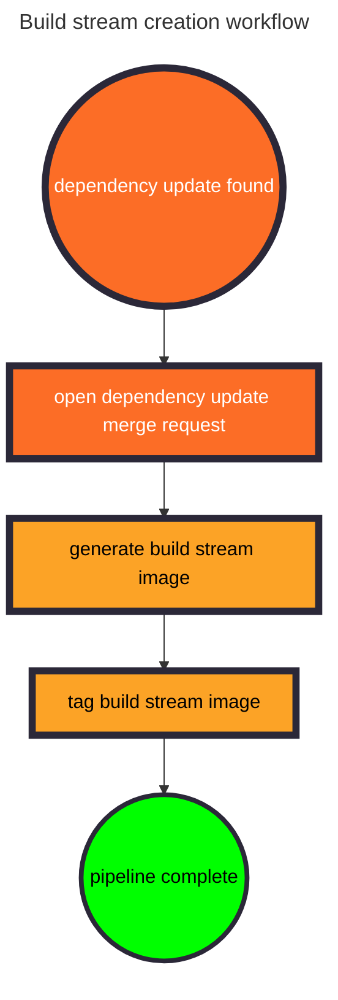

## Introduction

Build streams are well-defined environments with everything required to
compile a software package. The Totally Unified Build Environment uses them
to isolate structural dependency updates.

Most structural dependency updates are either patch revisions with bug and
security fixes or major version upgrades with breaking changes. The Totally
Unified Build Environment provides dynamic build stream configuration that
allows projects to test against newer versions without manual intervention
by subscriber projects.

## Types of build streams

|Build Stream|Description|When it Runs|
|-|-|-|
|`CURRENT`|The certified toolchain that builds GitLab packages.|Every time a pipeline runs.|
|`PATCH`|A candidate to replace the `CURRENT` build stream with minor revisions.|Only runs on the default branch when a patch update is available.|
|`MAJOR`|A candidate to replace the `CURRENT` build stream with major revisions.|Only runs on the default branch when a major version update is available.|

The distinction between `PATCH` and `MAJOR` build streams accounts for situations
where a major version upgrade requires substantial changes at the same time
a component releases a security update. Due to their lower risk, `PATCH`
build streams move more quickly and allow engineers to continue work on major upgrades and more easily maintain service level agreements with customers.

## Build stream generation

Automated dependency update pipelines generate the `PATCH` and `MAJOR` build
stream containers. After validation, the Totally Unified Build Environment
promotes the build stream container to `CURRENT`.

