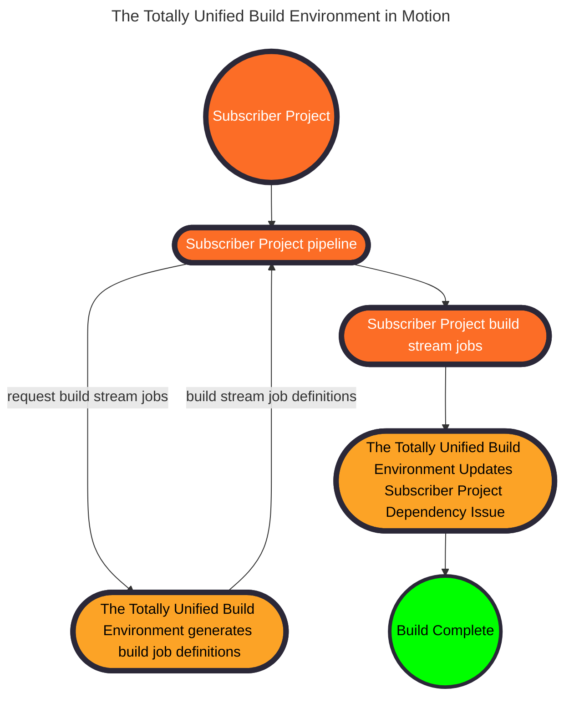

## Overview

The Totally Unified Build Environment creates a single build environment for
all GitLab components and dependencies. This eliminates inconsistency
between what gets tested and what gets shipped to customers.

## Workflows

Most will encounter the Totally Unified Build Environment through their
daily work when a continuous integration pipeline builds their code.

### How Engineers use The Totally Unified Build Environment

The Totally Unified Build Environment provides centrally managed continuous integration job configuration that project maintainers customize for their project.

- Patch and major updates show up automatically with no changes in local continuous integration configuration.
- Issues open automatically and align to the subscriber project workflow.

### How Management uses The Totally Unified Build Environment

The upgrade process uses GitLab project management features. It automatically creates an epic and labels it for discoverability along with a due date.

Engineering and Product managers can schedule the automatically opened issues through their normal process.

## Design philosophy

The Totally Unified Build Environment follows five core principles:

- One common toolchain builds all software across GitLab.
- Keep management processes light to maximize engineer agency and autonomy.
- Increase velocity for feature and incubation teams through baked in self-service.
- Decrease or eliminate manual work wherever feasible.
- Retain the final go/no-go decision for a human.
