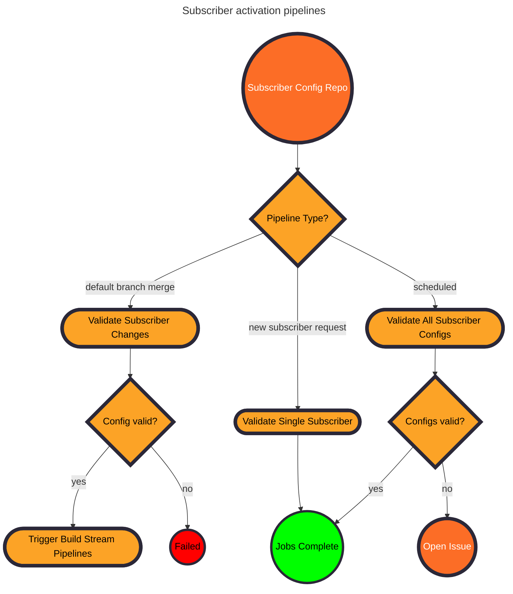

## Add subscriber configuration

When a new subscriber opens a merge request in the central build
architecture subscriber configuration repository it should:

- Add the subscriber project's directly responsible individuals to `CODEOWNERS`.
- Add a subscriber configuration file named `<PROJECT_NAME>.yaml` where the
  `PROJECT_NAME` is the commonly known subscriber project name. The name
  must be unique.

The subscriber file should follow the format in the provided example. The
subsequent table defines each available key.

```yaml
---
project:
  name: MY_COMPONENT_NAME
  project_id: MY_PROJECT_ID
components:
  golang:
    contacts:
      people:
        - MaintainerA
        - MaintainerB
      groups:
        - GroupNameA
    labels:
      - MY_SPECIAL_GOLANG_LABEL
  ruby:
    contacts:
      people:
        - MaintainerC
        - MaintainerD
    labels:
      - MY_SPECIAL_RUBY_LABEL
labels:
  - MY_TEAM_TRIAGE_LABEL
  - MY_SECTION_LABEL
  - MY_AWESOME_CUSTOM_LABEL_NOBODY_ELSE_USES
contacts:
  people:
    - NON_MAINTAINER_YOU_WANT_ADDED_TO_ALL_COMPONENTS
auto_close: false
```

|Config Key|Definition|
|-|-|
|`components`|List of Framework components required by this project.|
|`components:<COMPONENT_NAME>:contacts`|The subscriber project's directly responsible individuals. Merges with the top level `labels` key.|
|`components:<COMPONENT_NAME>:labels`|The subscriber project's preferred triage labels for this component. Merges with the top level `labels` key.|
|`components:<COMPONENT_NAME>:project_id`|Overrides the `project_id` set for the subscriber. Only needed when a monorepo utilizes two issue trackers for separation.|
|`project:project_id`| The integer IID assigned to the subscriber project in GitLab. `PATCH` and `NEXT` jobs open an issue in the defined project.|
|`project_name`| The well known name for a subscriber project.|
|`labels`|Labels applied to all issues Framework opens for this susbcriber project. The list merges with component specific labels.|
|`contacts`|Framework assigns build failure issues to everyone in `contacts:people`. The list merges with the contacts specified per component. Groups named in `contacts:groups` will be copied in the description. A project must provide at least one entry in `contacts` under `people` or `groups`.|
|`auto_close`|Optional. If the default pipeline succeeds for a `PATCH` or `NEXT` job, close the related open issue.  Defaults to `false`.|

## Activation pipeline workflows



The repository enforces validation through a series of business rules:

- The `component` entry only contains valid component names.
- The `project_id` exists.
- The labels exist in the available scope of the `project_id`.
- At least one person or group is defined in `contacts`.
- Anyone specified in `contacts` exists and is active.

### Merge requests

Every time a merge request tries to add a new subscriber configuration it
runs the validation logic against only the net new file. If validation finds
no issues, then a build team maintainer will merge it. For updates to
current configuration, the change may be merged by either a build team
maintainer or a member listed in `CODEOWNERS` for the subscriber project.

### Default branch

The default branch pipeline validates each subscriber configuration file
with the same rules used in merge request pipelines. If this final
validation passes, the pipeline triggers build stream generation jobs for
any in-flight update. The build stream generation jobs open any necessary
issues based on the components declared in the subscriber configuration.

### Scheduled job

A scheduled job runs on a weekly cadence to detect broken configuration. It
provides a guard against schema changes that may inadvertently break older
subscriber configuration files.

## Add Framework to subscriber project repository

After the subscriber project configuration file successfully merges into the
central build architecture repository, the directly responsible individuals
then need to configure their own project to consume Framework's unified
common build templates.
