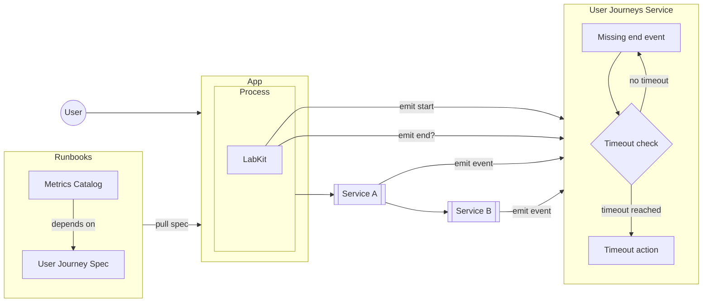
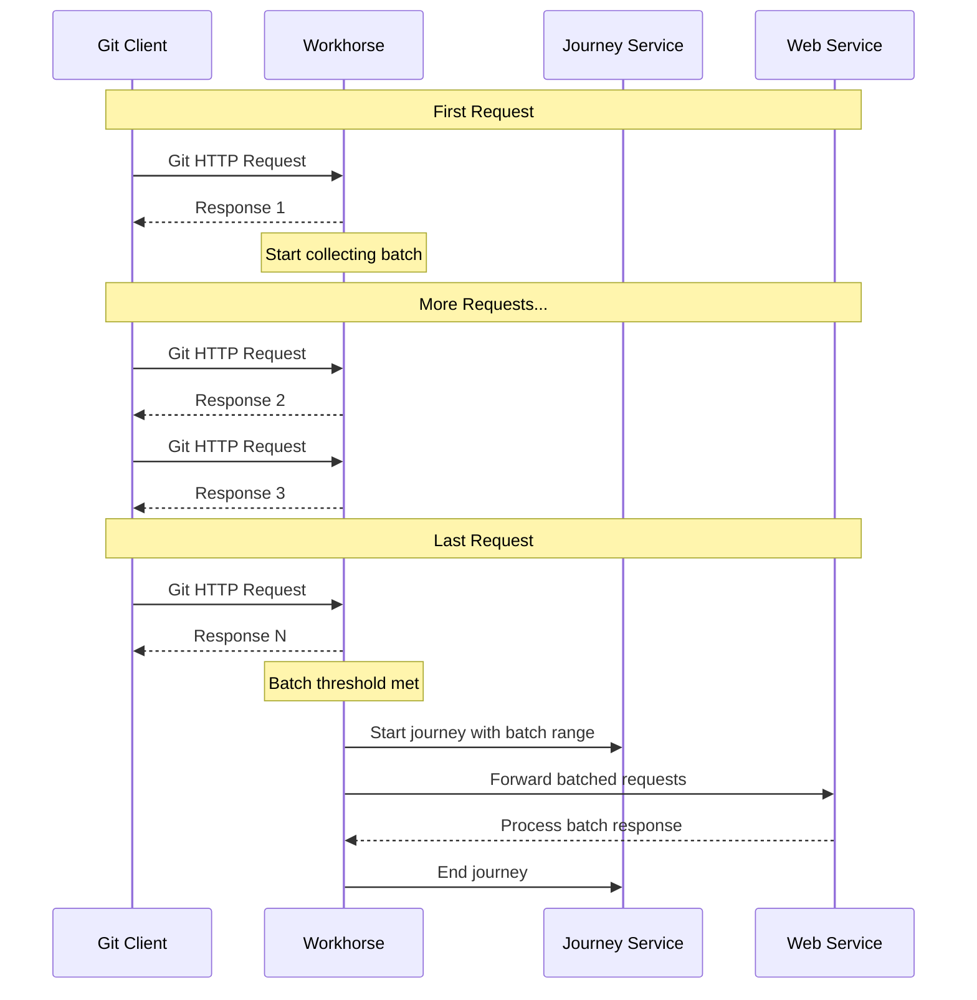

<!-- vale gitlab.FutureTense = NO -->

<!-- This renders the design document header on the detail page, so don't remove it-->


[TOC]

## Summary

This design document proposes a new architecture for measuring and tracking user journeys across GitLab services. A user journey represents an end-to-end flow of user interactions that may span multiple services (e.g., from receiving a git push in GitLab Shell to updating a merge request). The proposal includes creating a new service for maintaining journey state, developing an SDK within LabKit for instrumenting journeys, and establishing a framework for product teams to define and monitor critical user journeys.

The system will help measure the reliability and performance of key user interactions and provide valuable data for both operational excellence and product decisions.

## Motivation

While GitLab has robust service-level metrics through our SLI framework, we currently lack a systematic way to track and measure complete user journeys that span multiple services. Our existing SLIs excel at measuring individual service performance but cannot effectively track the success/failure rate and performance of end-to-end user interactions. This gap makes it challenging to:

- Understand the true user experience across service boundaries
- Set and monitor user-centric SLOs for complex user interactions
- Identify bottlenecks in multi-service flows
- Ensure critical user paths are well-tested and monitored

### Goals

- Create a framework for product teams to define important user journeys in a structured way
- Develop an SDK that makes it easy for engineers to instrument user journeys using start, checkpoints and ending.
- Build a service to track journey state and emit relevant metrics/logs
- Support both GitLab.com and self-managed/dedicated deployments
- Enable measurement of journey success/failure rates and durations through SLIs
- Provide data that can help identify test coverage gaps for critical user paths

### Non-Goals

- Building a general-purpose distributed tracing solution
- Supporting user journeys that originate outside GitLab services (e.g., client-side only flows)
- Real-time journey visualization or debugging tools
- Initial support for languages other than Ruby

## Proposal

The core proposal consists of three main components:

1. Journey Definition Framework
   - YAML-based journey definitions authored by product teams
   - Support for specifying success criteria and SLO targets
   - Integration with test coverage reporting

2. LabKit SDK
   - DSL for marking journey start/end points
   - Journey ID generation and propagation
   - Automatic state management and metric emission
   - Built-in retry and backoff mechanisms

3. Journey State Service
   - Centralized journey state tracking
   - Metric aggregation and SLI calculation
   - Support for both Runway and self-managed deployments
   - Sensible time to live (TTL) threshold for journey duration

## Design and implementation details

### Synchronous workflow



### Batched Workflow



### Journey Definition Spec

The user journey definition will be a YAML file containing the relevant details. For example:

```yaml
journeys:
  - id: merge_request_creation                        # Required: Unique identifier for the journey
    description: "User creates a merge request"       # Required: Human readable description
    feature_category: source_code_management          # Required: GitLab feature category
    success_threshold: 30                             # Optional: Success threshold in seconds (default: 60)
    timeout: 300                                      # Optional: Journey timeout in seconds (default: 600)

  - id: git_push
    description: "User pushes commits to a repository"
    feature_category: source_code_management
    # Using default thresholds

  - id: issue_creation
    description: "User creates an issue"
    feature_category: team_planning
    success_threshold: 45                             # Custom success threshold of 45 seconds
    # Using default timeout
```

### SDK Requirements

- Implementation in LabKit starting with Ruby
- Journey ID generation
- Automatic retries with exponential backoff for sending reports to the User Journey Service
- Batching reports for the User Journey Service
- Reports are sent asynchronously outside of the User Journey.

### User Journey State Management Service

The user journey state management service will serve an endpoint that will respond to the client generated payload:

```json
POST /api/v1/journeys/events
Content-Type: application/json

# Start journey
{
  "journey_id": "f6587c32-6e2f-4586-a82e-8d73c335e8cd",
  "journey_type": "http_request",
  "event_type": "start",
  "component": "web",
  "client_timestamp": "2025-02-06T14:30:00Z",
  "context": {
    "feature_category": "source_code_management"
  }
}

# Response: 201 Created
{
  "journey_id": "f6587c32-6e2f-4586-a82e-8d73c335e8cd",
  "server_timestamp": "2025-02-06T14:30:00.123Z"
}

# End journey
POST /api/v1/journeys/events
Content-Type: application/json

{
  "journey_id": "f6587c32-6e2f-4586-a82e-8d73c335e8cd",
  "journey_type": "http_request",
  "event_type": "end",
  "component": "web",
  "client_timestamp": "2025-02-06T14:30:01Z",
  "context": {
    "feature_category": "source_code_management"
  }
}

# Response: 200 OK
{
  "journey_id": "f6587c32-6e2f-4586-a82e-8d73c335e8cd",
  "server_timestamp": "2025-02-06T14:30:01.234Z"
}

# Intermediate components participating in journey (optional event_type, meaning it is an intermediate step)
POST /api/v1/journeys/events
Content-Type: application/json

{
  "journey_id": "f6587c32-6e2f-4586-a82e-8d73c335e8cd",
  "journey_type": "http_request",
  "component": "database",
  "client_timestamp": "2025-02-06T14:30:00.500Z",
  "context": {
    "feature_category": "source_code_management"
  }
}

# Response: 200 OK
{
  "journey_id": "f6587c32-6e2f-4586-a82e-8d73c335e8cd",
  "server_timestamp": "2025-02-06T14:30:00.567Z"
}

# Error Responses
# Journey not found
HTTP/1.1 404 Not Found
{
  "error": "journey_not_found",
  "message": "Journey f6587c32-6e2f-4586-a82e-8d73c335e8cd not found"
}

# Journey already ended
HTTP/1.1 409 Conflict
{
  "error": "journey_already_ended",
  "message": "Journey f6587c32-6e2f-4586-a82e-8d73c335e8cd has already ended"
}

# Journey type not found in definitions
HTTP/1.1 422 Unprocessable Entity
{
  "error": "invalid_journey_type",
  "message": "Journey type 'http_request' not found in journey definitions"
}

# Notes:
# 1. Single endpoint for all event types, differentiated by payload
# 2. Server always returns its own timestamp
# 3. Feature category must match the one in journey definition YAML
# 4. All components must provide journey_type to validate against definitions
```

Batched operations collect the `start` and `end` timestamp of batched requests:

```json
{
  "journey_id": "f6587c32-6e2f-4586-a82e-8d73c335e8cd",
  "journey_type": "http_request",
  "component": "workhorse",
  "batch_range": {
    "start": "2025-02-07T10:00:00.123Z",
    "end": "2025-02-07T10:00:05.678Z"
  },
  "context": {
    "feature_category": "source_code_management"
  }
}
```

The storage must support:

- High write throughput optmized for time-series data
- Capable of querying events by `journey_id` efficiently for analytical purposes

### Service Architecture

- Runway service for GitLab.com
- Kubernetes deployment for self-managed instances
- Redis for journey state storage

### Failure Modes

- Journey timeout after configured threshold (default 10 minutes)
- Automatic cleanup of stale journeys
- Retry mechanisms for state updates

### Initial Implementation Scope

- Ruby-only support targeting Rails application
- Focus on web request and Sidekiq job flows
- Batching support
- Success/failure tracking measurements

## Alternative Solutions

1. Distributed Tracing
   Pros:
   - Existing solutions available
   - Opportunity to iterate towards a global Tracing solution

   Cons:
   - Different cardinality requirements -- one trace per request
   - Lack of business-level success criteria
   - More complex to implement and maintain

2. Do Nothing
   Pros:
   - No implementation cost

   Cons:
   - Continue lacking end-to-end user journey visibility
   - Harder to set meaningful SLOs
   - Miss opportunities for better capturing perceived user experience and testing coverage
