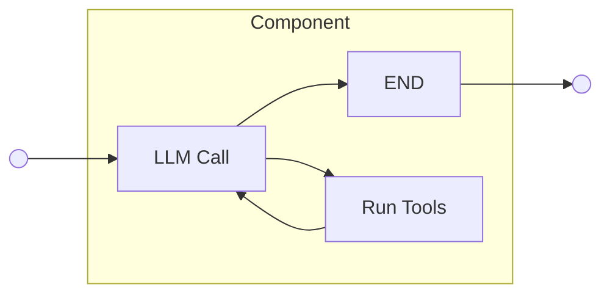
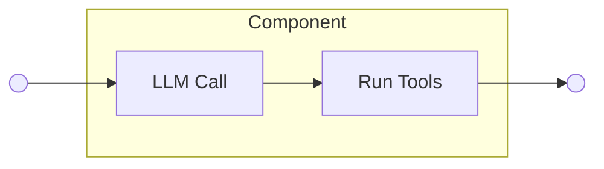
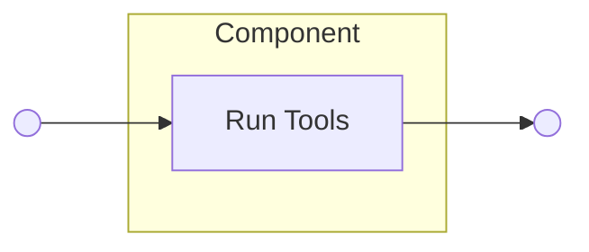
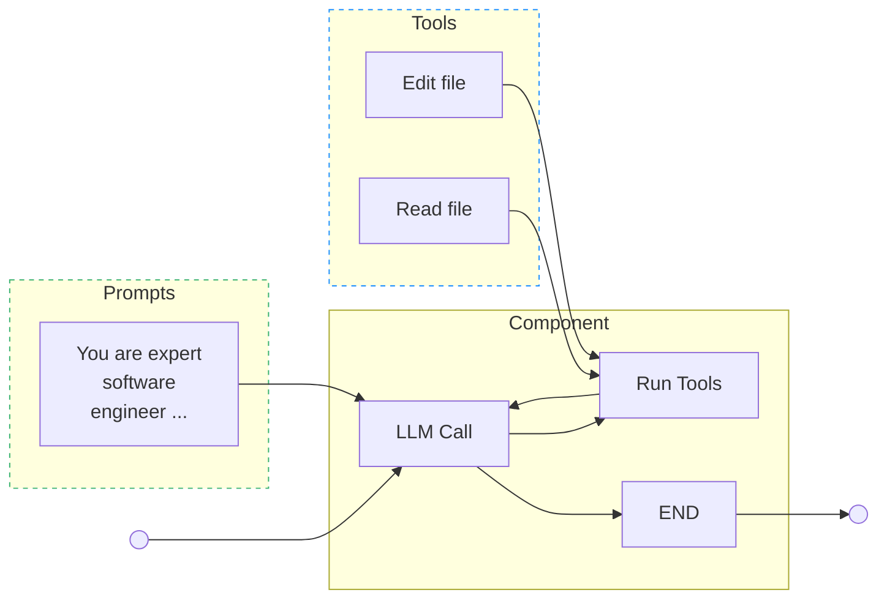
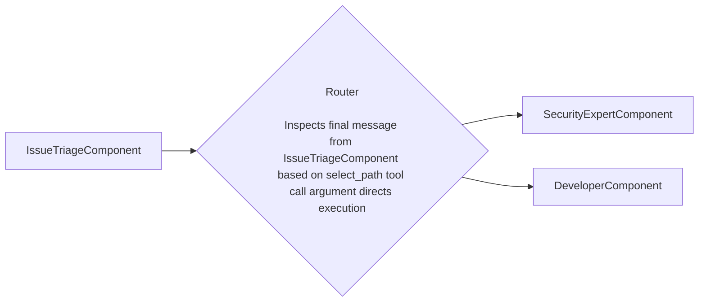



## Summary

This blueprint presents the implementation of a Workflow Registry as part of the AI Gateway to centrally manage GitLab growing collection of agentic AI workflows.
As GitLab continues transforming AI features to be agentic and building new agentic capabilities, there is a need for centralized discoverability, governance, and orchestration of these workflows.
The proposed Workflow Registry will serve as a single entry point for storing, managing, and orchestrating LangGraph-based workflows, building upon existing infrastructure like the Prompt Registry and Workflow engine.

## Preamble

### Large Language Models are powerful Agents

Large Language Models (LLMs) are powerful text processing systems capable of understanding, reasoning, and generating human-like responses across diverse domains.
When equipped with tools (external functions that allow models to perform specific actions like web searches, API calls, or database queries), 
LLMs transform into intelligent agents that can interact with the world beyond text generation.
An agent is essentially an LLM that can perceive its environment, make decisions, and take actions to achieve specific goals using these available tools.

### Agents with zero tools

Publications often debate whether an LLM with zero tools should be considered a simple LLM call or still an agent.
At GitLab, we might establish a clear distinction using our LangGraph implementation in Duo Workflow:
an LLM used outside the LangGraph codebase with zero tools is simply an LLM call,
while an LLM within LangGraph, even without tools, qualifies as an agent because it functions as part of a larger complex graph execution.
This approach will help us maintain conceptual clarity and implementation simplicity throughout our blueprint.

### Agents vs Workflows: what is the difference?

As mentioned above, GitLab relies on LangGraph to build agentic behavior. LangGraph represents complex agentic behavior
as a network graph that consists of one or more agents, pure Python logic, and other components built around a shared data state.
The network graph defines how different components communicate with each other, moving and processing the data flow to perform a given task.
Thus, we can say that a workflow is a graph that serves as a building block for creating complex AI applications.

### Workflow orchestration to solve complex tasks

The market has demonstrated that coordinated groups (swarms) of specialized agentic workflows are exceptionally effective at solving complex user tasks that would be challenging for a single workflow to handle alone.
For example, a developer requesting "fix the performance issue in my Python API" could be served by multiple workflows:
a code analysis workflow that reviews the codebase and identifies bottlenecks, a monitoring workflow that examines logs and metrics, and a code generation workflow that implements optimizations. 
Workflows appear to be a good example of encapsulation. Every workflow is a standalone feature; a group of workflows can solve much more complex tasks.
Implementing one workflow that handles code analysis, monitoring, and code generation is less reliable as it violates encapsulation,
overcomplicates the graph state, and complicates testing. Orchestration via communication of workflows provides a better approach.

## Motivation

We recently migrated Duo Workflow Service to the AI Gateway.
We also reimplemented Duo Chat using the Duo Workflow codebase, effectively making Duo Workflow an engine for building various agentic workflows.
This opens a path for creating many different workflows on top of the Duo Workflow engine, orchestrated to complete specific tasks.
As we continue working increasingly on implementing new agentic AI features and transforming existing AI features to be agentic, there is a growing need for centralized management and orchestration of these agentic workflows.
The AI Gateway requires a Workflow Registry to provide discoverability, governance, and seamless implementation of agentic workflows of varying complexity across the platform.

## Goal

Build a central Workflow Registry in the AI Gateway that makes it easy to find, run, and manage AI workflows, while making development simpler and improving performance across GitLab AI features.

## Objectives

Based on the goal and motivation, we define the following objectives:

1. Build a Workflow Registry as part of the AI Gateway and Workflow Service
2. Create examples showing how to use the Workflow Registry
3. Write clear documentation to help developers build and improve AI workflows

## Non-goals

1. Customer-facing Workflow Registry. This blueprint focuses on improving our internal stack for implementing AI workflows efficiently.
   However, the Workflow Registry can be reused by the Duo Workflow Catalog team to further extend its functionality for customers.  
2. DSL implementation. We have already had several ideas and conversations about implementing a [DSL](https://gitlab.com/gitlab-org/modelops/applied-ml/code-suggestions/ai-assist/-/issues/1074) on top of YAML to easily prototype new workflows.
   This blueprint focuses on one step before DSL and is mainly about organizing our architecture in Python.
   This architecture can be later extended by DSL when required.
   Building DSL is risky at this moment as the Workflow engine is under active development and DSL might become a bottleneck.

## Implementation plan

The implementation plan builds on existing work done by the AI Framework and Duo Workflow teams - 
mainly the Prompt Registry, which is our single entry point to store all prompts using YAML and Jinja templates, and
the Workflow engine, which is an agent with a set of collected tools to perform generic tasks.

1. **Agent Implementation**
   In this step, we define every agent as part of a LangGraph node.
   Every agent reads its prompt from the Prompt Registry in the AI Gateway.
   The agent knows which tools are attached and works with the graph state to produce its output.
   As output, it can return the next tool to be called or a message to be passed to the next LangGraph node.

   ```mermaid
   flowchart LR
    subgraph Node["Node"]
      Ask("Ask codebase agent")
    end
    subgraph Tools["Tools Node"]
      Find("Find file")
      Read("Read file")
    end
    Node <--> Tools
    Prev("Previous LangGraph node") --> Node
    Node --> Next("Next LangGraph node")
   ```

2. **Core Registry Implementation**
   Having a dedicated solution to store LangGraph Python definitions will help the 
   team have a single entry point to the building blocks required to construct complex AI features.
   Every graph we store in the registry requires a name, description, and defined input and output parameters.
   By inputs, we mean the minimum data we need to pass to the compiled graph to create a state and start graph execution.
   By outputs, we mean what part of the data presented in the state should be returned as a result of graph execution.
   The name of the graph uniquely identifies the graph.

3. **Workflow Implementation**
   In this step, we present every workflow as a solid graph that has its own isolated state.
   This graph consists of more than one agent and other pure Python logic.
   The workflow's responsibility is to encapsulate a complete, domain-specific AI capability that can solve a well-defined class of problems.
   The workflow can operate as a standalone AI feature similar to the current agentic Duo Chat.
   The workflow can also be orchestrated with other workflows for solving complex tasks.
   Since every workflow is a graph, the Workflow Registry is the right place to store workflows.

   ```mermaid
   flowchart LR
      subgraph Workflow["Ask Codebase workflow"]
         Ask("Ask agent")
         Planner("Planner agent")
         Tools("Tools")
         State[("State")]
         Ask <--> Tools
         Ask <--> Planner
         Ask --> State
         Planner --> State
      end
    Inputs --> Workflow
    Workflow --> Outputs
   ```

4. **Workflow Orchestration Implementation**
   In this step, we present the orchestration logic as a graph that operates with subgraphs, which are workflows.
   The responsibility of the orchestration logic is to manage groups of agentic workflows to solve a complex multi-domain task.
   This orchestration graph has its own global state but doesn't have access to the subgraph states.
   Examples of orchestration graphs include:
     - Supervised - the agent selects the next workflow based on descriptions of available workflows. The agent can look
       into the Prompt Registry to select an appropriate next workflow or rely on the available list.
     - Peer-to-peer - two workflows exchanging messages to solve the given task.
     - Polling - a supervised agent polls every connected workflow asking whether it can solve the next task.
   Similar to the workflows above, the Workflow Registry is the right place to store orchestration graphs. 
   
   ```mermaid
   flowchart LR
      subgraph Orchestration["Workflow Orchestration"]
         Ask("Ask Codebase workflow")
         Develop("Code Developer workflow")
         Review("Code Review workflow")
         Supervisor("Supervisor workflow")
         State[("Global State")]
         Supervisor --> State
         Supervisor <--> Ask
         Supervisor <--> Develop
         Supervisor <--> Review
      end
    Inputs --> Orchestration
    Orchestration --> Outputs
   ```

The steps above will give us the first iteration of the Workflow Registry.
The estimated implementation time is 1-1.5 milestones.
The recommended team size to complete the implementation is minimum 3 engineers.


### Worfklow composition

Workflows models business processes that automate various tasks carried in organisations.
They consist of many steps that can be orchestrated with different architectures reflecting specific aspects of an organistaition, and business needs. 

Workflows model business processes using following privitives:
1. Components
1. Routers
1. State
1. Prompts
1. Tools

In addition workflows may be nested within other workflows, modeling higher level processes that manage and orcestare multiple childe ones

#### 1\. Components

Components are the basic atomic unit of operations within workflow, they represent a single respobsibility within a process.
For example component can be respobsible for reviewing a merge request, or component can be responsible for writing a new unit test to improve test coverage for a project. 
One can perceive componentes as individuals withing organisation, to whom various tasks in a business process can be delegated, those tasks can varry in complexity, and
be as simple as one-off interaction (eg: sending an email), to more elaborate like reviewing a merge request. What creates important distinction is the fact that
components must have **a single role** in an organisation, or a business process, while _workflows_ (business processes) includes one or more individuals with certains roles. 
For example, when a feature is being developed, an engineer creates fature implementation,
but a technical writer is responsible for providing user facing documentation,
each of those personas is an expert in thier field, which assure quality of their outputs.

##### Implementation

On a more technical level, the component is collection of LangGraph nodes arrenged in certain architecture, which is designed to solve a category of problems.
Among many other options, there are components designed to act as cylic agents, one-off agents, or event predefined non AI steps in the process. 
Example diagaras for mentined components are presented below

1. Cyclic agent



2. One-off agent



3. Deterministic step



##### Inputs

Components may define set of reuired inputs.
A compoement inputs relfects attributes within a global workflow's [state](#3-state) object
that carry necessary information wihtout which the component won't be able to fulfill its role in a 
workflow.

##### Outputs

Components should specify set of attributes within a global workflow's [state](#3-state) object
that they will modify, or add on the course of their execution. This is necessary to assure that 
subsequent components within a workflow will have their inputs present.

##### Generic components

Some components may server as customisable blueprints flexible enough,
to be reused in different roles. To specif generic component into a 
distinct role, one assign them a [prompt](#4-prompts), and then define the component permissions with
assigned set of [tools](#5-tools), that restrict actions available to an individual in the role in modelled process.

The diagram below pictures role specification



#### 2\. Routers

Routers are responsible for arraging Components into predefined structures, governing order of operations within a workflow.

Business processes (moddeled as Workflows) not only consist of indivduals in certain roles, but also relay on 
interactions between those individuals. In the same manner Workflows are composed with Components, but in order to move from a set of components
to a workflow that models a business process, those components needs to be arranged into some structure. Routers plays important role
navigating between different components in a workflow, and assuring that required order of operations is respected.

By the way of analogy, during a software development, it is important that design department prepare vision of a new layout,
before engineering can act upon it. In the same fashion in a workflow some component must preceed other, assuring correct delivery of 
a final outcome.

On a technical level Routers wraps LangGraph edges that conntects two or more components and implements logic that enforces correct execution flow through a
whole workflow. 

Routers carry out path selection based on predefined attributes within a Workflow's state like: _status_ or a final message from a precceding component

An example Router diagram is being presented below



#### 3\. State

Each workflow has a global State object that is being used to transport information between different components composing 
a workflow. The State can be imagined as an epic, or a merge request with wich multiple members of organisation collaborate together over a shared goal
of a business process. For example first design departament adds mocks ups into an epic description, then engieering department steps in the process, and 
use the epic as source of truth to understand thiers requirements.

##### Implementation

State object is a dictionary, that contains a combination of 
predefined required attributes, as well as a flexible _context_ attribute, which 
itself is a nested dictionary, enabling every component in a workflow to write their 
outputs to, in form of key, value pairs, that can be used by subsequent components.

```python
class WorkflowState(TypedDict):
    status: WorkflowStatusEnum
    conversation_history: Annotated[
        Dict[str, List[BaseMessage]]
    ]
   ui_chat_log: Annotated[List[UiChatLog]]
   context: Dict[str, Union[str, int, float]]
```

#### 4\. Prompts

Prompts are text templates used to specify roles for generic components. 
Upon configuration of generic component must be connected to a prompt via _prompt id_
Prompt templates can have a placeholder fileds for dynamic values. If prompt template
have any placeholder its name must match with a container [input](#inputs), which is 
going to be used to replace the placeholder with dynamic value

#### 5\. Tools

Tools represent actions in external environment that component can take on cours of its execution.
By method of analogy, tools can be imagined as permissions assinged to a role in an organisation. 
For example a CFO can issue financial statements on behalf of a whole organisation,
a while database admin has direct access to a database server. In the same fashion tools should be 
assinged to components based on their role in a workflow.

## Future evolution

Implementing DSL on top of the Workflow Registry might be considered as the next step.
The DSL could potentially be used by customers. This work requires additional effort and collaboration with the
Duo Workflow Catalog team.
