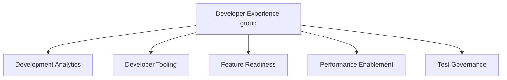

## Mission

Our mission is to empower developers to focus on innovation, build, and deliver high-quality products to our customers. We aim to achieve this through:

1. State-of-the-art developer tooling
2. Robust and reliable test infrastructure
3. Data-driven analysis for informed decision-making
4. Streamlined release governance
5. Comprehensive performance validation

## Team Structure

Infrastructure Platforms Department structure is documented [here](/handbook/engineering/infrastructure-platforms/#organization-structure).

### Developer Experience group structure

## Team Members

### Management team



### Individual contributors

The following people are members of the [Development Analytics group](./development-analytics/):



The following people are members of the [Developer Tooling group](developer-tooling-team):



The following people are members of the [Feature Readiness group](feature-readiness-team):



The following people are members of the [Performance Enablement group](performance-enablement-team):



The following people are members of the [Test Governance group](test-governance-team):


