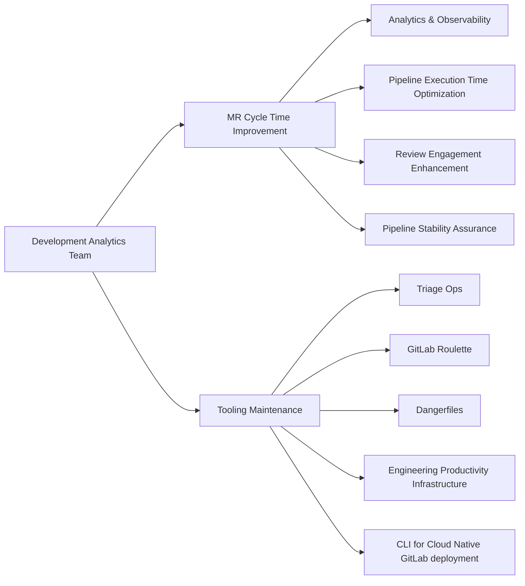

## Common Links

| **Category**            | **Handle**                                                                                                                 |
|-------------------------|----------------------------------------------------------------------------------------------------------------------------|
| **GitLab Group Handle** | [`@gl-dx/development-analytics`](https://gitlab.com/gl-dx/development-analytics)                                           |
| **Slack Channel**       | [`#g_development_analytics`](https://gitlab.enterprise.slack.com/archives/C064M4D2V37)                                     |
| **Slack Handle**        | `@dx-development-analytics`                                                                                                |
| **Team Boards**         | [`Team Issues Board`](https://gitlab.com/groups/gitlab-org/-/boards/8966549?label_name%5B%5D=group::development%20analytics), [`Team Epics Board`](https://gitlab.com/groups/gitlab-org/-/epic_boards/2068920?label_name[]=group%3A%3Adevelopment%20analytics)                                           |
| **Issue Tracker**       | [`tracker`](https://gitlab.com/groups/gitlab-org/quality/dx/analytics/-/issues)                                            |
| **GitLab Repositories** | [development-analytics](https://gitlab.com/gitlab-org/quality/analytics)                                                   |

## Mission

Our mission is to enhance developer efficiency by delivering actionable insights, optimizing pipeline performance, and building scalable productivity tools that measurably improve the software development lifecycle.

## Vision

We envision a future where GitLab’s development workflows are seamless, insightful, and empowered by data. The Development Analytics team will:

- Establish GitLab as the industry benchmark for measurable developer productivity
- Improve cycle time to industry-leading standards through tooling and practices
- Create intuitive, powerful analytics dashboards that drive informed development decisions
- Deploy AI-powered systems that optimize pipeline performance and resource utilization

## Team members



## Core Responsibilities

## Roadmap

As part of our commitment to aligning with GitLab's company goals, our team conducts a thorough review of company-level Roadmap and [Objectives and Key Results (OKRs)](/handbook/company/okrs/) at the beginning of each quarter. This process ensures that our efforts are strategically focused on delivering high-impact results that contribute to the broader organizational objectives. View the [Development Analytics Roadmap for FY26](https://gitlab.com/groups/gitlab-org/-/epics/16026) for detailed insights and upcoming priorities

## Dashboards

### Pipeline Duration Analytics

- [Pipeline Duration Analytics](https://app.snowflake.com/ys68254/gitlab/#/dx-pipeline-durations-d4NWA2TAT)
- [Job Execution Analytics](https://app.snowflake.com/ys68254/gitlab/#/dx-job-durations-dPkG7M61u)
- [Pipeline Tier Analysis](https://app.snowflake.com/ys68254/gitlab/#/dx-pipeline-tiers-dS2zNDPHP)
- [Long-Running Test Analysis](https://app.snowflake.com/ys68254/gitlab/#/dx-weekly-long-running-qa-jobs-d8JKf0WUW)

### Pipeline Stability Analytics

- [Main Branch Incident Analytics](https://app.snowflake.com/ys68254/gitlab/#/dx-master-broken-incident-overview-dVcWBjizf)
- [E2E Test Analytics](https://dashboards.quality.gitlab.net/)

### AI Latency Analytics

- [AI Models and Providers Latncy Analysis](https://lookerstudio.google.com/reporting/8698a296-485e-40a6-a128-b7aa73021fc3)
- [Duo Comparative Analysis](https://lookerstudio.google.com/reporting/f26671e3-7d6d-459f-94ee-919722d8700b)
- [Duo E2E Latency Analysis](https://lookerstudio.google.com/s/o3HSXdWFoX4)

*Note: Access to these dashboards requires appropriate permissions. Contact team leads for access requests.*

## How we work

- We prioritize asynchronous communication and a handbook-first approach, in line with GitLab's all-remote, timezone-distributed structure.
- We emphasize the [Maker's Schedule](https://www.paulgraham.com/makersschedule.html), focusing on productive, uninterrupted work.
- Most critical recurring meetings are scheduled on Tuesdays and Thursdays.
- We dedicate 3-4 hours weekly for focused learning and innovation. This protected time enables the team to explore emerging technologies, conduct proof-of-concepts, and stay current with industry trends. Meeting requests during these blocks require advance notice.
- All meeting agendas can be found in the [Team Shared Drive](https://drive.google.com/drive/folders/1uZg0J5hYsOUu3WMNR-PoAcmrhhmDxxoA?usp=drive_link) as well as in the meeting invite.

### Work related rituals

| Event                        | Cadence                                                                | Agenda                                                                                                                                                                                                                                                                                                                                                                                                                                                                               |
|------------------------------|------------------------------------------------------------------------|--------------------------------------------------------------------------------------------------------------------------------------------------------------------------------------------------------------------------------------------------------------------------------------------------------------------------------------------------------------------------------------------------------------------------------------------------------------------------------------|
| End-of-Week progress update  | Once a week (Wednesday)                                                | Summarize status, progress, ETA, and areas needing support in the weekly update in issues and Epics. We leverage [epic-issue-summaries bot](https://gitlab.com/gitlab-com/gl-infra/epic-issue-summaries) for automated status checks |
| Team meeting | Twice a month on Tuesday 4:00 pm UTC | [Agenda](https://docs.google.com/document/d/1gtghZCYeg42cMbQ8mWnjBcsu4maMO4OFA0xcQ8MfRHE/edit?usp=sharing) |
| Monthly Social Time          | Monthly on last Thursday 4:00 pm UTC | No agenda, fun gathering. Choose one of the slots based on your timezone alignment. Read [Virtual team building](/handbook/finance/expenses/#team-building)                                                                                                                                                                                                                                                                                                                          |
| Quarterly Business Report    | Quarterly                                                              | Contribute to [team's success, learnings, innovations and improvement opportunities for each business quarter](https://gitlab.com/groups/gitlab-org/quality/quality-engineering/-/epics/61)                                                                                                                                                                                                                                                                                          |
| 1:1 with Engineering Manager | Weekly                                                                 | Discuss development goals (see the [1:1 guidelines](/handbook/leadership/1-1/))                                                                                                                                                                                                                                                                                                                                                                                                      |
| Team member's coffee chats   | once/twice a month                                                     | Optional meetings for team members to regularly connect                                                                                                                                                                                                                                                                                                                                                                                                                              |

### Repository Maintenance Rituals

#### Issue Management

~"group::development analytics" does not actively monitor the issue queue for new requests. Feature development and bug fixes are prioritized based on the group's active work. External teams requiring urgent changes are encouraged to submit MRs in a self-service manner.

#### MR Maintenance

~"group::development analytics" is responsible for providing maintainer review feedback for MRs.

#### Version Management

| Repository | Release Process |
|------------|----------------|
| `gitlab-roulette` | Version updates are not scheduled on a regular cadence. Instead, a new release can be made whenever a version update MR is submitted. |
| `gitlab-dangerfiles` | Version updates are not scheduled on a regular cadence. Instead, a new release can be made whenever a version update MR is submitted. |
| `triage-ops` | A new release is initiated after adding a new commit in the master branch. |
| `engineering-productivity-infrastructure` | ~"group::development analytics" needs to ensure dependency update MRs are created by Renovate bot |

### Work management

#### Planning

- Each financial year, we develop a clear roadmap for the team to enhance visibility and alignment.
- Our roadmap preparation is an intensive month-long exercise (usually in Q4), led by a [DRI](/handbook/people-group/directly-responsible-individuals/). During this phase, DRIs take the lead in drafting the roadmap using [the roadmap prep-work template](https://gitlab.com/gitlab-org/quality/work-log/-/blob/main/templates/roadmap-pre-work-template.md?ref_type=heads) for necessary project tracks. This involves gathering inputs from the team, various stakeholders, assessing past performance, and aligning with the strategic goals of the Development Analytics group.
- We utilize and plan [OKRs](/handbook/company/okrs/) to prioritize the roadmap items.
- Adhering to our team's [work rituals](#work-related-rituals), we conduct reviews to assess progress, address challenges, and recalibrate goals if necessary every two weeks.
- We maintain a [Team Board](https://gitlab.com/groups/gitlab-org/-/boards/8966549?label_name%5B%5D=group::development%20analytics) to visualise the current state of the feature work.

#### Working with us through support requests

We estimate ~20% of weekly time for support tasks, and balancing our roadmap work with emerging support needs. Please note this estimate varies depending upon ongoing priorities.

- For individual questions please reach out to the team via our Slack channels: [#s_developer_experience](https://gitlab.enterprise.slack.com/archives/C07TWBRER7H) and [#g_development-analytics](https://gitlab.enterprise.slack.com/archives/C064M4D2V37).
- Raise support requests as [issues in the dx space](https://gitlab.com/groups/gitlab-org/quality/dx/-/issues). Add [~"group::Development Analytics"](https://gitlab.com/groups/gitlab-org/-/labels?subscribed=&sort=relevance&search=group::development+analytics) and [~"development-analytics::support-request"](https://gitlab.com/groups/gitlab-org/-/labels?subscribed=&sort=relevance&search=development-analytics#) labels.
- Ensure each issue is tagged with one of `~"type::feature"`, `~"type::bug`, `~"type::maintenance` following [workflow classification guidelines](/handbook/product/groups/product-analysis/engineering/metrics/#work-type-classification).
- Team members analyze the issue and add a priority. P1 issues will be taken up on an urgent basis the same week based on the availability of the relevant team members. Lower-priority issues are scheduled for review and discussion in our next team meeting.
- The issues should be following the [workflow label guidelines](/handbook/engineering/infrastructure/platforms/project-management/#workflow-labels).

#### Automated label migration

Please read our [handbook entry for creating label migration triage policy with GitLab Duo Workflow](/handbook/engineering/infrastructure-platforms/developer-experience/development-analytics/create-triage-policy-with-gitlab-duo-workflow-guide)
