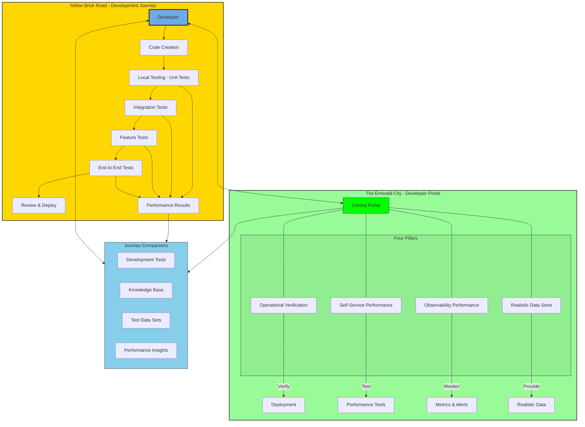

Performance Enablement enables internal teams to build reliable systems and deliver seamless customer experiences through our comprehensive developer portal (our Emerald City). We transform GitLab's performance testing from reactive to proactive by providing tooling, frameworks, best practices, and solutions that foster a culture of performance awareness. Working closely with product groups, we develop application standardization and production readiness quality gates to ensure consistent performance and reliability outcomes, empowering teams to detect and prevent performance issues early in the development lifecycle.

The first four pillars in the Emerald City will be:

- Operational Verification
- Self-Service Feature Performance
- Observability Performance
- Realistic Data Store

Journey Diagram

## Common Links

| S.No     | Section                   |
|------    |-------------------------|
| **GitLab Team Handle** | [`@gl-quality/dx-performance-enablement`](https://gitlab.com/gl-quality/dx-performance-enablement) |
| **Team Boards** | [Team Board](https://gitlab.com/groups/gitlab-org/-/boards/8955771?label_name[]=team%3A%3Aperformance%20enablement) |

Engineers in this team support Performance Enablement projects.

## Team members

Engineering Manager: Kassandra Svoboda

| S.No     |                    |
|------    |-------------------------|
| 1        | Andy Hohenner    |
| 2        | Brittany Wilkerson     |
| 3        | Jim Baumgardner       |
| 4        | John McDonnell      |
| 5        | Nivetha Prabakaran |
| 6        | Vishal Patel  |

## OKRs

Every quarter, the team commits to [Objectives and Key Results (OKRs)](/handbook/company/okrs/). The below shows current quarter OKRs and is updated regularly as the quarter progresses.

## Primary Projects

## All Projects

| Name | Description |
| :---: | :--- |
| [Backup and Restore](https://gitlab.com/gitlab-org/quality/gitlab-environment-toolkit-configs/backup-and-restore) | The Backup and Restore pipelines are designed to build environments using GET that are based on different Reference Architectures. Each is designed to run through the backup and restore process and verify the data that has been restored. |
| [GitLab Browser Performance Tool](https://gitlab.com/gitlab-org/quality/performance-sitespeed)| A sister pipeline to GPT's backend performance pipelines, these pipelines are designed to specifically test web page frontend performance in browsers. |
| [Performance Test Data](https://gitlab.com/gitlab-org/quality/performance-data)| This Project serves as an LFS data repository for the GitLab Performance Tool |
| [Performance Docker Images](https://gitlab.com/gitlab-org/quality/performance-images)| Docker builder and registry for GitLab Performance testing |
| [AI Gateway Latency Baseline Executor](https://gitlab.com/gitlab-org/quality/gitlab-environment-toolkit-configs/aigw-latency-baseline-executor)| Gets the latency baseline for AI Gateway in a specific region |

## Roadmap

## Working with us

To request for help with performance testing of a new feature, please create a new issue within the GPT project with the request for help template.

For individual questions please reach out to the team via our Slack channels.

### Slack Channels

| Channel | Purpose |
| :---: | :--- |
| [#g_performance_enablement](https://gitlab.slack.com/archives/C081476PPAM) | Channel to engage with the Performance Enablement Team |

## How we work

### Meetings and Scheduled Calls

Our preference is to work asynchronously, within our projects issues trackers.

The team does have a set of regular synchronous calls:

- Performance Enablement Team meeting
- 1-1s between the Individual Contributors and Engineering Manager

### Project Management

#### Issue Boards

We track our work on the following issue boards:

- [Developer Experience: Performance Enablement](https://gitlab.com/groups/gitlab-org/-/boards/8955771?label_name[]=team%3A%3Aperformance%20enablement)

#### Capacity Planning

We use a simple issue weighting system for capacity planning, ensuring a
manageable amount of work for each milestone. We consider both the team's
throughput and each engineer's upcoming availability from Workday.

The weights are intended to be used in aggregate, and what takes one person a
certain amount of time may be different for another, depending on their level of
knowledge of the issue. We should strive to be accurate, but understand that
they are estimates. We will change the weight if it is not accurate or if the issue
becomes more difficult than originally expected, leave a comment indicating why the
weight was changed, and tag the EM and any assigned DRIs so we can better understand the scope
and continue to improve.

##### Weights

To weigh an issue, consider the following important factors:

- Volume of work: expected size of the change to the code base or validation testing required.
- Amount of investigation or research expected.
- Complexity:
  - Problem understanding: how well the problem is understood.
  - Problem-solving difficulty: the level of difficulty we expect to encounter.

The following weights are available based on the Fibonacci Series with 8 being the highest assignable number. The definitions are as below:

| Weight | Description | Examples |
| ------ | ----------- | -------- |
| 1 - Trivial | Simple and quick changes | Documentation fixes or smaller additions. |
| 2 - Small | Straight forward changes, no underlying dependencies needed with little investigation or research required. | Smaller Ansible additions or changes, e.g. within one role. |
| 3 - Medium | Well understood changes with a few dependencies that should only require a reasonable amount of investigation or research. | Large Ansible changes, e.g. affecting multiple roles.   Small Terraform additions or changes, such as an additional setting for a Cloud Service. |
| 5 - Large | A larger task that will require a notable amount investigation and research.   All changes relating to security. | Large Terraform additions or changes such as a new Cloud Service or changes affecting multiple components. |
| 8 - X-large | A very large task that will require a significant amount of investigation and research. Pushing initiative level. | Large GitLab changes such as new component that will require joint Reference Architecture, GET and GPT work |

Anything that would be assigned a weight of 8 or larger should be broken down.

#### Status Updates

- By 20:00 UTC / 03:00 PM ET on Fridays DRIs of OKRs to provide a status update in the comment section of the OKR
  - Format for weekly update:
    - Date of Update (YYYY-MM-DD)
    - Brief update (~sentence or couple bullets) for each of these four bullets:
      - Status update - Progress has been updated to X %.
      - What was done :white_check_mark: - Unblocked blockers, any other progress achieved
      - Next steps :construction_worker:
      - Blockers :octagonal_sign: - Issues or unexpected work that blocked/affected progress. For example, customer escalations/on-call DRI
- ASYNC weekly epic status updates

## Test Platform process across product sections

Overall we follow the same process as [defined](/handbook/engineering/infrastructure/test-platform/#how-we-work) in our Test Platform handbook across all groups in Core Platform and SaaS Platform
except for a few exceptions curated to fit the needs of specific groups.

- [Test Platform in Distribution group](/handbook/engineering/infrastructure-platforms/developer-experience/performance-enablement/distribution/)
