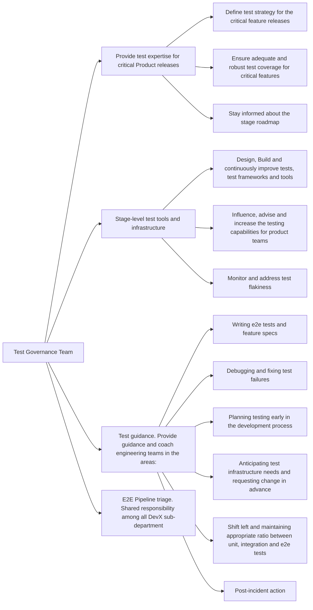

## Common Links

| **Category**            | **Handle**                                                                                      |
|-------------------------|-------------------------------------------------------------------------------------------------|
| **GitLab Group Handle** | [`@gl-dx/test-governance`](https://gitlab.com/gl-dx/test-governance)                            |
| **Slack Channel**       | [`#g_test-governance`](https://gitlab.enterprise.slack.com/archives/C064M4S0FU5)                |
| **Slack Handle**        | `@dx-development-analytics`                                                                     |
| **Team Boards**         |                                                                                                 |
| **Issue Tracker**       | [`tracker`](https://gitlab.com/groups/gitlab-org/developer-experience/test-governance/-/issues) |
| **GitLab Repositories** | [test-governance](https://gitlab.com/gitlab-org/developer-experience/test-governance)           |

## Mission

## Vision

## Team members



## Core Responsibilities

## Roadmap

## How we work

### Work related rituals

### Work management

#### Planning

#### Working with us through request for help
The Test Governance group aims to better enable teams to apply the principle that [quality is everyone's responsibility](/handbook/engineering/development/principles/#quality).
To that aim, we have been working to make it easier to contribute to E2E test development, and we want to begin gradually transitioning product teams to own E2E tests. During and after the transition, the Test Governance team will act more as coaches, helping to provide the platform that enables effective testing among the team.
Below is a Request for Help process that teams can use to get started on this transition process.
Like everything we do at GitLab, this is an iterative process, and we always welcome feedback for improvement.
#### Request for Help Process
1. An Engineer, Engineering Manager (EM) or Product Manager (PM) creates an issue in the [Request for Help](https://gitlab.com/gitlab-org/quality/test-governance/request-for-help/-/issues) project using one of the available templates:
 * Test Tooling Improvement Request - For help improving or implementing testing tools
 * Test Strategy Guidance Request - For help developing or improving your test strategy
 * Flakiness Investigation Request - For help investigating and resolving flaky tests
 * Test Execution Support Request - For help executing tests or evaluating test results
2. When creating the issue, provide as much detail as possible:
 * Add as much detail as possible in the template
 * Include specific context about your project and requirements
 * Attach relevant links, resources, and examples
 * Clearly state your expectations and timeline
3. The Test Governance team will triage the request within a week, adding appropriate labels and assigning team members based on the request type and priority.
4. An SET is assigned to the issue and will reach out to establish initial communication.
5. The assigned SET will:
 * Review requirements and collaborate with the team
 * Create a test planning issue if needed to define test cases and determine where existing tests need to be updated
 * Evaluate what E2E framework, tooling, or infrastructure work might be required
 * Provide coaching and guidance throughout the process
6. For feature-specific testing needs, the SET will work with the appropriate feature engineer(s) as assigned by the EM, serving as a coaching buddy for pairings, questions, and reviews during test development.
7. If there are changes in implementation or direction that affect the planned testing approach, the development team should update the relevant issues and notify the assigned SET.
8. After test implementation, the Test Governance SET can continue to provide support with troubleshooting and maintenance as needed.
9. You can track progress via the issue itself and reach out in the #test-governance Slack channel with any questions.
 
For more detailed guidance on E2E test coverage, consider these approaches:
* Engage with key DRIs to define [persona](/handbook/product/personas) use cases that illustrate how different customers will use new features
* Evaluate which parts of use cases can be covered by lower-level tests versus E2E tests, keeping the entire [testing pyramid](https://docs.gitlab.com/ee/development/testing_guide/testing_levels.html) in mind
* Refer to our documentation on [Testing Best Practices](https://docs.gitlab.com/development/testing_guide/end_to_end/best_practices) before submitting your request