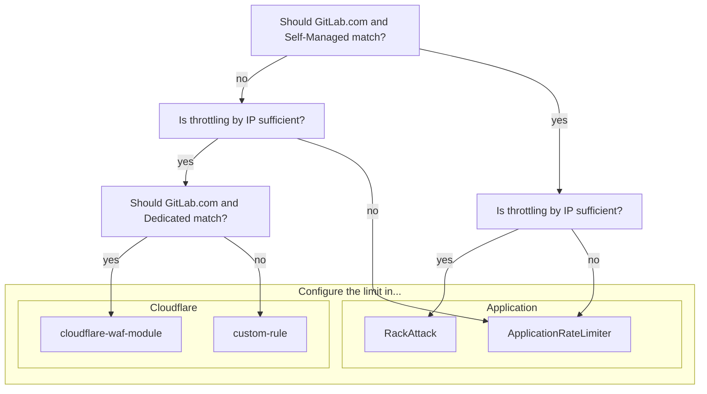

## Overview

TODO: Write overview for why these processes are important

## Where to configure the limit

Use the following diagram to determine where the limit should be configured,
then follow the corresponding guidance for the appropriate configuration method.

## Evaluation

Rate limits should be enabled by default. If we are considering introducing new limits enabling or changing a limit, we should do an evaluation first.

1. Determine if a rate limit already exists
  -

### Cloudflare

TODO: Talk about process of setting in log mode, whether to create in cloudflare-waf-module or custom-rule, how to validate the potential impact, engaging with customers, etc.

### Application

TODO: Break down by RackAttack and ApplicationRateLimiter, reference existing documentation.

## Continued

- Get Approval
- Raise a Change Request
