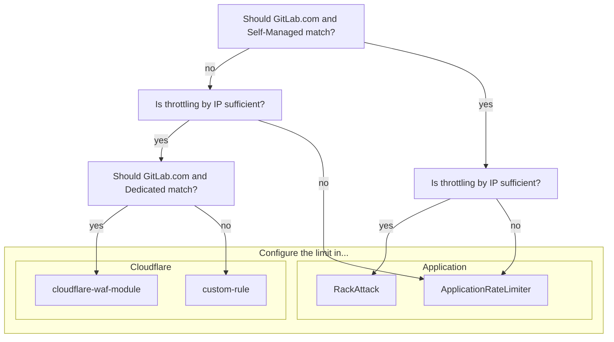

## Overview

GitLab environments require a multi-layered approach to rate limiting to effectively protect services and resources.
Each layer provides distinct advantages and serves as a complementary control in a comprehensive defense in depth strategy to protect our platform.

Follow this guide when introducing or managing limits.

## Where to configure the limit

Use the following diagram to determine where the limit should be configured,
then follow the corresponding guidance for the appropriate configuration method.

> [!note]
> This is currently focused on inbound limits such as HTTP traffic,
> and may be expanded in the future to account for internal limits between services.

## Evaluation

Rate limits should be enabled by default. If we are considering introducing new limits enabling or changing a limit, we should do an evaluation first.

1. Determine if a rate limit already exists

TODO: More detail here

### Cloudflare

TODO: Talk about process of setting in log mode, whether to create in cloudflare-waf-module or custom-rule, how to validate the potential impact, engaging with customers, etc.

### Application

TODO: Break down by RackAttack and ApplicationRateLimiter, reference existing documentation.

## Continued

- Get Approval
- Raise a Change Request
