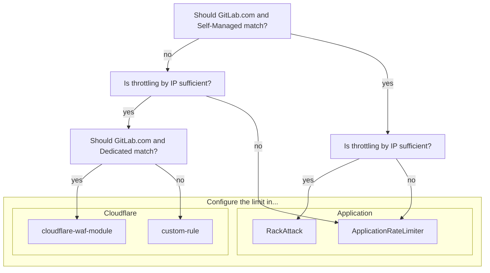

## Overview

GitLab environments require a multi-layered approach to rate limiting to effectively protect services and resources.
Each layer provides distinct advantages and serves as a complementary control in a comprehensive defense in depth strategy to protect our platform.

Follow this guide when introducing or managing limits.

## Where to configure the limit

Use the following diagram to determine where the limit should be configured,
then follow the corresponding guidance for the appropriate configuration method.



> [!note]
> This document is currently focused on inbound limits such as HTTP traffic,
> and may be expanded in the future to account for internal limits between services.

## Considerations

Rate limits should be enabled by default. If this is not the case, then this process should be followed for the following cases:

- Introducing new rate limits
- Lowering existing rate limits
- Re-enabling disabled rate limits
- Increasing rate limits

## Process

> [!important]
> In cases of incident remediation, see [Rate Limiting Runbooks](https://gitlab.com/gitlab-com/runbooks/-/tree/master/docs/rate-limiting).

1. Determine if a rate limit already exists
    - Is there an Application limit for this already? What about Cloudflare?
    - Is it possible an existing limit could be adjusted (higher or lower)?
    - See [Rate Limiting: Limits](/handbook/engineering/infrastructure/rate-limiting/#limits) for where these limits are configured.
1. Compare proposed limit with existing limits
    - Will customers be negatively impacted by introducing this limit?
    - Are there risks to out platform if we don't introduce these limits?
1. Where possible, enable in `log` or `track` mode first
    - It should be left in this mode for at least one week to understand weekly traffic patterns.
    - This will allow you to gauge potential impact.
    - Use observability tooling (Cloudflare dashboard, logs, metrics) to analyze impact.
1. Produce evidence for the proposed limit
    - Why have you selected the value you have?
    - Using the findings from the previous step to support your proposal.
    - Are there any knock on effects to customers or backend systems we need to consider?
1. Determine a rollout plan
    - Will you use brownouts (temporarily introduce for short periods of time)?
    - If an Application Limit: will you use feature flags?
1. Inform relevant stakeholders of the change
    - Consider informing [#customer_success](https://gitlab.enterprise.slack.com/archives/C5D346V08), [#support_gitlab-com](https://gitlab.enterprise.slack.com/archives/C4XFU81LG), and [#security](https://gitlab.enterprise.slack.com/archives/C248YCNCW).
    - Make sure they have access to documentation, and relevant information to help customers who contact them regarding the limit.
1. Communicate with customers
    - Announce the rate limits on the GitLab blog, see example for [Projects, Groups, and Users APIs](https://about.gitlab.com/blog/2024/05/14/rate-limitations-announced-for-projects-groups-and-users-apis/).
    - If an Application Limit: Document this change in the next release post.
    - Raise a contact request by following the [Support: Contacting Customers](/handbook/support/internal-support/#contacting-users-about-gitlab-incidents-or-changes) workflow.
        - Notify of the change, and timeframes where possible.
        - Provide guidance on any available remedies, workarounds, or best practices to help mitigate the impact.
1. Document the limits on docs.gitlab.com
    - Make sure the limit is documented, and if it's configurable, what the default is.
    - Note: This may not always be possible for Cloudflare limits.
1. Follow the [Change Management](/handbook/engineering/infrastructure/change-management/) process
    - Any change to rate limits is considered a `Criticality 2` change, as they have the potential to disrupt traffic flow.
    - This requires approval from `@gitlab-org/saas-platforms/inframanagers`

## Cloudflare

Enforcing limits at the edge network before traffic reaches the underlying GitLab infrastructure enables us to block malicious traffic before it consumes backend resources, protecting us against large-scale volumetric attacks. This is however limited in the configuration options we can use to limit on.

TODO:

- how to set in log mode
- if adding to cloudflare-waf-modules - how?
- if adding to custom-rule for DotCom - how?
- if adding to Dedicated - how? (may need to ask Dedicated team about this one)

## Application

Enforcing limits in the application level within GitLab itself enable us to be more opinionated,
as they are more context aware (understanding GitLab-specific resources) that provide us more granular control over specific features, and supports the ability to apply business logic and user/project-based dimensions to limiting decisions.

TODO:

- Break down by RackAttack and ApplicationRateLimiter, reference existing documentation.
- How to set in log mode

## Identifying Potentially Impacted Customers

Cloudflare - Potentially Project ID from URL and IP
RackAttack - logs contain the user and the IP
ApplicationRateLimiter - TODO

### Using the Project ID to identify a customer namespace

If you have access to the project ID for requests identified as potentially hitting rate limits,
there are two methods to attribute these to a namespace:

1. Using the API with an admin token

    ```shell
    curl gitlab.com/api/v4/projects/:id
    ```

1. Using a production Rails console

    ```ruby
    [ gprd ] production> p = Project.find(PROJECT_ID)
    => #<Project id:REDACTED redacted/redacted>>
    [ gprd ] production> p.full_path
    => "redacted/redacted"
    ```

## Requesting Further Assistance

If you require further assistance, please open a [Production Engineering::Foundations](https://gitlab.com/gitlab-com/gl-infra/production-engineering/-/issues/new?issuable_template=request-foundations) request issue.
