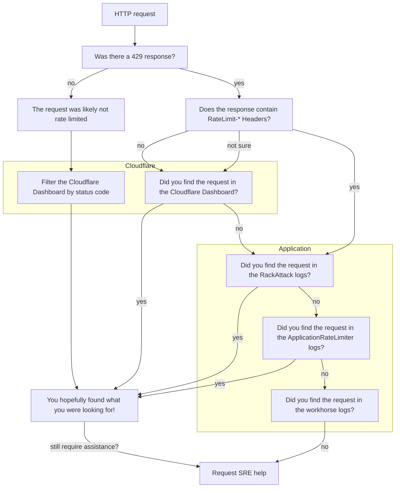

## Overview

Troubleshooting rate limiting issues can be complicated,
particularly as requests can be throttled at different layers of our stack.
This page provides GitLab team members (who have the correct permissions) steps to follow
in order to find where a customer's request has been rate limited, and why.

## Has a request been rate limited?

Rate limited requests will return a `429 - Too Many Requests` response.

Following these troubleshooting guides for other status codes may still be beneficial.

## What layer is rate limiting the request?

All traffic to GitLab.com is subject to rate limiting,
there are different [limits](/handbook/engineering/infrastructure/rate-limiting/#limits) applied at Cloudflare and within the Application.

Note: If you are troubleshooting rate limiting issues for GitLab Pages or Registry, see [other rate limits](/handbook/engineering/infrastructure/rate-limiting/#other-rate-limits) for details on how these are configured.

The following diagram should aid you in determining where to look first,
and for further detail scroll down to the related section.

### Rate Limit Response Headers

Sometimes users will see `RateLimit-*` response headers when a request has been rate limited;
this depends on the layer that has throttled the request.
For example, Cloudflare does not return a `RateLimit-*` response header.
This behaviour is better documented in the [Rate Limiting Headers](/handbook/engineering/infrastructure/rate-limiting/#headers) section of the handbook.

The presence (or absence) of these headers can be used to signal where to start your investigation,
as the `RackAttack` rate limits configured in the Application return these response headers on throttled requests.

### Cloudflare

GitLab employees with access can use SSO to login to our Cloudflare account.
To do so, enter your GitLab email and the `Log in with SSO` option will appear.

#### Quick Links

- [Cloudflare Overview: gitlab.com domain](https://dash.cloudflare.com/852e9d53d0f8adbd9205389356f2303d/gitlab.com)
- [Analytics & Logs: HTTP Traffic for gitlab.com](https://dash.cloudflare.com/852e9d53d0f8adbd9205389356f2303d/gitlab.com/analytics/traffic)
- [Security Events for gitlab.com](https://dash.cloudflare.com/852e9d53d0f8adbd9205389356f2303d/gitlab.com/security/events)

##### Select custom date ranges for your searches

Doing so serves two purposes:

1. It narrows your search to a specific time period.
1. It allows you to share a URL with a snapshot view with colleagues, whereas the `Previous 24 hours` will generate a link with a rolling window, which may not be as useful for investigations.

#### HTTP Traffic Analytics

This page on the Cloudflare dashboard will show the HTTP traffic for `gitlab.com`,
which can return sampled results.
Use this dashboard to look up paths, IPs, source user agents, data centers, and more.

##### Add filters

There are a number of filters that can be applied when looking at HTTP traffic.
A few useful filters to be aware of:

- `Source IP` - filter by the customer's IP address.
- `Edge status code` - this is the response code from Cloudflare.
- `Origin status code` - this is the response code from GitLab.

For example, seeing that the Edge status is different
to the Origin status returned from GitLab
could be an indication that a request isn't making it past Cloudflare.

You can apply as many filters as required,
then scroll down to see the results.
The default view will return the top 5 items,
but this can be increased to 15 items if required.

#### Security Events

The [Security Events](https://dash.cloudflare.com/852e9d53d0f8adbd9205389356f2303d/gitlab.com/security/events) show the volume of requests that were blocked, challenged, or skipped.
Use this dashboard to investigate if (and what) Cloudflare rule might be blocking traffic.

##### Add filters

The most useful filters you can apply when looking at Security Events are:

- `Source IP` - filter by the customer's IP address.
- `Action` - search for allowed, blocked, challenged, or other statuses.
- `Ray ID` - search for a specific identifier [[Cloudflare Ray ID docs](https://developers.cloudflare.com/fundamentals/reference/cloudflare-ray-id/)].

You can apply as many filters as required,
then scroll down to see the results.
The default view will return the top 5 items,
but this can be increased to 15 items if required.

#### SSH Traffic

The Cloudflare dashboard does not provide analytics for SSH traffic.
These logs are pushed to a google Cloud Storage (GCS) bucket
where those with access to GCP can investigate further.

See the [Cloudflare runbook](https://gitlab.com/gitlab-com/runbooks/-/blob/master/docs/cloudflare/logging.md) for details on querying the Cloudflare logs,
or follow guidance to request further assistance.

### HAProxy

HAProxy is not used to throttle requests to `gitlab.com`,
however if you're investigating rate limits related to Registry or Pages,
then you can refer to the [HAProxy Logging runbook](https://gitlab.com/gitlab-com/runbooks/-/blob/master/docs/frontend/haproxy-logging.md).

### Application

[Grafana: Rate Limiting Overview dashboard](https://dashboards.gitlab.net/d/rate-limiting-rate-limiting_overview/rate-limiting3a-rate-limiting3a-overview?orgId=1)

#### RackAttack

#### ApplicationRateLimiter

### Requesting further assistance
