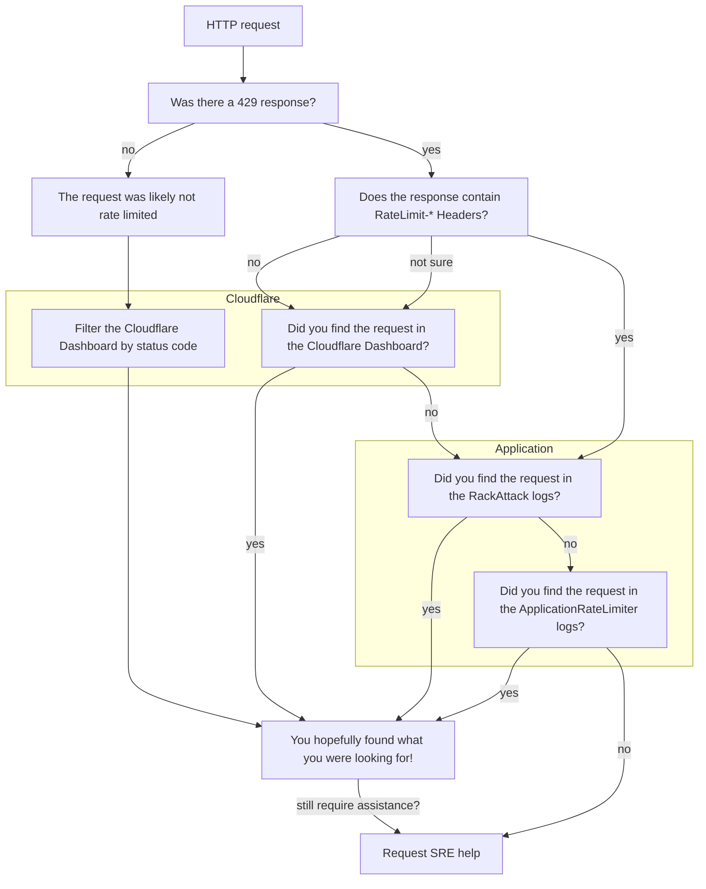

## Overview

Troubleshooting rate limiting issues can be complicated,
particularly as requests can be throttled at different layers of our stack.
This page provides GitLab team members (who have the correct permissions) steps to follow
in order to find where a customer's request has been rate limited, and why.

## Has a request been rate limited?

Rate limited requests will return a `429 - Too Many Requests` response.

## What layer is rate limiting the request?

All traffic to GitLab.com is subject to rate limiting,
there are different [limits](/handbook/engineering/infrastructure/rate-limiting/#limits) applied at Cloudflare and within the Application.

Note: If you are troubleshooting rate limiting issues for GitLab Pages or Registry, see [other rate limits](/handbook/engineering/infrastructure/rate-limiting/#other-rate-limits) for details on how these are configured.

The following diagram should aid you in determining where to look first,
and for further detail scroll down to the related section.

### Rate Limit Response Headers

Sometimes users will see `RateLimit-*` response headers when a request has been rate limited;
this depends on the layer that has throttled the request.
For example, Cloudflare does not return a `RateLimit-*` response header.
This behaviour is better documented in the [Rate Limiting Headers](/handbook/engineering/infrastructure/rate-limiting/#headers) section of the handbook.

The presence (or absence) of these headers can be used to signal where to start your investigation, as the `RackAttack` rate limits configured in the Application return these response headers on throttled requests.

### Cloudflare

### HAProxy

### Application

#### RackAttack

#### ApplicationRateLimiter

### Requesting further assistance

