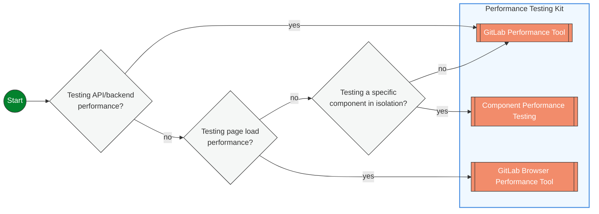

## Overview

Performance Testing is a broad discipline that includes various approaches to evaluate a system's performance characteristics. Load Testing, while often considered synonymous with Performance Testing is one of many approaches to Performance Testing. There are other approaches that do not involve load and enable Shifting Left and Right Performance Testing.



### Testing API or Backend Performance

Use GPT when you want to test how your APIs, database queries, or backend services perform under load. This includes testing response times, throughput, and system behavior under various load conditions.

**When to use:**

- Testing REST API endpoints
- Validating database query performance
- Load testing backend services
- Reference architecture validation

### Testing Components in Isolation

Use Component Performance Testing to run load tests on individual services or components that can be deployed and tested separately from the main GitLab application.

**When to use:**

- Load testing a new microservice (like Gitaly, Registry, or Workhorse)
- Testing component changes before integration
- Validating that component modifications don't introduce performance regressions
- Isolating performance issues to specific services

### Testing Page Load Performance

Use GBPT to measure how fast your pages load for users, including metrics like Time to First Byte, Largest Contentful Paint, and other Core Web Vitals.

**When to use:**

- Testing frontend performance
- Measuring page load times
- Validating user experience metrics
- Browser-based performance testing

## Future improvements

These tools have not been implemented and will complement the Performance Testing Kit and enhance our ability to detect performance problems early.

```mermaid
flowchart LR
  START((Start))
  UNIT[[Performance checks in Unit Tests]]
  PROFILE[[Profiling tools]]
  OBSERVE_TEST[[Observability based Performance Testing]]

  SPECS{Testing with\nnew unit tests?}
  BUILT{Testing during\ndevelopment?}
  OBSERVABILITY{Analyzing live\nperformance data?}

  START --> BUILT
  BUILT -- no --> OBSERVABILITY
  BUILT -- yes --> SPECS
  SPECS -- yes --> UNIT
  SPECS -- no --> PROFILE


  OBSERVABILITY -- yes --> OBSERVE_TEST


  %% Class definition
  classDef decision fill:#f5f7f6,stroke:#333,stroke-width:1px,rx:5px;
  classDef tool fill:#F28C6B,stroke:#333,stroke-width:1px,color:white,rx:5px;
  classDef start fill:#03822d,stroke:#333,stroke-width:1px,color:white,rx:10px;

  class BUILT,SPECS,OBSERVABILITY decision;
  class PROFILE,UNIT,OBSERVE_TEST tool;
  class START start;

  %% Tool tooltips with links
  click PROFILE "#profiling-tools"
  click OBSERVE_TEST "https://handbook.gitlab.com/handbook/engineering/testing/observability_performance/"
  click UNIT "#performance-unit-testing" "Add performance assertions and benchmarks directly within your unit test suite for fast feedback"

  %% Decision node tooltips
  click OBSERVABILITY "Analyzing-live-performance-data"
  click BUILT "Testing-during-development"
  click SPECS "Testing-with-new-unit-tests"
 ```

### Testing with new unit tests

Add performance assertions directly to your unit tests to catch performance regressions early in development. This provides fast feedback on code changes without requiring separate performance test suites.

**When to use:**

- Writing new unit tests and want to include performance validation
- Adding performance checks to existing test coverage
- Ensuring critical methods maintain acceptable performance thresholds
- Catching performance regressions during code review

**Example approaches:**

- Execution time assertions (method completes under X milliseconds)
- Memory allocation limits (method allocates fewer than Y objects)
- Database query count validation

### Testing during development

Use lightweight profiling tools while actively developing to understand performance characteristics of your code before it reaches production.

**When to use:**

- Optimizing algorithm performance during development
- Understanding memory usage patterns in new features
- Identifying performance bottlenecks in work-in-progress code
- Getting quick feedback on code changes without full test suites

**Example tools:**

- Code profilers for CPU and memory analysis
- Database query analyzers
- Benchmarking utilities for comparing implementations

### Analyzing live performance data

Leverage existing monitoring and observability data to identify performance issues and validate improvements using real production metrics.

**When to use:**

- Investigating performance issues reported by users
- Validating that performance improvements are effective in production
- Understanding real-world performance patterns
- Correlating code changes with production performance metrics

**Example approaches:**

- Dashboard analysis of key performance indicators
- Log-based performance trend analysis
- Correlation of deployment events with performance changes

### Performance Unit Testing

Performance unit testing allows developers to evaluate and enforce the performance characteristics of their code at the unit level. This approach provides fast feedback on performance during development, helping catch performance regressions early in the development lifecycle.

#### Using rspec-benchmark

We have [rspec-benchmark](https://github.com/piotrmurach/rspec-benchmark) included in our Gemfile. It is a gem that provides RSpec matchers for performance testing. It offers various matchers to assert on different performance aspects such as execution time, iterations per second, allocation counts, and memory usage.

<details>

<summary>Example Test Case</summary>

Here's a complete example of using rspec-benchmark to test the performance of a method:

```ruby
require 'spec_helper'

RSpec.describe UserFinder do
  describe '#find_active' do
    it 'performs query under 50ms' do
      users = create_list(:user, 100, status: :active)

      expect {
        UserFinder.new.find_active
      }.to perform_under(50).ms
    end

    it 'allocates less than 20 objects' do
      users = create_list(:user, 100, status: :active)

      expect {
        UserFinder.new.find_active
      }.to perform_allocation(count: 1..20)
    end

    it 'scales linearly with number of users' do
      expect do |n, i|
        users = create_list(:user, n, status: :active)
        UserFinder.new.find_active
      end.to perform_linear.in_range(10..100).sample(5)
    end
  end
end
```

</details>

### Profiling Tools

We already use profiling tools (i.e. rubocop) in our pipelines to ensure that we meet coding guidelines and avoid common problematic patterns. Several performance focused ones that are in our codebase:

1. [ruby-prof](https://ruby-prof.github.io/): A comprehensive profiling solution that supports both flat and graph profiles. ruby-prof can measure CPU time, memory allocation, and object creation.
2. [stackprof](https://github.com/tmm1/stackprof): A sampling call-stack profiler. It's designed to be a faster and more memory-efficient alternative to ruby-prof for certain use cases.
3. [memory_profiler](https://github.com/SamSaffron/memory_profiler): A memory profiler that provides detailed information about memory usage, including object allocation and retention. [documentation](https://gitlab.com/gitlab-org/gitlab/-/blob/master/doc/development/performance.md?ref_type=heads#using-memory-profiler) in our performance guidelines.
4. [rbspy](https://rbspy.github.io): A sampling profiler for Ruby, [documentation](https://gitlab.com/gitlab-org/gitlab/-/blob/master/doc/administration/sidekiq/sidekiq_troubleshooting.md?ref_type=heads#ruby-profiling-with-rbspy) in our sidekiq troubleshooting docs
5. [derailed_benchmarks](https://github.com/zombocom/derailed_benchmarks): A set of benchmarks that measure various aspects of Rails application performance, including memory usage and load time. [documentation](https://gitlab.com/gitlab-org/gitlab/-/blob/master/doc/development/performance.md?ref_type=heads#derailed-benchmarks) in our performance guidelines.
6. [benchmark-ips](https://github.com/evanphx/benchmark-ips): benchmarks a blocks iterations/second
7. [rspec_profiling](https://github.com/foraker/rspec_profiling): collects data on spec execution times, [documentation](https://gitlab.com/gitlab-org/gitlab/-/blob/master/doc/development/performance.md?ref_type=heads#rspec-profiling) from our performance guidelines.

Some approaches to using these tools are detailed on the [profiling page](https://gitlab.com/gitlab-org/gitlab/-/blob/master/doc/development/profiling.md?ref_type=heads)

## References

### Projects

| Project | Description |
| ---- | ----------- |
| [GPT](https://gitlab.com/gitlab-org/quality/performance) | The GitLab Performance Tool (gpt) is built and maintained by the GitLab Quality Enablement team to provide performance testing of any GitLab instance |
| [GBPT](https://gitlab.com/gitlab-org/quality/performance-sitespeed) | SiteSpeed CI pipelines for Quality Performance testing |
| [sitespeed-measurement-setup](https://gitlab.com/gitlab-org/frontend/sitespeed-measurement-setup) | Setup to measure performance on Gitlab websites (.com, dev.) through sitespeed.io and report to Grafana |
| [gitlab-exporter](https://gitlab.com/gitlab-org/ruby/gems/gitlab-exporter) | a Prometheus Web exporter that exports GitLab metrics |

### Documentation pages

| Page | Description |
| ---- | ----------- |
| [Profiling page](https://gitlab.com/gitlab-org/gitlab/-/blob/master/doc/development/profiling.md?ref_type=heads) | Documentation on approaches to do profiling on GitLab |
| [Observability for stage groups](https://docs.gitlab.com/ee/development/stage_group_observability/index.html) | Documentation on Observability focused at Stage Groups |
| [GitLab Performance Monitoring](https://docs.gitlab.com/ee/administration/monitoring/performance/index.html) | GitLab comes with its own application performance measuring system called GitLab Performance Monitoring |
| [Performance Bar](https://docs.gitlab.com/ee/administration/monitoring/performance/performance_bar.html) | Performance Bar that can be used in a running GitLab instance to see metrics |
| [Dev Performance Guidelines](https://docs.gitlab.com/ee/development/performance.html) | Developer focused Performance Guidelines |
| [Performance Guidelines](https://gitlab.com/gitlab-org/gitlab/-/blob/master/doc/development/performance.md?ref_type=heads) | Our docs page on performance guidelines |
| [Cells Performance Testing](/handbook/engineering/infrastructure-platforms/tenant-scale/cells_and_organizations/cells_test_strategy/#performance-testing) | Cells performance test strategy handbook page |
| [Metrics Catalog](https://gitlab.com/gitlab-com/runbooks/-/tree/master/metrics-catalog?ref_type=heads) | home for our SLA/SLO/SLI definitions |
| [Cells Performance Dashboard](https://dashboards.gitlab.net/d/cells-main/cells3a-cells-performance?orgId=1&from=now-6h%2Fm&to=now%2Fm&timezone=utc&var-PROMETHEUS_DS=mimir-gitlab-ops&var-environment=gprd) | First pass at creating an Observability Performance Dashboard in Grafana |
| [Platform Triage Dashboard](https://dashboards.gitlab.net/d/general-triage/general3a-platform-triage?orgId=1&from=now-6h%2Fm&to=now%2Fm&timezone=utc&var-PROMETHEUS_DS=mimir-gitlab-gprd&var-environment=gprd&var-stage=main) | the home page dashboard for our grafana, a common starting point for investigating performance in our Observability |
| [Merge Request Performance Guidelines](https://docs.gitlab.com/ee/development/merge_request_concepts/performance.html) | Merge Request Performance Guidelines |
