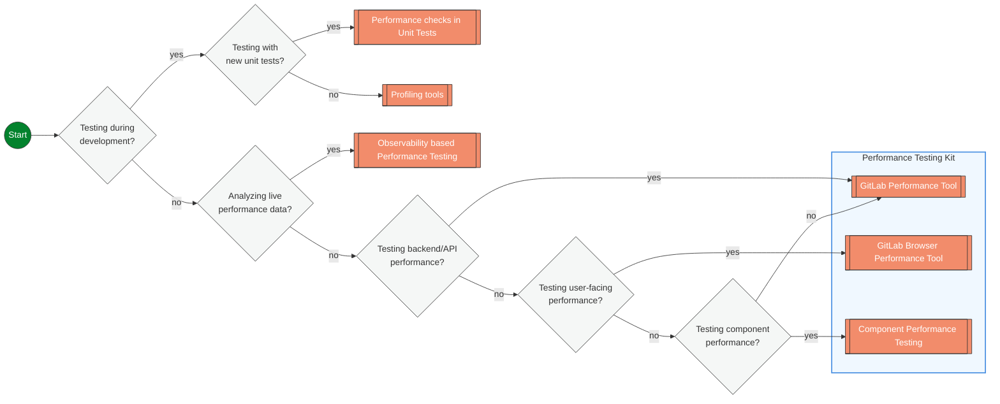

## Overview

Performance Testing is a broad discipline that includes various approaches to evaluate a system's performance characteristics. Load Testing, while often considered synonymous with Performance Testing is one of many approaches to Performance Testing. There are other approaches that do not involve load and enable Shifting Left and Right Performance Testing.



### Server-side Performance Testing

Existing performance testing includes:

* [Gitlab Performance Tool](https://gitlab.com/gitlab-org/quality/performance)
* [Reference Architecture server performance testing](../infrastructure-platforms/gitlab-delivery/framework/reference-architecture-validation-testing.md)
* [Gitlab Performance Tool Quickstart](https://gitlab.com/gitlab-org/quality/performance/-/blob/main/docs/quick_start.md)

This testing is predominately run against our Reference Architectures, but can be run against a live environment. Caution should be applied when running against shared environments as this can notably impact any results.

### Component Performance Testing

We can run load tests on specific sub components. This can be a subsystem (like Gitaly) or a specific server. This testing can be focused on validating that we have optimal loading on that subsystem.

* [Component Performance Testing](https://gitlab.com/gitlab-org/quality/component-performance-testing)

### Client-side Performance Testing

* [Browser performance testing](browser-performance-testing.md)

### Performance Unit Testing

Performance unit testing allows developers to evaluate and enforce the performance characteristics of their code at the unit level. This approach provides fast feedback on performance during development, helping catch performance regressions early in the development lifecycle.

#### Using rspec-benchmark

We have [rspec-benchmark](https://github.com/piotrmurach/rspec-benchmark) included in our Gemfile. It is a gem that provides RSpec matchers for performance testing. It offers various matchers to assert on different performance aspects such as execution time, iterations per second, allocation counts, and memory usage.

<details>

<summary>Example Test Case</summary>

Here's a complete example of using rspec-benchmark to test the performance of a method:

```ruby
require 'spec_helper'

RSpec.describe UserFinder do
  describe '#find_active' do
    it 'performs query under 50ms' do
      users = create_list(:user, 100, status: :active)

      expect {
        UserFinder.new.find_active
      }.to perform_under(50).ms
    end

    it 'allocates less than 20 objects' do
      users = create_list(:user, 100, status: :active)

      expect {
        UserFinder.new.find_active
      }.to perform_allocation(count: 1..20)
    end

    it 'scales linearly with number of users' do
      expect do |n, i|
        users = create_list(:user, n, status: :active)
        UserFinder.new.find_active
      end.to perform_linear.in_range(10..100).sample(5)
    end
  end
end
```

</details>

### Profiling Tools

We already use profiling tools (i.e. rubocop) in our pipelines to ensure that we meet coding guidelines and avoid common problematic patterns. Several performance focused ones that are in our codebase:

1. [ruby-prof](https://ruby-prof.github.io/): A comprehensive profiling solution that supports both flat and graph profiles. ruby-prof can measure CPU time, memory allocation, and object creation.
2. [stackprof](https://github.com/tmm1/stackprof): A sampling call-stack profiler. It's designed to be a faster and more memory-efficient alternative to ruby-prof for certain use cases.
3. [memory_profiler](https://github.com/SamSaffron/memory_profiler): A memory profiler that provides detailed information about memory usage, including object allocation and retention. [documentation](https://gitlab.com/gitlab-org/gitlab/-/blob/master/doc/development/performance.md?ref_type=heads#using-memory-profiler) in our performance guidelines.
4. [rbspy](https://rbspy.github.io): A sampling profiler for Ruby, [documentation](https://gitlab.com/gitlab-org/gitlab/-/blob/master/doc/administration/sidekiq/sidekiq_troubleshooting.md?ref_type=heads#ruby-profiling-with-rbspy) in our sidekiq troubleshooting docs
5. [derailed_benchmarks](https://github.com/zombocom/derailed_benchmarks): A set of benchmarks that measure various aspects of Rails application performance, including memory usage and load time. [documentation](https://gitlab.com/gitlab-org/gitlab/-/blob/master/doc/development/performance.md?ref_type=heads#derailed-benchmarks) in our performance guidelines.
6. [benchmark-ips](https://github.com/evanphx/benchmark-ips): benchmarks a blocks iterations/second
7. [rspec_profiling](https://github.com/foraker/rspec_profiling): collects data on spec execution times, [documentation](https://gitlab.com/gitlab-org/gitlab/-/blob/master/doc/development/performance.md?ref_type=heads#rspec-profiling) from our performance guidelines.

Some approaches to using these tools are detailed on the [profiling page](https://gitlab.com/gitlab-org/gitlab/-/blob/master/doc/development/profiling.md?ref_type=heads)

## References

### External References

| Page | Description |
| ---- | ----------- |
| [Slack's Koi Pond](https://slack.engineering/load-testing-with-koi-pond/) | Slack's approach to organizing their load testing effort, into pods of "koi" to test specific sections |
| [Using test automation to enhance Observability](https://www.youtube.com/watch?v=BqM-z00BqDQ) | A presentation Andy did on using test automation to improve Observibility |
| [Measure app performance in Visual Studio](https://learn.microsoft.com/en-us/visualstudio/profiling/?view=vs-2022) | Microsoft course on profiling in VSCode |
| [Shift Left Performance Testing](https://www.parasoft.com/blog/how-to-optimize-performance-testing-with-a-shift-left-approach/) | Blog about shifting left performance testing |
| [Netflix performance testing](https://netflixtechblog.com/fixing-performance-regressions-before-they-happen-eab2602b86fe) | Blog post about performance testing at Netflix |
| [Automation Pyramid Model for Performance Testing Process](https://abstracta.us/blog/test-automation/performance-testing-automation-pyramid-model-process/) | Blog post looking into the test pyramid for performance testing |
| [Continuous Performance Testing: A Comprehensive Guide](https://abstracta.us/blog/performance-testing/continuous-performance-testing-a-comprehensive-guide/) | Blog post on Continuous Performance Testing |
| [3 Challenges to Effective Performance Testing in Continuous Integration](https://abstracta.us/blog/performance-testing/3-challenges-effective-performance-testing-continuous-integration/) | Blog post on challenges on implementing performance testing in CI |
| [When is the Best Time to Start Performance Testing?](https://abstracta.us/blog/performance-testing/best-time-start-performance-testing/) | Blog post on when to do performance testing |
| [The Performance Driven Development manifesto](https://github.com/srperf/PDD) | An approach to shifting left performance testing  |
| [Catch issues before your customers do: Shift left with k6 and Grafana](https://grafana.com/events/observabilitycon/2022/catch-issues-before-your-customers-do-shift-left-with-k6-and-grafana/) | Demostration of using K6 and Grafana to shift left performance testing |

### Internal References

#### Projects

| Project | Description |
| ---- | ----------- |
| [GPT](https://gitlab.com/gitlab-org/quality/performance) | The GitLab Performance Tool (gpt) is built and maintained by the GitLab Quality Enablement team to provide performance testing of any GitLab instance |
| [GBPT](https://gitlab.com/gitlab-org/quality/performance-sitespeed) | SiteSpeed CI pipelines for Quality Performance testing |
| [sitespeed-measurement-setup](https://gitlab.com/gitlab-org/frontend/sitespeed-measurement-setup) | Setup to measure performance on Gitlab websites (.com, dev.) through sitespeed.io and report to Grafana |
| [gitlab-exporter](https://gitlab.com/gitlab-org/ruby/gems/gitlab-exporter) | a Prometheus Web exporter that exports GitLab metrics |

#### Documentation pages

| Page | Description |
| ---- | ----------- |
| [Profiling page](https://gitlab.com/gitlab-org/gitlab/-/blob/master/doc/development/profiling.md?ref_type=heads) | Documentation on approaches to do profiling on GitLab |
| [Observability for stage groups](https://docs.gitlab.com/ee/development/stage_group_observability/index.html) | Documentation on Observability focused at Stage Groups |
| [GitLab Performance Monitoring](https://docs.gitlab.com/ee/administration/monitoring/performance/index.html) | GitLab comes with its own application performance measuring system called GitLab Performance Monitoring |
| [Performance Bar](https://docs.gitlab.com/ee/administration/monitoring/performance/performance_bar.html) | Performance Bar that can be used in a running GitLab instance to see metrics |
| [Dev Performance Guidelines](https://docs.gitlab.com/ee/development/performance.html) | Developer focused Performance Guidelines |
| [Performance Guidelines](https://gitlab.com/gitlab-org/gitlab/-/blob/master/doc/development/performance.md?ref_type=heads) | Our docs page on performance guidelines |
| [Cells Performance Testing](/handbook/engineering/infrastructure-platforms/tenant-scale/cells_and_organizations/cells_test_strategy/#performance-testing) | Cells performance test strategy handbook page |
| [Metrics Catalog](https://gitlab.com/gitlab-com/runbooks/-/tree/master/metrics-catalog?ref_type=heads) | home for our SLA/SLO/SLI definitions |
| [Cells Performance Dashboard](https://dashboards.gitlab.net/d/cells-main/cells3a-cells-performance?orgId=1&from=now-6h%2Fm&to=now%2Fm&timezone=utc&var-PROMETHEUS_DS=mimir-gitlab-ops&var-environment=gprd) | First pass at creating an Observability Performance Dashboard in Grafana |
| [Platform Triage Dashboard](https://dashboards.gitlab.net/d/general-triage/general3a-platform-triage?orgId=1&from=now-6h%2Fm&to=now%2Fm&timezone=utc&var-PROMETHEUS_DS=mimir-gitlab-gprd&var-environment=gprd&var-stage=main) | the home page dashboard for our grafana, a common starting point for investigating performance in our Observability |
| [Merge Request Performance Guidelines](https://docs.gitlab.com/ee/development/merge_request_concepts/performance.html) | Merge Request Performance Guidelines |

## Future

### Shift Performance Testing Left and Right

Performance testing is not limited to the final stages of development or to load testing scenarios. It can and should be integrated throughout the entire software development lifecycle, from early stages (shift left) to production monitoring (shift right). This comprehensive approach allows teams to gain a holistic understanding of their system's performance characteristics. It can also be done on all [testing levels](https://docs.gitlab.com/ee/development/testing_guide/testing_levels.html) not waiting for a full component or system to be ready for testing.

Shifting left in performance testing involves:

1. Early-stage performance considerations:
    * Unit Testing: Utilizing performance-focused gems and frameworks during development.
    * Profiling: Analyzing code execution, memory usage, and CPU utilization from the outset.
    * Database Performance Testing: Assessing query performance and data access patterns early in development.
2. Continuous performance awareness:
    * Instrumenting Existing Tests: Capturing performance metrics from regular test runs.
    * Observability Testing: Leveraging monitoring tools to identify performance trends before they become issues.
    * Contract Testing: Defining and testing performance expectations at system boundaries.

Shifting right involves:

1. Production-level performance evaluation:
    * Load Testing: Simulating real-world usage scenarios to understand system behavior under various loads.
    * Stress Testing: Pushing the system beyond normal capacity to identify breaking points.
    * Soak Testing: Evaluating performance over extended periods of continuous load.
2. Ongoing performance monitoring:
    * Real-time Observability: Continuously monitoring production systems for performance anomalies.
    * User-centric Performance Metrics: Gathering and analyzing performance data from actual user interactions.

By combining both left-shifted and right-shifted approaches, teams can create feedback loops that:

* Identify potential performance issues earlier in the development cycle.
* Continuously validate and improve performance throughout the application lifecycle.
* Gain insights into real-world performance characteristics and user experiences.
* Create a culture of performance awareness across development, operations, and business teams.

It's important to note that performance results from one testing level may not directly translate to another. For example, a code change that improves a unit test runtime by one second will probably not result in a one-second improvement in production. However, these metrics serve as valuable indicators in a fast feedback loop, helping teams quickly identify potential performance impacts of code changes.
