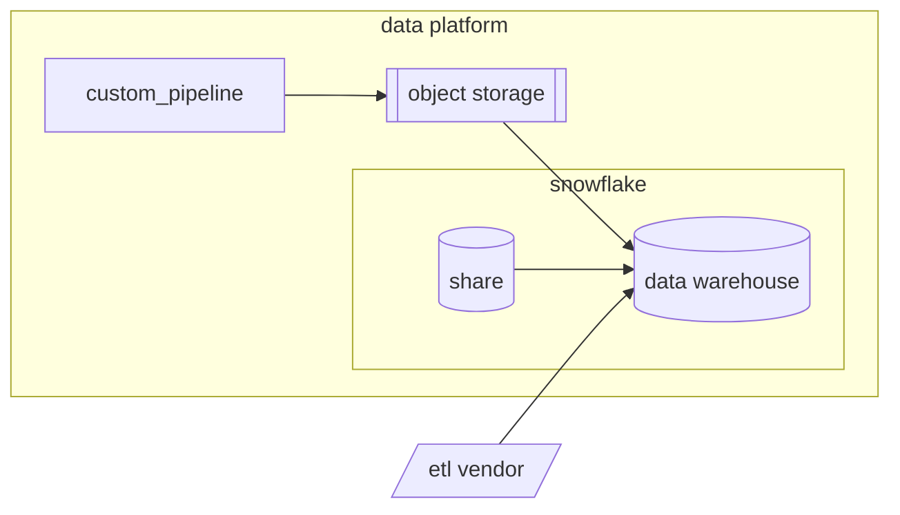

:---
title: "Data pipelines"
description: "This page describes the different data sources and the way we extract this data via data pipelines."
---

## Overview
The Data Warehouse contains data from a wide variety of sources. In order to support such dynamic and vast integrations we employ a data extraction strategy with advanced tooling and best-in-class data engineering standards.
Detailed information about specific **Data Pipelines** is available on our [Internal GitLab Handbook Pipelines page](https://internal.gitlab.com/handbook/enterprise-data/platform/pipelines).

## Data Extraction Solutions 

Ideally, all data extraction pipelines should fall into 1 of 3 categories:
1. Snowflake Share
1. ETL Vendor (Fivetran)
1. Custom Pipeline 

These solutions have varying strengths and weaknesses and there is no solution that fits all cases. In solutioning we take a variety of factors into consideration. 

| Factors        | Custom  | Snowflake share | ETL Vendor |
| -------------- | ------- |-----------------| ---------- |
| Ease           | ❔      | ✅              | ✅         |
| Flexible       | ✅      | ❌              | ❌         |
| Private        | ✅      | ✅              | ❌         |
| Secure         | ✅      | ✅              | ❔         |
| Maintainable   | ✅      | ❔              | ❌         |
| Cost Effective | ❔      | ❔              | ❔         |

Given than the main downside to Custom Pipelines is their slower time to implementation, any gains on developer efficiency and code maintainability here come with signigicant advantages. Even still, in many cases new pipelines are implemented without clarity on criticality. Enterprise applications are often changed and replaced and so even if we were able to implement the best possible custom pipeline framework, it would still make sense for us to use vendors. That is, in many cases, writing a custom pipeline just isn't worth the time or effort. 

### Criteria for Snowflake Share

### Criteria for ETL Vendor

### Criteria for Custom Pipelines