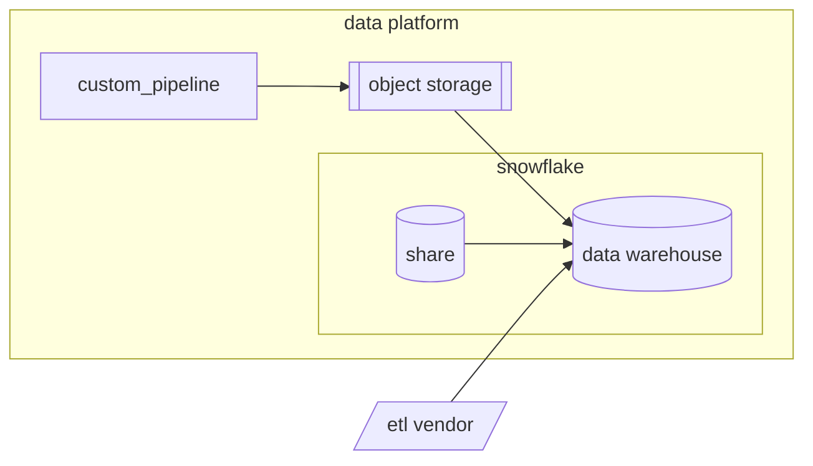

:---
title: "Data pipelines"
description: "This page describes the different data sources and the way we extract this data via data pipelines."
---

## Overview
The Data Warehouse contains data from a wide variety of sources. In order to support such dynamic and vast integrations we employ a data extraction strategy with advanced tooling and best-in-class data engineering standards.
Detailed information about specific **Data Pipelines** is available on our [Internal GitLab Handbook Pipelines page](https://internal.gitlab.com/handbook/enterprise-data/platform/pipelines).

## Data Extraction Solutions 

Ideally, all data extraction pipelines should fall into 1 of 3 categories:
1. Snowflake Share
1. ETL Vendor (Fivetran)
1. Custom Pipeline 

These solutions have varying strengths and weaknesses and there is no solution that fits all cases. In solutioning we take a variety of factors into consideration. 

| Factors        | Custom  | Snowflake share | ETL Vendor |
| -------------- | ------- |-----------------| ---------- |
| Ease           | ❔      | ✅              | ✅         |
| Flexible       | ✅      | ❌              | ❌         |
| Private        | ✅      | ✅              | ❌         |
| Secure         | ✅      | ✅              | ❔         |
| Maintainable   | ✅      | ❔              | ❌         |
| Cost Effective | ❔      | ❔              | ❔         |

Given than the main downside to Custom Pipelines is their slower time to implementation, any gains on developer efficiency and code maintainability here come with signigicant advantages. Even still, in many cases new pipelines are implemented without clarity on criticality. Enterprise applications are often changed and replaced and so even if we were able to implement the best possible custom pipeline framework, it would still make sense for us to use vendors. That is, in many cases, writing a custom pipeline just isn't worth the time or effort. 

### Criteria for Snowflake Share

The Main limitation on Snowflake Shares is their availability. If a Snowflake share is available for a data source **_and_ it meets the requirements given by our business partners** then it's likely a good solution, asumming any price is within budget.

It is essential to assess current and future requirements for the data because the easy and simplicity of using snowflake shares is paired with no flexibility. So if our requirements exceed what is available in the share then we are left without options. Further, if downstream models have already been implemented, a pipeline migration would be needed, which can be more expensive than an initial implementation.

### Criteria for ETL Vendor

ETL Vendors, like Fivetran give us more flexibility than a Snowflake share, but they come with additional cost to our contract. As noted, these can be a great option when we need to move quickly, espeically when the criticality of a new data source is unclear.

A lack of flexibility and maintainability is still an important consideration here. We've had trouble managing high complexity pipelines within vendor interfaces, and have experience pain in change management without the ability to apply approvals or tests to changes.  If the complexity of objects and/or attributes is relatively high, it might be worth considering a cutom pipeline. 

The volume of records is also a primary consideration for using Vendors at the moment as they are usually priced on usage. Contract impact is a required evaluation step for this solution. High cost may also warrant a custom pipeline.

Some data sources are just too senstive to allow for a third party to have access. Keeping the pipeline without our data platform is likely required for such cases.

### Criteria for Custom Pipelines

Custom data pipelines should be considered our best option in the sense that these pipelines offer the most opportunity for flexibility, privacy, security, and maintainability. Though, as noted, such a solution isn't always warrented. 

Said another way, when other solutions are inadequate, Custom Pipelines can solve the issue. 

#### Making Custom Pipelines 'The Best'

A signifcant weakness that can emerge from custom pipelines is that we can write inconsistencies, redundancies, and complexity into our data platform if we're not careful. 