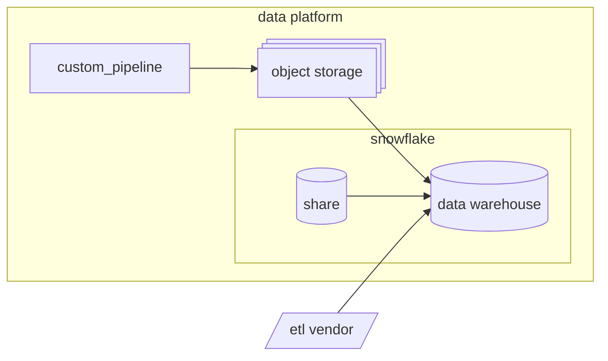

## Overview
The Data Warehouse contains data from a wide variety of sources. In order to support such dynamic and vast integrations we employ the a data extraction strategy with advanced tooling and best in class data engineering standards.
Detailed information about specific **Data Pipelines** is available on our [Internal GitLab Handbook Pipelines page](https://internal.gitlab.com/handbook/enterprise-data/platform/pipelines).

Ideally, all data extraction pipelines should fall into 1 of 3 categories:
1. Snowflake Share
1. ETL Vendor (Fivetran)
1. Custom Pipeline 

