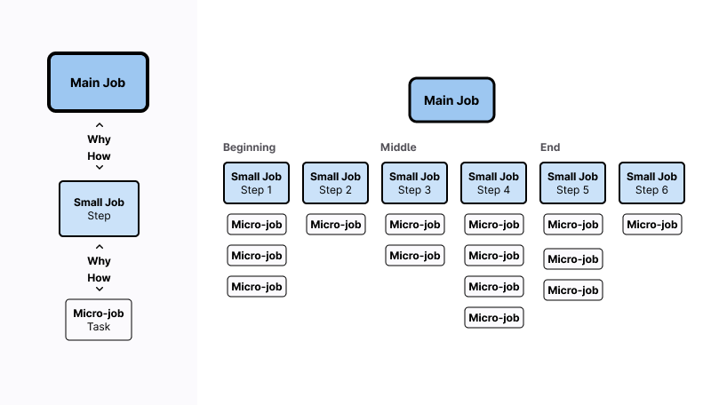

The material in this page and related pages ([Playbook](/handbook/product/ux/jobs-to-be-done/jtbd-playbook/), [Beyond the Playbook](/handbook/product/ux/jobs-to-be-done/jtbd-beyond-the-playbook/)) draws from [Jim Kalbach](https://www.jtbdtoolkit.com/) and his book, "[The Jobs to be Done Playbook](https://www.amazon.com/Jobs-Be-Done-Playbook-Organization/dp/1933820683)".

For practical JTBD research guidance, see the [playbook](/handbook/product/ux/jobs-to-be-done/jtbd-playbook).

**Note:** The previous JTBD source ([yml file](https://gitlab.com/gitlab-com/www-gitlab-com/-/blob/master/data/jobs_to_be_done.yml?_gl=1%2a1hjur0y%2a_ga%2aNDkwNzM2Mzg5LjE2MzUxODMzMTE.%2a_ga_ENFH3X7M5Y%2aMTY2ODAxOTA2Mi42Ni4xLjE2NjgwMTk2MjUuMC4wLjA.), internal only) is being replaced. Teams should track JTBD work in FigJam until a new handbook page is created.

## Anatomy of a JTBD Canvas

A Job to be Done Canvas organizes the elements of a [Job Performer's](/handbook/product/ux/jobs-to-be-done/#job-performer-who-do-you-want-to-innovate-for) [Main Job](#main-jobs) for easy iteration, sharing, and documentation. We use canvases in our [JTBD playbook](/handbook/product/ux/jobs-to-be-done/jtbd-playbook) within our [FigJam template](https://www.figma.com/file/Z4lsAOLH1ANN3pstQFYgSk/Jobs-to-be-done----Playbook-Template?type=whiteboard&node-id=0%3A1&t=7nzgsnW0igvXKwjr-1).

### **The Domain:** Where do you want to innovate?

Start by identifying the relevant area within your Stage Group to help determine who you're innovating for and what they need to accomplish.

### **Job Performer:** Who do you want to innovate for?

A Job Performer is the person executing a specific job, distinct from their job title. After identifying your domain, focus on one Job Performer aligned with the Main Job.

Key characteristics:

- Describes an individual role, not a job title
- Avoids compound descriptions (no AND/OR)
- Remains high-level, not a detailed persona
- Simple and directly connected to the target job

| Good Examples | Bad Examples |
|--------------|--------------|
| New home buyer | Millionaire real estate investor (describes circumstances, not the job) |
| Author | Steven King (too specific) |
| Code reviewer | Software Engineer (job title) |

#### [Optional] Related Job Performers: Who affects our Job Performer?

Identifying other actors who relate for your Domain can provide valuable context and aide in selecting a primary Job Performer. Once a Job Performer is selected, these related Job Performers can be documented and explored with their own canvases later if needed.

#### Job Performers vs. Personas

While [user personas](/handbook/product/personas/#user-personas) represent job titles (like "Software Developer"), Job Performers focus on specific tasks within roles. One persona may handle multiple Main Jobs (coding, reviewing, maintaining infrastructure), and different personas may share the same Job Performer role. For example, various roles might review code, but we'd use a single "Code Reviewer" Job Performer to understand that specific task.

### **Main Job:** What is the Job Performer trying to get done?

The Main Job serves as the central focus for innovation efforts. It represents a goal and has specific criteria. What is the Job Performer trying to get done in the selected Domain? Main Jobs should be timeless and as unchanging as possible. It should be expressed in functional terms, like a utilitarian goal. It’s an act that should be performed and have a clear end state… the “done” part of JTBD. It is not what your company needs to do to deliver a service. Always think in terms of the Job Performer’s perspective. The level of granularity for the Main Job can vary, depending on the innovation's purpose and feasibility.

What goes into a Main Job:

- Discrete functional, utilitarian goals independent of a solution
- Begin with a Verb so it’s action-oriented
- Should have a clear end state (done part of JTBD)
- Are singular (avoid ANDs or ORs)
- Are technology or solution agnostic
- Specific but broad enough to allow for innovative solutions
- Do NOT include adjectives (those are more Outcomes)
- Ask, "How would people have gotten this done 30 years ago?"
- Format: [verb] + [object] + [(optional) qualifiers/clarifier] (try putting an “I want to…” to get the ball rolling, then remove the “I want to”)
  - **Verb**: Action that describes what the Job Performer is trying to accomplish. Verb choice is crucial as it sets the stage for the activity or outcome the Job Performer seeks.
  - **Object**: The target of the Verb Action. Clarifies what the verb is acting upon and provides a focus for the job.
  - **Clarifier/Qualifier**: This adds specificity, context, conditions, or purpose that helps refine the job. It can be critical for distinguishing between similar jobs or highlighting unique aspects of the job that are particularly relevant to the Job Performer's situation or needs.

Good examples:

- Buy (verb) a new home (object) within 10 minutes of my work (clarifier)
- Write (verb) a book (object)
- Ensure (verb) code changes (object) meet organizational standards (clarifier)

Bad examples:

- Purchase the house at 123 Main Street for less than asking. (Too specific)
- Be a best selling author (Aspirational goal, but not a Main Job)
- Review Merge Requests efficiently (references a specific technology [merge request], uses an adjective [efficiently])

### **Related Jobs:** What else is the Job Performer trying to get done?

Consider 3-6 other goals the Job Performer has within the Domain. They should be distinct objectives and forumlated at a similar level of detail. These Related Jobs can be explored with their own canvases later if needed.

### **Aspirations:** What does the Job Performer aspire to become?

Aspirations are typically 1-3 "be" goals representing the Job Performer's desired personal growth from completing the Main Job. They sit at the top of the canvas, hierarchically above the Main Job.

Example hierarchy for home ownership:

- Job Performer: New homeowner
- Aspirations: Be happy with home life, Be part of a local community
- Main Job: Acquire a new home
- Related Jobs: Finance a new home, Move homes, Sell old home

### **Job Steps:** How does the Job Performer get the job done?

Job Steps are the sequential objectives a Job Performer must complete to accomplish their Main Job. They form a Job Map, with each step being high-level rather than individual tasks. Keep steps broad enough to apply to all performers of the job.

Key characteristics:

- Begins with an action verb in first person
- Avoids compound descriptions (no AND/OR)
- Remains solution agnostic
- Flows left to right through stages
  - Sub-steps stack vertically within each stage

| Good Examples | Bad Examples |
|--------------|--------------|
| Decide where to look for a new home | Ask Richard what neighborhoods are popular (Too specific to one scenario) |
| Determine selection criteria |  |
| Seek new homes |  |
| Transfer home ownership |  |

### **Outcomes:** How does the Job Performer measure success?

Outcomes are the subjective criteria Job Performers use to gauge success. A Main Job typically has 50-100 Outcome statements.

Key characteristics:

- Begins with a directional verb (minimize, increase, etc.)
- Includes a measurable unit (time, effort, likelihood)
- Ends with job-specific qualifiers
- Avoids compound statements (no AND/OR)
- Remains solution agnostic

| Good Examples | Bad Examples |
|--------------|--------------|
| Minimize the time it takes to identify a potential new home | Find the best home quickly (No direction, "best" isn't specific) |
| Reduce the number of compromises made when deciding on a new home | Have the most attractive house on the street (No direction, subjective measure) |
| Minimize the distance to the place of employment |  |

### **Emotional/Social Aspects:** How does the Job Performer feel and want to be perceived?

Emotional and social aspects represent the experiential side of the job, helping shape how solutions should be delivered to meet Job Performers' personal needs.

Key characteristics of Emotional aspects:

- Begins with "feel" or "avoid feeling"
- Indicates a specific emotion
- Avoids compound statements (no AND/OR)
- Remains solution agnostic

Key characteristics of Social aspects:

- Begins with "appear as" or "avoid appearing as"
- Indicates social perceptions
- Avoids compound statements (no AND/OR)
- Remains solution agnostic

| Aspect Type | Examples |
|-------------|----------|
| Emotional | Feel in control of the home acquisition process |
|           | Avoid feeling uncertain about new home selection |
| Social    | Appear as a good future neighbor |
|           | Avoid appearing unknowledgeable about the new home acquisition process |

Understanding these aspects helps design solutions that address both functional and personal needs - like adding time-saving features for programmers concerned about appearing efficient.

### **Job Differentiators:** What factors influence how the job gets done?

Job Differentiators are the factors or circumstances that influence how the job gets done. They often encompass time, manner, or place, among other characteristics. Job Differentiators are introduced with the word "if", indicate a range of options, and use "versus/vs." when applicable to show a comparison.

What goes into a Job Differentiators:

- Begins with words like _if_
- Should show a range of options with Versus/Vs
- Avoid ANDs or ORs (they need to be singular), and be technology/solution agnostic.

Good Job Differentiators examples:

- If the Job Performer is single vs. married
- If the Job Performer has young children or not
- If the potential new home is local (within driving distance) vs. far away from the current location

Additionally, you can qualify the Main Job in order to narrow its scope, such as "get energy **in the morning**" or "get energy **in the afternoon at work.**" These are often called _job differentiators_, and provide a more focused perspective on the target job.

## Main Jobs to micro jobs

When talking about Jobs to be Done, we’re often talking about different levels of jobs. It’s important to note the differences in terminology between these levels so that you and your stakeholders can communicate effectively.

### Main Jobs

A Main Job is a means to an end. It's an act that will be performed and should have a clear end state (the "done" part of JTBD). That is why we write jobs in the pattern Verb + Object + Clarifier when writing job statements.

Example: Buy a new home

### Small jobs

Small Jobs are more practical and correspond to a process or workflow. They answer the question, "How does the job get done?" in the context of the Main Job and moves the user closer to accomplishing their goal.

Example: Put in an offer on a house

### Micro-jobs

Micro-jobs are the small tasks a user may undergo to accomplish their small job and Main Job. Micro-jobs should be self-explanatory and easy to understand without much context.

Example: Decide how much you’re going to offer in relation to the asking price.

It’s important to be able to identify and correctly place jobs at the right altitude as you work through the Jobs to be Done process. It will help keep you focused on the Main Job and allow you to quickly incorporate (or discard) new information that you hear during interviews into your [job steps](#job-steps-how-does-the-job-performer-get-the-job-done).

## Job Stories

([reference article](https://jtbdtoolkit.medium.com/job-stories-revisited-13ad0b54eb3c) by JTBD Toolkit)

Job Stories should be created to synthesize and summarize your data from your Job Canvas to help bring it all together. The goal is to avoid leading designers with a preconceived solution to better align development with the company’s vision and strategy by encapsulating the customer pain point to address in a Job Story that will aid in innovative solution creation.

Job Stories emphasize the situation and context over the individual. Ultimately, Job Stories combine your top insights to one place and summarize them. Good Job Stories describe the pain points that you’re going after and help you empathize with the Job Performer.

**Paint points must:**

- Express a need, not a solution
- Be concrete, not abstract
- Be measured quantitatively, not anecdotal

The story part of Job Stories implies its connection to narrative storytelling. While this is a more creative aspect of the JTBD framework, it should still align coherently with each of the elements selected from your JTBD Canvas to build your Job Stories. This means the Job Story you build should still make logical sense when pieced together from the most important aspects of your JTBD Canvas.

For any domain, you might end up with 3 to 5 Job Stories covering the data and insights you've gathered.

### Job Story Format

1. **When I** ___________ [am at this Job Step] + [under these conditions-Job Differentiators],
2. **I want** ____________ [this New Ability, customer imperative or demand the Job Performer has on the solution],
3. **So I can** __________ [reach these Outcomes] + [and have these Emotional/Social Aspects].

#### Line 1

- Job Step: During your Job Mapping workshop, you voted on the most important Job Steps on the map. Typically, 1 or 2 of them came out of that voting session as important to focus on. You will use those to create your Job Stories.
- Job Differentiators: During your Job Differentiator workshop, you voted on the most important Job Differentiators to come out of your research and moved them to your canvas. Use the Job Differentiators to create your Job Stories.

#### Line 3

- Outcomes: While reviewing your research data, you performed quantitative research to learn how your Job Performers prioritize the outcomes you’ve found. Use these prioritized Outcomes to create your Job Stories.
- Emotional/Social Aspects: During your Emotional and Social Aspects workshop, you voted on the most important Emotional and Social Aspects to come out of your research and moved them to your canvas. Use the Job Differentiators to create your Job Stories.

#### Line 2

- This doesn’t come directly from your Job Canvas but is still derived from your knowledge of your Job Performers and their Main Jobs, which are derived from your research data.
- You’ll need to get creative by considering what you’ve learned about your Job Performer and this Main Job; consider what “superpower” an ideal solution might grant your Job Performer.
- This is a specific, aspirational, even a little ambitious statement of what the Job Performer wants to achieve from completing this Main Job. What capabilities are missing from the Job Performer's current tools?

### Qualities of a Job Story

- **Evidence-based**: Job Stories are derived from data and Job Canvases; they aren’t created off the cuff when you first hear about a new potential pain point from a customer.
- **Specific about the pain point**: Job Stories aren’t vague; they are specific in their narrative about the pain point they’re addressing.
- **Empathy-building**: The first line of a Job story should contextualize the scenario to foster empathy.
- **Aspirational**: Line 2 of a Job Story is the literal central element. It’s the customer imperative, the goal that drives the solution forward. Ambitious but achievable.
- **Self-evident**: A good Job Story should be able to stand on its own, representing and summarizing a solidly researched Job Canvas.

### How to use Job Stories

- **To generate HMW statements**: Use the Job Story as a springboard by turning them into How Might We (HMW) statements to guide explorations.
- **To define a Design Sprint challenge**: Use the Job Story to articulate the focus or challenge statement of the Design Sprint.
- **To create a testable hypothesis for an MVP**: Lean’s MVP model requires creating a hypothesis statement that will be validated against the proposed solution. Here’s a framework that can be formatted:
  - We believe that [job performers]
  - Will achieve [desired outcome]
  - While performing [job step]
  - Using [proposed solution].
  - Success will be evidenced by [specific measure].
- **Incorporate them into issues**: Add them into the description of an issue as a heuristic to measure the solution against and to aid in making design decisions.
- **Usability testing success criteria**: Validate whether the solution successfully achieves the Job Story.
