## Overview

The [gitlab-com](https://gitlab.com/groups/gitlab-com) top-level group namespace on GitLab.com is being deprecated to allow us to improve our corporate data security, improve onboarding and offboarding, and solve for the information architecture challenges that we've faced as we've evolved organically.

The primary reason for transitioning to a new namespace is that `gitlab-com` has an overwhelming amount of tech debt and operational challenges related to least privilege and nomenclature structure of groups and projects. We also have a lot of commingled collaboration with external users so we do not have as much security assurance as we'd like for internal company data. As a public company, this also allows us to update our information architecture for our [SAFE framework](/handbook/legal/safe-framework) and [Confidentiality Level](/handbook/communication/confidentiality-levels/).

The groups and projects in `gitlab-com` are being refactored into several new top-level group namespaces:

- [gitlab-inc](/handbook/security/corporate/systems/gitlab/inc) - **Internal** Company Issue Trackers and non-product code repositories, deployment pipelines, scripts, and tools
  - Projects are private by default and not public to the world unless opted in.
- [gitlab-ext](/handbook/security/corporate/systems/gitlab/ext) - **External** collaboration issue trackers with customers, partners, and vendors
- [gitlab-eng](/handbook/security/corporate/systems/gitlab/eng) - Internally facing **Engineering, Infrastructure, and Product Management** issue trackers and project used for discussion, configuration management, and operations.
  - Many projects here are public and transparent as part of our values. This allow us to keep `gitlab-inc` group projects private in a sustainable way.
- [gitlab-org](/handbook/security/corporate/systems/gitlab/org) - There are no changes for `gitlab-org` that contains our **product source code and other open source repositories**.
- [gitlab-security-oss](/handbook/security/corporate/systems/gitlab/security-oss) - This is the equivalent of `gitlab-org` for **open source Security Engineering projects that don't relate to our product**.
- [gl-demo-{premium|ultimate}-{handle|team}](/handbook/security/corporate/systems/gitlab/demo) - This is a self-contained top-level group for each team member (or functional team with shared testing use cases) for **development, test, demo, and sandbox** use cases without commingling with company data groups to simplify compliance and allow us to automate internal licensing requests.

We will be transitioning groups with epics, issue tracker projects, and code/pipeline repository projects throughout FY26 and FY27.

## Reference Data

- [Stats at a Glance](https://docs.google.com/spreadsheets/d/1SrCG9Rb705xadNz1mC3-hLcFpUFpuJYzsFnDiTgMXck/edit?gid=2036353822#gid=2036353822)
- Internal
  - [List of Internal Groups](https://docs.google.com/spreadsheets/d/1SrCG9Rb705xadNz1mC3-hLcFpUFpuJYzsFnDiTgMXck/edit?gid=1852261586#gid=1852261586)
  - [List of Internal Projects](https://docs.google.com/spreadsheets/d/1SrCG9Rb705xadNz1mC3-hLcFpUFpuJYzsFnDiTgMXck/edit?gid=2062894699#gid=2062894699)
    - [List of Internal Issue Trackers](https://docs.google.com/spreadsheets/d/1SrCG9Rb705xadNz1mC3-hLcFpUFpuJYzsFnDiTgMXck/edit?gid=1075390167#gid=1075390167)
    - [List of Internal Code Projects](https://docs.google.com/spreadsheets/d/1SrCG9Rb705xadNz1mC3-hLcFpUFpuJYzsFnDiTgMXck/edit?gid=333066271#gid=333066271)
    - [List of Internal Dormant Projects](https://docs.google.com/spreadsheets/d/1SrCG9Rb705xadNz1mC3-hLcFpUFpuJYzsFnDiTgMXck/edit?gid=1440480016#gid=1440480016)
    - [List of Internal Misc/Other Projects](https://docs.google.com/spreadsheets/d/1SrCG9Rb705xadNz1mC3-hLcFpUFpuJYzsFnDiTgMXck/edit?gid=833858202#gid=833858202)
- External
  - Customer Accounts
    - [List of Customer Account Management Groups](https://docs.google.com/spreadsheets/d/1SrCG9Rb705xadNz1mC3-hLcFpUFpuJYzsFnDiTgMXck/edit?gid=1620379317#gid=1620379317)
    - [List of Customer Account Management Projects](https://docs.google.com/spreadsheets/d/1SrCG9Rb705xadNz1mC3-hLcFpUFpuJYzsFnDiTgMXck/edit?gid=2063280664#gid=2063280664)
  - Customer Professional Services
    - [List of Professional Services Customer Groups](https://docs.google.com/spreadsheets/d/1SrCG9Rb705xadNz1mC3-hLcFpUFpuJYzsFnDiTgMXck/edit?gid=1539245149#gid=1539245149)
    - [List of Professional Services Customer Projects](https://docs.google.com/spreadsheets/d/1SrCG9Rb705xadNz1mC3-hLcFpUFpuJYzsFnDiTgMXck/edit?gid=1346939013#gid=1346939013)
  - Alliance Partners
    - [List of Alliance Partner Groups](https://docs.google.com/spreadsheets/d/1SrCG9Rb705xadNz1mC3-hLcFpUFpuJYzsFnDiTgMXck/edit?gid=1431718438#gid=1431718438)
    - [List of Alliance Partner Projects](https://docs.google.com/spreadsheets/d/1SrCG9Rb705xadNz1mC3-hLcFpUFpuJYzsFnDiTgMXck/edit?gid=577128230#gid=577128230)
  - Channel Partners
    - [List of Channel Partner Groups](https://docs.google.com/spreadsheets/d/1SrCG9Rb705xadNz1mC3-hLcFpUFpuJYzsFnDiTgMXck/edit?gid=620071655#gid=620071655)
    - [List of Channel Partner Projects](https://docs.google.com/spreadsheets/d/1SrCG9Rb705xadNz1mC3-hLcFpUFpuJYzsFnDiTgMXck/edit?gid=550853022#gid=550853022)
  - Professional Services Partners
    - [List of Service Partner Groups](https://docs.google.com/spreadsheets/d/1SrCG9Rb705xadNz1mC3-hLcFpUFpuJYzsFnDiTgMXck/edit?gid=1898245671#gid=1898245671)
    - [List of Service Partner Projects](https://docs.google.com/spreadsheets/d/1SrCG9Rb705xadNz1mC3-hLcFpUFpuJYzsFnDiTgMXck/edit?gid=1398448178#gid=1398448178)

## Architecture

```mermaid
graph LR

subgraph "Previous Generation"
    direction LR
    CONF["gitlab.com/groups/gitlab-{confidential-topic}<br>"]

    COM["gitlab.com/groups/gitlab-com"]
    COM_INT["gitlab-com/*<br>**Internal Groups and Projects**"]
    COM_INT_INFRA["gitlab-com/gl-infra/*<br>**Product Infra Mgmt**"]
    COM_INT_RUNBOOKS["gitlab-com/runbooks/*<br>**Product Infra Runbooks**"]
    COM_INT_PRODUCT["gitlab-com/product/*<br>**Product Mgmt**"]
    COM_INT_SUPPORT["gitlab-com/support/*<br>**Support**"]
    COM_INT_SEC_APP["gitlab-com/gl-security/appsec/*<br>**Application Security**"]
    COM_INT_SEC_ENG["gitlab-com/gl-security/engineering-and-research/*<br>**Security Engineering**"]
    COM_INT_SEC_RES["gitlab-com/gl-security/security-research/*<br>**Security Research**"]
    COM_INT_SEC_PRD["gitlab-com/gl-security/product-security/*<br>**Product Security**"]
    COM_CUST_ACCT["gitlab-com/account-management/*<br>**Customer Collaboration**"]
    COM_CUST_SVC["gitlab-com/customer-success/professional-services-group/...\n...professional-services-delivery/gitlab-professional-services/*<br>**Professional Services Customers**"]
    COM_SVC_PART["gitlab-com/customer-success/professional-services-group/...\n...professional-services-delivery/gitlab-partner-collaboration/*<br>**Professional Services Partners**"]
    COM_CHANNEL_PART["gitlab-com/partners/channel/*<br>**Channel Partners**"]
    COM_ALLIANCE_PART["gitlab-com/partners/alliance/*<br>**Alliance Partners**"]

    COM --> COM_INT
    COM --> COM_CUST_ACCT
    COM --> COM_CUST_SVC
    COM --> COM_SVC_PART
    COM --> COM_CHANNEL_PART
    COM --> COM_ALLIANCE_PART
    COM --> COM_INT_INFRA
    COM --> COM_INT_RUNBOOKS
    COM --> COM_INT_PRODUCT
    COM --> COM_INT_SUPPORT
    COM --> COM_INT_SEC_APP
    COM --> COM_INT_SEC_ENG
    COM --> COM_INT_SEC_RES
    COM --> COM_INT_SEC_PRD

    ORG_OLD["gitlab.com/groups/gitlab-org<br>**No Changes**"]

    ORG_PRODUCT_OLD["gitlab.com/gitlab-org/gitlab<br>GitLab Product<br>**No Changes**"]
    ORG_OTHER_OLD["gitlab.com/gitlab-org/*<br>Other Projects<br>**No Changes**"]

    ORG_OLD --> ORG_PRODUCT_OLD
    ORG_OLD --> ORG_OTHER_OLD

end

COM_INT_INFRA --> ENG_INFRA
COM_INT_RUNBOOKS --> ENG_RUNBOOKS
COM_INT_PRODUCT --> ENG_PRODUCT
COM_INT_SUPPORT --> ENG_SUPPORT
COM_INT_SEC_APP --> ENG_SECURITY
COM_INT_SEC_ENG --> ENG_SECURITY
COM_INT_SEC_RES --> ENG_SECURITY
COM_INT_SEC_PRD --> ENG_SECURITY

subgraph "New Generation"
    direction LR
    ENG["gitlab.com/groups/gitlab-eng"]
    INC["gitlab.com/groups/gitlab-inc"]
    EXT["gitlab.com/groups/gitlab-ext"]


    subgraph TOOLS["🏗️ Non-Product Code/Infra"]
    INC_DEV["gitlab-inc/dev/*"]
    INC_DEVOPS["gitlab-inc/devops/*"]
    INC_OPS["gitlab-inc/ops/*"]
    end

    subgraph ISSUE["💬 Internal Issue Trackers"]
    INC_PLAN["gitlab-inc/plan/*<br><br>{division}<br>{division}/{dept}<br>{division}/{dept}/{team}<br>{wg-purpose}<br>okr"]
    INC_CONFIDENTIAL["gitlab-inc/confidential/*"]
    end

    subgraph MEMBER["🧑‍💻 Membership Groups"]
    INC_TEAM["gitlab-inc/team/*"]
    end

    subgraph EXTERNAL["💬 External Issue Trackers"]
    EXT_CUST_ACCT["gitlab-ext/customer-accounts/*"]
    EXT_CUST_SVC["gitlab-ext/customer-services/*"]
    EXT_CHANNEL_PART["gitlab-ext/channel-partners/*"]
    EXT_ALLIANCE_PART["gitlab-ext/alliance-partners/*"]
    EXT_SVC_PART["gitlab-ext/services-partners/*"]
    EXT_STACK["gitlab-ext/tech-stack/*"]
    end

    ORG_NEW["gitlab.com/groups/gitlab-org<br>**No Changes**"]


    subgraph PRODUCT_INT["🏗️ Product Internal"]
    ENG_DEV["gitlab-eng/dev/*"]
    ENG_INFRA["gitlab-eng/infra/*"]
    ENG_PRODUCT["gitlab-eng/product/*"]
    ENG_RUNBOOKS["gitlab-eng/runbooks/*"]
    ENG_SECURITY["gitlab-eng/security/*"]
    ENG_SUPPORT["gitlab-eng/support/*"]
    end

    subgraph PRODUCT_EXT["📦 Product External"]
    ORG_PRODUCT_NEW["gitlab.com/gitlab-org/gitlab<br>GitLab Product<br>**No Changes**"]
    ORG_OTHER_NEW["gitlab.com/gitlab-org/*<br>Other Projects<br>**No Changes**"]
    end

    ENG_DEV --- ENG
    ENG_INFRA --- ENG
    ENG_PRODUCT --- ENG
    ENG_RUNBOOKS --- ENG
    ENG_SECURITY --- ENG
    ENG_SUPPORT --- ENG

    INC_CONFIDENTIAL --- INC
    INC_PLAN --- INC
    INC_DEV --- INC
    INC_DEVOPS --- INC
    INC_OPS --- INC
    INC_TEAM --- INC

    EXT_CUST_ACCT --- EXT
    EXT_CUST_SVC --- EXT
    EXT_CHANNEL_PART --- EXT
    EXT_ALLIANCE_PART --- EXT
    EXT_SVC_PART --- EXT
    EXT_STACK --- EXT


    ORG_PRODUCT_NEW --- ORG_NEW
    ORG_OTHER_NEW --- ORG_NEW
end

COM_CUST_ACCT --> EXT_CUST_ACCT
COM_CUST_SVC --> EXT_CUST_SVC
COM_SVC_PART --> EXT_SVC_PART
COM_CHANNEL_PART --> EXT_CHANNEL_PART
COM_ALLIANCE_PART --> EXT_ALLIANCE_PART

COM_INT_ISSUES{"Business Issues"}
COM_INT_CODE_COLLAB{"Collaborative<br>Code"}
COM_INT_CODE_ISOLATED{"Isolated<br>Code"}
COM_INT_CODE_PIPELINE{"Deployment,<br>Script, or Tool<br>Pipeline"}
COM_INT_TEAM{"Taggable<br>Team Groups"}

CONF ----> INC_CONFIDENTIAL

COM_INT --- COM_INT_ISSUES --> INC_PLAN
COM_INT --- COM_INT_CODE_COLLAB --> INC_DEV
COM_INT --- COM_INT_CODE_ISOLATED --> INC_DEVOPS
COM_INT --- COM_INT_CODE_PIPELINE --> INC_OPS
COM_INT --- COM_INT_TEAM --> INC_TEAM

ORG_PRODUCT_OLD -.- ORG_PRODUCT_NEW
ORG_OTHER_OLD -.- ORG_OTHER_NEW

```

