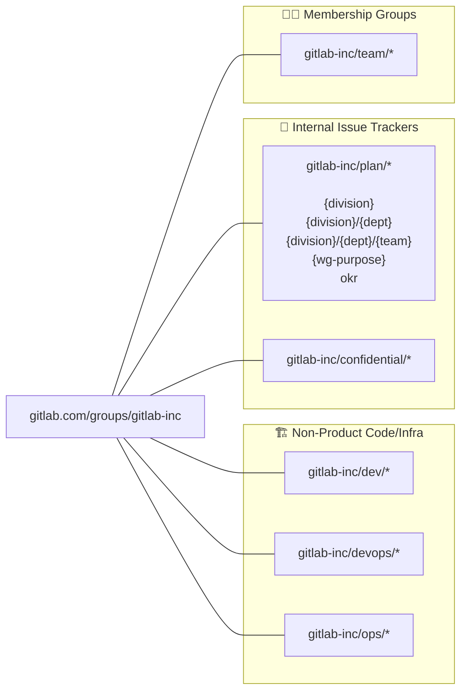

## Overview

The [gitlab-inc](https://gitlab.com/groups/gitlab-inc) top-level group namespace on GitLab.com is the next-generation replacement for the [gitlab-com](https://gitlab.com/groups/gitlab-com) top-level group namespace.

The primary reason for transitioning to a new namespace is that `gitlab-com` has an overwhelming amount of tech debt and operational challenges related to least privilege and nomenclature structure of groups and projects. We also have a lot of commingled collaboration with external users so we do not have as much security assurance as we'd like for internal company data.

We will be transitioning groups with epics, issue tracker projects, and code/pipeline repository projects throughout FY26 and FY27. See the [migration](/handbook/security/corporate/systems/gitlab/com/migration) page to learn more.

## Architecture

- **gitlab-inc**
  - 🧑‍💻 **Membership Only Groups for RBAC and Tagging**
    - [gitlab-inc/team](/handbook/security/corporate/systems/gitlab/inc/team)
      - Groups for each functional team (division, department, team, working group, cross-functional counterparts) using automated group membership managed by Access Control
  - 💬 **Issue Trackers**
    - [gitlab-inc/plan](/handbook/security/corporate/systems/gitlab/inc/plan)
      - **What**
        - Issue tracking projects for each division, department, team, working group and cross-functional teams.
        - No code repositories or pipelines are allowed in this group.
        - _This is the default location for migrating gitlab-com issue tracker projects to._
      - **Why**
        - This covers the **Internal Access** tier of [confidentiality levels](/handbook/communication/confidentiality-levels/)
        - Everyone can contribute and see what other teams are working on.
        - Any external collaboration should use projects in `gitlab-ext/*`.
        - Any transparent collaboration on product design should be in `gitlab-eng/*` or `gitlab-org/*`.
        - Any confidential discussions should be in the respective `gitlab-inc/confidential/*` project.
      - **Who**
        - **Team Members:** All team members automatically have `Planner` role inherited from `gitlab-inc/plan` managed by Access Control automated membership.
        - **Project Contributors:** All team members already have access.
        - **Merge Request Approvers:** No merge request features are enabled in issue tracker projects.
        - **Project Owners:** All configurations are managed by CorpSec Terraform (self service MRs). With few exceptions, no users have Owner or Maintainer access.
      - **Visibility**
        - **Public:** CorpSec Terraform configuration allows Project Owner to choose `Public` (to the world) or `Private` (team members only). For internal planning not related to the product that has moved to `gitlab-eng/*`, we default to `Private` and handle public visibility on an exception basis to simplify [SAFE compliance](/handbook/legal/safe-framework).
        - **Private:** All team members have access to these projects due to inherited `Planner` role.
    - [gitlab-inc/confidential](/handbook/security/corporate/systems/gitlab/inc/confidential)
      - **What**
        - Issue tracking projects for specific team members to collaborate on sensitive topics.
        - Each leadership team has one or more projects (with specific users).
        - Please have an information architecture discussion with CorpSec (likely Jeff Martin) if you are thinking about using confidential issuse trackers.
        - Users in the project have access to all issues, regardless if they are marked as confidential or not.
        - No code repositories or pipelines are allowed in this group.
        - _This is the default location for migrating gitlab-* top-level groups created for confidential issue tracker projects to._
      - **Why**
        - This covers the **Limited Access** tier of [confidentiality levels](/handbook/communication/confidentiality-levels/)
        - Many Director/VP/E-Group, People Group, Legal, and Finance team members need to collaborate in a private space for a specific need-to-know purpose.
        - This solves for the problem where team members previously had inherited access from a parent group to see confidential issues. The `gitlab-inc` and `gitlab-inc/confidential` parent groups do not have any users so there is no inherited access.
        - We historically had hundreds of top-level groups created for different use cases that became unsustainable to manage. This allows us to centrally manage the metadata with CorpSec Terraform while the contents of the projects remain confidential for the named users in the project.
      - **Who**
        - **New Projects:** Confidential projects are created using an access request with named users who should have access.
        - **Team Members:** No team members have access unless they are explicitely added to the CorpSec Terraform list of members. There is no inherited access.
        - **Project Contributors:** The CorpSec Terraform has a list of named members for the project that are provisioned by Terraform.
        - **Merge Request Approvers:** No merge request features are enabled in issue tracker projects.
        - **Project Owners:** All configurations are managed by CorpSec Terraform (self service MRs with named approvers). With few exceptions, no users have Owner or Maintainer access.
      - **Visibility**
        - **Public:** All projects are private and is set at the parent `gitlab-inc/confidential` group level. No exceptions.
        - **Private:** No team members have access unless they are explicitely added to the CorpSec Terraform list of members.
          - Team members can see a list of confidential projects that they have access to in a explore/tree view at [gitlab.com/groups/gitlab-inc/confidential](https://gitlab.com/groups/gitlab-inc/confidential). If you receive a 404 error, you do not have access to any confidential projects.
  - 🏗️ **Internal/Non-Product Infrastructure, Source Code, Scripts, and Tools**
    - [gitlab-inc/devops](/handbook/security/corporate/systems/gitlab/inc/devops)
      - **What**
        - Source code and pipelines for end-to-end DevOps lifecycle that provides read-only visibility for team members but must be added as Developer to be able to contribute.
        - This is for internal company tools (not related to the product). All product code should live in [gitlab-eng](/handbook/security/corporate/systems/gitlab/eng) (internally facing) or [gitlab-org](/handbook/security/corporate/systems/gitlab/org) (externally facing).
      - **Why**
        - This allows projects to exist in one place that users can see (transparency) and collaborate on.
        - This prevents everyone in the company from being able to click the play button on a pipeline deploy or destroy job.
      - **Who**
        - **Team Members:** All team members automatically have `Reporter` role inherited from `gitlab-inc/devops` managed by Access Control automated membership.
        - **Project Contributors:** `Developer` role at the project level managed by CorpSec Terraform. Terraform MR approved by Project Owners.
        - **Merge Request Approvers:** Project Owners have inherited access. They can create MR approval rules for specific users or `gitlab-inc/team/*`.
        - **Project (Code) Owners:** Project Codeowners have Maintainer or Owner roles and are Code Owners on CorpSec Terraform.
      - **Visibility**
        - **Public:** No projects are public (to the world) since those should exist in [gitlab-inc/dev](/handbook/security/corporate/systems/gitlab/inc/dev) or [gitlab-org/*](/handbook/security/corporate/systems/gitlab/org) or [gitlab-security-oss/*](/handbook/security/corporate/systems/gitlab/security-oss).
        - **Private:** All team members have access to these projects due to inherited `Reporter` role.
    - [gitlab-inc/dev](/handbook/security/corporate/systems/gitlab/inc/dev)
      - **What**
        - Source code that all team members can contribute.
        - Pipelines are restricted to unit tests and is not used for deployments.
        - A mirrored project exists in [gitlab-inc/ops](/handbook/security/corporate/systems/gitlab/inc/ops) for deployments and storing sensitive CI/CD variables.
      - **Why**
        - This allows everyone to contribute to the building of a product, script, or tool but restricting who can deploy it to production.
        - This prevents everyone in the company from being able to click the play button on a pipeline deploy or destroy job.
        - This prevents everyone from being able to see CI/CD variables, secrets and make configuration changes.
      - **Who**
        - **Team Members:** `Developer` role inherited from `gitlab-inc/dev` managed by Access Control automated membership.
        - **Project Contributors:** Automatic access through Team Member Access inheritance.
        - **Merge Request Approvers:** Project Owners have inherited access. They can create MR approval rules for specific users or `gitlab-inc/team/*`.
        - **Project (Code) Owners:** Project Codeowners have Maintainer or Owner roles and are Code Owners on CorpSec Terraform.
      - **Visibility**
        - **Public:** CorpSec Terraform configuration allows Project Owner to choose `Public` (to the world) or `Private` (team members only).
        - **Private:** All team members have access to these projects due to inherited `Developer` role.
    - [gitlab-inc/ops](/handbook/security/corporate/systems/gitlab/inc/ops)
      - **What**
        - Mirrored source code repositories from `gitlab-inc/dev` for deployments and storing sensitive CI/CD variables.
        - This is a safe place for script pipelines.
        - This is a safe place for Terraform infrastructure-as-code pipelines to be managed from.
        - **Need higher security?** We can deploy your project on `corpsec.gitlab-dedicated.com`.
      - **Why**
        - This is similar to `ops.gitlab.net` that is used for securely deploying customer facing infrastructure. `gitlab-inc/ops` and `corpsec.gitlab-dedicated.com` is used for internally facing applications and infrastructure with security best practices built-in.
        - This ensures that only Project Maintainers and Owners can run CI/CD pipelines to deploy source code for production.
        - This provides baseline change management isolation so only authorized users can make changes on the server for apps and tools.
        - This prevents the security risk sprawl of deployment pipelines and Terraform repositories living in insecure locations.
        - This provides a contained area or security scanning tools to monitor for risks.
      - **Who**
        - **Team Member:** No access is inherited for all team members.
          - Infrastructure and Security team members have `Reporter` roles inherited from `gitlab-inc/ops`
        - **Project Contributor:**  You or your team group must be added to the project in the CorpSec Terraform configuration.
        - **Merge Request Approvers:** Project Owners have inherited access. They can create MR approval rules for specific users or `gitlab-inc/team/*`.
        - **Project (Code) Owners:** Project Codeowners have Maintainer or Owner roles and are Code Owners on CorpSec Terraform.
      - **Visibility**
        - **Public:** No projects are public (to the world).
        - **Private:** Only project contributors have access. Team members do not have read-only visibility.
