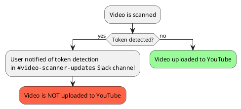
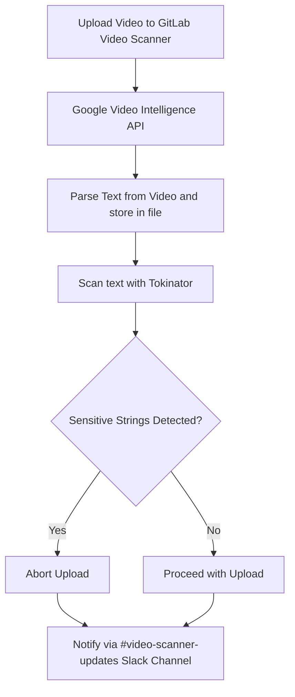

## About GitLab Video Scanner

You can access the application at https://frontend.video-scanner-live.sec.gitlab.net/

### What Is GitLab Video Scanner

GitLab Video Scanner is a GitLab internal application that scans videos for potential token leaks before they are published to the `GitLab Unfiltered` YouTube channel. Team members can access it via https://frontend.video-scanner-live.sec.gitlab.net/.

The same application is also functioning as a GitLab content scanner; the service is triggered by any file uploaded to the GitLab platform, such as text files or screenshots that we upload to public issues. We have separate alerts going to the `#security-research-alerts` Slack channel for token leaks detected in the GitLab platforms. Verified tokens will also trigger security incidents.

The complete workflow is illustrated in this [internal handbook page on Organization controls for detection of and response to leaked tokens](https://internal.gitlab.com/handbook/security/product_security/token-leaks/organizational_controls/#architecture-diagram).

### Why Should We Use It to Upload Videos

GitLab has experienced multiple security incidents involving token leaks from videos in `GitLab Unfiltered`. Going forward, We hope to prevent such incidents with the help of our Video Scanner, so the company can reduce bug bounty payouts and operational disruptions caused by token leaks.

### When to Use It

Starting from milestone 18.3, all GitLab team members are requested to upload videos to `GitLab Unfiltered` through Video Scanner.

### How to Use it

Instead of uploading a video directly to Youtube, please upload it through [the Video Scanner Uploader UI](https://frontend.video-scanner-live.sec.gitlab.net/) to kick off the scanning process.

### How the Scan is Performed

Video Scanner first parses texts from the video using [Google's Video Intelligence API](https://cloud.google.com/video-intelligence?hl=en). The parsing result is stored in a file, which then gets scanned by [Tokinator](https://gitlab.com/gitlab-com/gl-security/appsec/tokinator) to detect sensitive strings. Depending on the scan results, the application will decide whether to proceed or to abort the upload attempt and notify via the `#video-scanner-updates` Slack channel of the scan results.

 See [Pre-publication Workflow Diagram with Architectural Details](https://gitlab.com/gitlab-com/gl-security/security-research/video-scanner/youtube-video-scanner/-/issues/90#note_2457778646) for detailed architecture design.

## MVP Scope and Limitations

The Video Scanner MVP has limited product scope. See the [Pre-publication Workflow Diagram with Architectural Details](https://gitlab.com/gitlab-com/gl-security/security-research/video-scanner/youtube-video-scanner/-/issues/90#note_2457778646) for the supported workflow.

### MVP Limitations

* Users can only upload videos to `GitLab Unfiltered` YouTube channel through Video Scanner, as this channel has been identified as our highest security risk due to previous incidents. This new video upload workflow does not impact other GitLab managed channels, as those channels are more restricted with curated content.
* Uploading to playlists is not supported. However, users can move the video to a playlist after it's published on YouTube.

## Feedback

Please submit feedback in the [Video Scanner Feedback Issue](https://gitlab.com/gitlab-com/gl-security/security-research/video-scanner/youtube-video-scanner/-/issues/103).

## Project Details and Release Process

### MVP Release Plan

Beta-testing is scheduled for late milestone 18.2 to early 18.3. See [Video Scanner MVP Beta-Testing Issue](https://gitlab.com/gitlab-com/gl-security/security-research/video-scanner/youtube-video-scanner/-/issues/106) for who is involved. However, the product is already available to the entire company now, so everyone is encouraged to adopt the product as early as possible, so you can take advantage of the security protection!

### Video Scanner Project Epic

https://gitlab.com/groups/gitlab-com/gl-security/security-research/video-scanner/-/epics/1

### DRI

`#sec-product-security-engineering`

### Project links

1. GitLab repos:

* [YouTube Video Scanner](https://gitlab.com/gitlab-com/gl-security/security-research/video-scanner/youtube-video-scanner)
* [Frontend](https://gitlab.com/gitlab-com/gl-security/security-research/video-scanner/frontend)
* [Terraform Config](https://gitlab.com/gitlab-com/gl-security/security-research/security-research-terraform-config)

### Deployment

1. Infrastructure

Video Scanner is hosted in GCP, with all resources configured using terraform. See [Video Scanner infra deployment instructions](https://gitlab.com/gitlab-com/gl-security/security-research/security-research-terraform-config#deploy-1) when making changes to these cloud resource configurations.

1. `secret-matcher`

The [secret-matcher](https://gitlab.com/gitlab-com/gl-security/security-research/video-scanner/youtube-video-scanner/-/tree/main/functions/secret-matcher?ref_type=heads) function is responsbile for secret scanning and the completion of video upload + Slack notification. It's hosted in GCP as a cloud run function.

After an MR is merged to [youtube-video-scanner](https://gitlab.com/gitlab-com/gl-security/security-research/video-scanner/youtube-video-scanner)'s main branch containing changes to the `secret-matcher` source code, CI pipeline triggered by this merge will include manual jobs in the `push-to-artifact-registry` and `deploy` stages. Team members can run these jobs to proceed with the deployment when ready. See [example pipeline](https://gitlab.com/gitlab-com/gl-security/security-research/video-scanner/youtube-video-scanner/-/pipelines/1885470995).

1. `frontend-service`

The [frontend-service](https://gitlab.com/gitlab-com/gl-security/security-research/video-scanner/frontend) powers the uploader UI. New versions can be deployed following the same steps as `secret-matcher`.

## Communication Plan for Future Releases

Major version changes to Video Scanner will be announced in `#whats-happening-at-gitlab`, `#brand_video`, `#security`, `#engineering-fyi`.

## Token Rotation

YouTube OAuth2.0 tokens enable automated video uploads. For token rotation instructions, see the [security-research-terraform-config README](https://gitlab.com/gitlab-com/gl-security/security-research/security-research-terraform-config/-/blob/main/README.md?ref_type=heads#youtube-video-scanner-oauth20-client-and-audience-details).

## End-to-End Testing

[Section content WIP] See https://gitlab.com/gitlab-com/gl-security/security-research/video-scanner/youtube-video-scanner/-/issues/98.
