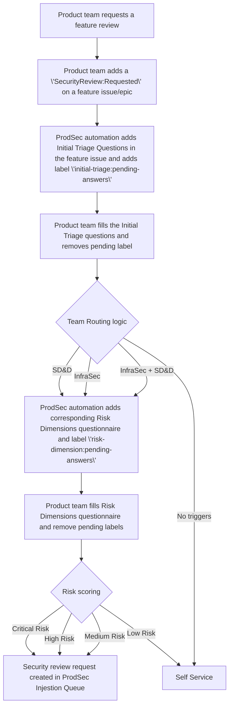

## Security Review Framework

This security review framework for GitLab establishes a systematic approach to evaluating and reviewing features based on appropriate security team engagement and risk assessment. The framework aims to balance security requirements with development velocity by directing security resources where they can have the most impact. The process begins with team routing to identify whether Secure Design and Development or Infrastructure Security should lead the review, with Security Platforms and Architecture (SPA) automatically engaged for High or Critical risk scores.

How the security review framework fits into the Security Review Process is visualized in the [Overall Process flow](#overall-process-flow) section.

### Framework purpose

1. Identity which GitLab features needs a security review.
1. Which type of security review is needed.
1. Which team needs to be engaged for the security review.

### Team Responsibilities

| Team | Focus Areas | Engagement Criteria |
| ----- | ----- | ----- |
| Secure Design and Development | Code vulnerabilities, threat modeling, developer education, authentication, authorization, input validation | Sensitive data handling, auth changes, new technologies, third-party integrations, customer-facing features |
| Infrastructure Security | Infrastructure configurations, network security, deployment, cloud security, container orchestration, infrastructure-as-code | New infrastructure, deployment changes, network modifications, cloud provider configuration, container security |
| SPA | System design, data flows, architectural patterns, trust boundaries, component interactions | Automatically engaged for High or Critical risk scores from either team |

## 1: Security Team Routing

The first step is to determine which security team(s) should be engaged for the security review of the feature. This routing happens before the detailed risk assessment to ensure teams only answer questions relevant to their domain.

### Initial Triage Questions

When a product team initiates a feature, they complete an initial triage to determine team routing:

#### Secure Design and Development Triggers

* Does this feature handle customer repositories, credentials, PII? (Y/N)
* Does this feature add or modify authentication, authorization or cryptographic mechanisms? (Y/N)
* Does this feature interact with third-party services? (Y/N)
* Does this feature add a [new service component](https://docs.gitlab.com/development/adding_service_component/){:target="_blank"} ? (Y/N)

#### Infrastructure Security Triggers

* Does this feature require new cloud infrastructure components? (Y/N)
* Does this feature modify containerization or orchestration configurations? (Y/N)
* Does this feature change network architecture or security groups? (Y/N)
* Does this feature alter infrastructure-as-code implementations? (Y/N)
* Does this feature modify production deployment processes? (Y/N)

### Team Routing Logic

Based on the responses to these triage questions, the system routes the review to the appropriate team(s):

```text
IF ANY Secure Design and Development Trigger is YES
    THEN engage Secure Design and Development Team
IF ANY Infrastructure Security Trigger is YES
    THEN engage Infrastructure Security Team
```

Multiple teams may be engaged for complex features that have triggers across multiple domains.

## 2: Team-Specific Risk Assessment Models

After identifying which team(s) need to be engaged, each engaged team conducts their domain-specific risk assessment to determine review depth.

### Secure Design and Development Risk Dimensions

| Dimension | Description | Score Range |
| ----- | ----- | ----- |
| Data Processing Impact | Level of sensitive data access or processing | 1-5 |
| Feature Exposure | How widely accessible the feature is | 1-5 |
| Architecture Impact | Degree of changes to the system architecture | 1-4 |
| Implementation Complexity | Technical complexity of the implementation | 2-3 |
| Past Security Issues | Whether this feature was involved in past security issues | 0/5 |

### Infrastructure Security Risk Dimensions

| Dimension | Description | Score Range |
| ----- | ----- | ----- |
| Infrastructure Scope | Breadth of infrastructure affected | 1-5 |
| Environment Criticality | Criticality of affected environments | 1-5 |
| Configuration Complexity | Complexity of infrastructure changes | 1-4 |
| Automation Level | Level of infrastructure automation | 1-3 |

### Detailed Scoring Criteria

#### Secure Design and Development Risk Dimensions

##### Data Processing Impact (1-4)

* 4: Direct access/modification to customer source code, database, credentials and PII
* 3: Processes untrusted data, even if it is coming from a trusted component
* 2: Access to metadata about projects/pipelines
* 1: No sensitive data access or display-only features

##### Feature Exposure (1-5)

* 5: Public-facing API or web interface accessible without authentication
* 4: Features available to all authenticated users
* 3: Features behind proper role permissions but widely used
* 2: Admin-only features or limited to specific user roles
* 1: Internal tooling not exposed to customers

##### Architecture Impact (1-4)

* 4: Changes to core authentication, authorization, or system architecture
* 3: New service (GitLab or third-party) integrations that are outside the trust boundary of the current application
* 2: Feature additions within the trust boundary of the current application.
* 1: UI changes with no backend implications

##### Implementation Complexity (2-3)

* 3: New feature implementation
* 2: Enhancements to an existing feature

##### Past Security Issues (0/5) (To be filled by AppSec. Product team won’t be asked to fill this)

* 5: The change is related to a feature that had S1 incidents in the past
* 4: The change is related to a feature that had \>1 S2
* 3: The change is related to a feature that had 1 S2
* 0: No S1/S2 history

Note: A combination of `~"group::[group-name]"`, `~"severity::1/2/3"` and `~"bug::vulnerability"` labels can be used to search in project's issue tracker to identify this.

##### Launch Tier Impact (0-3)

* 3: Tier 0
* 2: Tier 1
* 1: Tier 2
* 0: Tier 3

Note: Launch tier is different from GitLab tiers (Free/Premium/Ultimate). Launch tier indicates what kind of events/announcements will be accompanied with the feature launch. Definitions can be found in [Google Sheet](https://docs.google.com/spreadsheets/d/1Pis-VRUYTlitNjoKmDKNQMIf-4bWBo5XjPyWOYo0R54/edit?gid=838006198#gid=838006198&range=B20){:target="_blank"}

#### Infrastructure Security Risk Dimensions

##### Infrastructure Scope (1-5)

* 5: Affects core infrastructure across all environments
* 4: Affects multiple infrastructure components in production
* 3: Affects a single critical infrastructure component
* 2: Affects non-production infrastructure
* 1: Minimal infrastructure impact

##### Environment Criticality (1-5)

* 5: Production environment with customer data
* 4: Production environment without direct customer data
* 3: Pre-production/staging environment
* 2: Testing environment
* 1: Development environment only

##### Configuration Complexity (1-4)

* 4: Complex infrastructure-as-code with multiple services
* 3: Moderate infrastructure changes with some dependencies
* 2: Simple infrastructure changes
* 1: Configuration file changes only

##### Automation Level (1-3)

* 3: Manual infrastructure changes required
* 2: Partially automated infrastructure changes
* 1: Fully automated infrastructure-as-code implementation

##### Launch Tier Impact (0-3)

* 3: Tier 0
* 2: Tier 1
* 1: Tier 2
* 0: Tier 3

Note: Launch tier is different from GitLab tiers (Free/Premium/Ultimate). Launch tier indicates what kind of events/announcements will be accompanied with the feature launch. Definitions can be found in [Google Sheet](https://docs.google.com/spreadsheets/d/1Pis-VRUYTlitNjoKmDKNQMIf-4bWBo5XjPyWOYo0R54/edit?gid=838006198#gid=838006198&range=B20){:target="_blank"}

### Risk Score Calculation

Each engaged team calculates their risk score using their domain-specific dimensions:

```text
Secure Design and Development Risk Score = Data Processing Impact + Feature Exposure + Architecture Impact + Implementation Complexity + Past Security Issues + Launch Tier Impact
Infrastructure Security Risk Score = Infrastructure Scope + Environment Criticality + Configuration Complexity + Automation Level + Launch Tier Impact
```

### Risk Categorization and SPA Engagement

Each team categorizes risk based on their domain-specific score:

#### Secure Design and Development

* Critical Risk (Score ≥ 18): Full comprehensive review \+ SPA automatically engaged
* High Risk (Score 14-17): Complete review with targeted testing \+ SPA automatically engaged
* Medium Risk (Score 10-13): Focused review of specific components by primary team only
* Low Risk (Score \< 10): Self-service review

#### Infrastructure Security

* Critical Risk (Score ≥ 15): Full comprehensive review \+ SPA automatically engaged
* High Risk (Score 12-14): Complete review with targeted testing \+ SPA automatically engaged
* Medium Risk (Score 8-11): Focused review of specific components by primary team only
* Low Risk (Score \< 8): Self-service review

## 3: Review Process by Team and Risk Level

### Secure Design and Development Review Process

#### Critical Risk Review (with SPA)

* Joint architectural and security review
* Comprehensive threat modeling session
* Manual code review of critical components
* Penetration testing of feature
* Security test case creation
* Multiple security engineers involved
* Post-implementation validation
* Timeline: TBD (could span across multiple milestones since there could be gap between design and implementation of feature)

#### High Risk Review (with SPA)

* Joint architectural review
* Focused threat modeling
* Targeted code review
* Timeline: TBD (could span across multiple milestones since there could be gap between design and implementation of feature)

#### Medium Risk Review

* Security checklist completion
* Timeline: 3-5 business days

#### Low Risk Review

* Self-assessment against security guidelines
* Automated security scanning
* Timeline: 1-2 business days

### Infrastructure Security Review Process

#### Critical Risk Review (with SPA)

* Joint architectural and infrastructure review
* Comprehensive infrastructure security review
* Cloud configuration audit
* Network security analysis
* Container security review
* Infrastructure-as-code security analysis
* Multiple security engineers involved
* Post-implementation validation
* Timeline: 2-3 weeks

#### High Risk Review (with SPA)

* Joint architectural review
* Focused infrastructure review
* Key configuration validation
* Security group analysis
* Security architect and infrastructure security engineer collaboration
* Timeline: 1-2 weeks

#### Medium Risk Review

* Infrastructure security checklist completion
* Configuration validation of key components
* Timeline: 3-5 business days

#### Low Risk Review

* Self-assessment against infrastructure security guidelines
* Automated configuration checking
* Timeline: 1-2 business days

## 4\. Implementation

### Security Review Phase 1: Initial Triage

The security review process begins with a product team requesting a security review for a feature. This is done by adding a label \`SecurityReview::Requested\` to a feature issue or epic (\~"type::feature"). ProdSec automation will then add the initial triage questionnaire to this feature issue, ping the review initiator for completion, and add the label \`initial-triage:pending-answers\`. The initial triage questionnaire is a set of Yes/No questions to determine whether this feature needs a review from Secure Design and Development (SD\&D, SPA) or InfraSec. Once the phase 1 questionnaire is completed, the review initiator removes the \`initial-triage:pending-answers\` label.

### Security Review Phase 2: Determine Risk Score

The ProdSec automation will then run the Team Routing Logic to decide which teams need to perform the security review of the feature and add their corresponding Risk Dimensions questionnaire to the feature issue. Review initiator is pinged  for completing the questions and the label \`risk-dimension:pending-answers\` is added to the issue as well.

When the questionnaire is completed, the review initiator removes the \`risk-dimension:pending-answers\` label. The ProdSec automation will then calculate the Risk Score, which determines the review type and recommended timeline. A Security Review request issue is then opened by ProdSec automation in the ProdSec ingestion queue.

The Security Review request issue in the ProdSec ingestion queue will contain the following details and the ProdSec ingestion triage process can redirect the request to the team members.

1\. Initial triage questionnaire and its answers
2\. Secure Design and Development Risk Dimensions questionnaire and its answers
3\. Infrastructure Security Risk Dimensions and its answers (if applicable)
4\. Secure Design and Development risk score
5\. Infrastructure Security risk score (if applicable)
6\. Recommended Security review type
7\. Recommended Security review teams (SD\&D, SPA, InfraSec)

### Security Review Phase 3: Conduct Security Review

Based on the risk score the ProdSec conducts Critical, High or Medium level Security review.

## Overall Process flow


