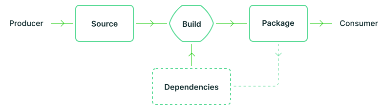

# Supply Chain Risk Management Strategy

## Introduction

This page outlines GitLab's comprehensive strategy for identifying, assessing, and mitigating risks within our software supply chain. Our risk-based approach is designed to protect both our own data and our customers' data while progressively advancing towards higher levels of Supply chain Levels for Software Artifacts (SLSA) compliance.

## Goals and Objectives

- Identify and mitigate risks to GitLab's internal data assets throughout the supply chain
- Safeguard our customers' data by ensuring the integrity and security of our software delivery pipeline
- Achieve and maintain progressively higher levels of SLSA compliance through risk-focused improvements
- Establish comprehensive visibility and traceability to detect supply chain threats and vulnerabilities
- Implement a proactive risk management framework to address emerging supply chain threats
- Create a measurable approach to reduce supply chain attack surfaces
- Support and enhance the [Product Security Risk Register (PSRR)](https://handbook.gitlab.com/handbook/security/product-security/risk-register/) with structured supply chain risk data and analysis

## Supply Chain Component Model

### Decomposing Supply Chain Complexity

GitLab's complete supply chain is too complex to represent in a single comprehensive diagram. Instead, we break down this complexity into manageable components using a recursive model:

- Each artifact has its own supply chain
- Each artifact's supply chain may depend on other artifacts, which have their own supply chains
- This creates a directed graph structure where:
  - Root nodes are the distributed artifacts (our final products)
  - Internal nodes are intermediate artifacts and components
  - Leaf nodes represent the boundaries of our supply chain (external components)

We focus our inventory and management efforts on artifacts and components within GitLab's direct control. For external components (leaf nodes), we track their origin and basic metadata but do not attempt to document their entire supply chains at this stage.

### SLSA Supply Chain Model

We align our supply chain tracking with the SLSA framework, which defines three key areas to secure:

This model illustrates the core components we track:

1. **Source**: Where code is authored, reviewed, and stored
2. **Build**: Where source is transformed into packages/artifacts
3. **Package**: Where built artifacts are stored and distributed

The model also shows:
- **Producer**: The entity responsible for creating the software
- **Consumer**: The end user of the software
- **Dependencies**: External components that feed into the build and package processes

For each artifact in our supply chain, we track its path through these three primary areas, documenting controls and provenance at each stage.

### Supply Chain Component Categories

Our model identifies specific dependency types within each core step of the supply chain. These categories serve as reference elements to be used when describing a particular supply chain. Note that not all elements will be present in every supply chain - the categorization below provides a framework for comprehensive modeling.

#### Source Core Step

The Source core step includes everything that can edit and alter the source code before the Build step:

* **Development Dependencies**
   * Language version managers (asdf/mise)
   * IDE extensions and plugins
   * Local development tools
   * Pre-commit hooks
   * Code formatters and linters used in development
   
* **GitLab Repository**
   * Project configuration
   * Branch protection rules
   * Merge request templates and settings
   * Code owners configuration
   * Repository access controls

#### Build Core Step

The Build core step includes everything that can transform the source code (compilation, linting, etc.) and produce an artifact:

* **CI/CD Infrastructure**
   * GitLab Runners
   * CI/CD Templates
   * CI/CD Components
   * Build orchestration tools
   * Testing frameworks
   
* **Container Infrastructure**
   * Base Docker images
   * Intermediate images
   * Container build tools
   * Container scanning systems
   
* **Runtime Dependencies**
   * Ruby Gems
   * NPM packages
   * Go modules
   * Python packages
   * Other language-specific dependencies
   
* **Secrets Management**
   * Vault
   * CI/CD variables
   * Key management systems
   * Certificate authorities
   * Signing infrastructure

#### Package Core Step

The Package core step usually shares many of the same dependency types as the Build step, but focuses on artifact distribution:

* **Repository Management**
   * Package registries
   * Repository managers
   * Release pipelines
   
* **Distribution Infrastructure**
   * CDNs
   * Mirror services
   * Download servers
   
* **Verification Systems**
   * Signature verification
   * Checksumming services
   * Attestation systems

### SLSA 1.0 Alignment

This framework is based on the Supply chain Levels for Software Artifacts (SLSA) specification 1.0. We deliberately adopt SLSA terminology and concepts to ensure consistency with industry standards and facilitate compliance efforts. Key SLSA elements incorporated into our model include:

- Build provenance documentation
- Source verification
- Build integrity controls
- Artifact authentication
- Access control requirements

### SBOM Integration

Software Bills of Materials (SBOMs) play a crucial role in connecting different supply chains. For each artifact we produce:

- We generate a comprehensive SBOM
- The SBOM documents all dependencies and their sources
- These SBOMs serve as the "connective tissue" between different supply chain segments
- SBOMs provide traceability from any artifact back through its entire dependency tree

Our model encompasses three primary domains across the supply chain:

### 1. Source Management

Components involved in creating, storing, and managing source code:
- Source code repositories
- Version control systems
- Code review platforms
- Dependency management systems
- Source code scanning tools

### 2. Build Infrastructure

Components that transform source code into deployable artifacts:
- Build servers and infrastructure
- Continuous Integration/Continuous Deployment (CI/CD) pipelines
- Compilation and build tools
- Testing frameworks
- Code signing mechanisms
- Build verification systems

### 3. Distribution Infrastructure

Components that deliver artifacts to end users:
- Package repositories
- Content delivery networks
- Update servers
- Release management systems
- Deployment automation tools

## Component Risk Classification

Each component in our supply chain is classified according to the following risk-focused attributes:

| Attribute | Description |
|-----------|-------------|
| Type | The functional category (Source, Build, or Distribution) |
| Risk Level | Critical, High, Medium, or Low based on impact and likelihood |
| Criticality | Impact on overall security and operations if compromised |
| Ownership | Team or individual responsible for risk management of the component |
| Data Sensitivity | Types of data handled and potential impact if breached (Public, Internal, Confidential, Regulated) |
| Threat Exposure | Level of exposure to external threats and attack vectors |
| Authentication Method | How access control risks are managed |
| Integrity Controls | Measures mitigating tampering and unauthorized modification risks |
| Audit Capability | Level of logging and monitoring implemented for risk detection |
| SLSA Relevance | How the component contributes to SLSA compliance and risk reduction |

## Integration with Product Security Risk Register

The Supply Chain Risk Management Strategy serves as a critical foundation for the [Product Security Risk Register (PSRR)](https://handbook.gitlab.com/handbook/security/product-security/risk-register/). Each supply chain-related risk identified in the PSRR must be linked to specific elements within this supply chain model:

1. **Risk Mapping Requirements**
   - Every supply chain risk in the PSRR must reference specific components from this model
   - Risks should identify which part of the supply chain graph is affected (Source, Build, or Package)
   - Risk documentation must include the specific artifacts or components involved
   - The potential for risk propagation through the supply chain should be documented

2. **Bidirectional Traceability**
   - Supply chain model entries must link back to relevant PSRR risk items
   - PSRR entries must link to the affected supply chain components
   - Updates to the supply chain model should trigger reviews of related PSRR entries
   - New PSRR risks related to supply chain must be mapped to this model during risk registration

3. **Unified Risk Assessment Approach**
   - The risk scoring methodology must be consistent between this model and the PSRR
   - Supply chain risk mitigations documented in the PSRR should align with controls in this model
   - Vulnerability management priorities should reflect the criticality classifications in this model
   - Risk acceptance decisions should consider the full context of the supply chain graph

This integration ensures a comprehensive approach to supply chain risk management that leverages our existing security frameworks while providing deeper visibility into supply chain-specific threats.

## Supply Chain Graph Visualization

To effectively manage our supply chain model as a graph:

1. **Artifact-Centric View**
   - Each distributed artifact serves as an entry point to its supply chain
   - Visualization tools represent dependencies as directed links between components
   - The graph can be traversed to understand the full lineage of any artifact

2. **Boundary Definition**
   - External dependencies are clearly marked as supply chain boundaries
   - These boundaries represent where our direct control and visibility end
   - Future expansion may include deeper visibility into critical external dependencies

3. **Risk Propagation**
   - The graph structure enables analysis of how vulnerabilities may propagate
   - Critical paths through the supply chain can be identified and hardened
   - Bottlenecks and single points of failure become visible for mitigation

## Implementation Guide

1. **Artifact Risk Identification**
   - Catalog all artifacts generated by GitLab systems with risk classifications
   - Document artifact formats, locations, purposes, and associated threats
   - Establish unique identifiers and risk profiles for each artifact type

2. **Component Risk Mapping**
   - Identify all components involved in creating each artifact
   - Map relationships, dependencies, and potential risk propagation paths
   - Document attack surfaces and threat scenarios throughout the supply chain

3. **Comprehensive Risk Assessment**
   - Evaluate the security posture and risk exposure of each component
   - Identify and categorize potential vulnerabilities, threats, and attack vectors
   - Create risk matrices and prioritize components based on risk level and criticality
   - Establish baseline risk metrics for future comparison

### Phase 2: Control Implementation

1. **Access Controls**
   - Implement least-privilege access across all components
   - Establish multi-factor authentication for critical systems
   - Regularly review and audit access permissions

2. **Integrity Verification**
   - Implement digital signatures for all artifacts
   - Establish build provenance documentation
   - Create tamper-detection mechanisms for critical components

3. **Monitoring and Alerting**
   - Deploy comprehensive logging across the supply chain
   - Establish automated alerts for suspicious activities
   - Create dashboards for supply chain health monitoring

### Phase 3: SLSA Advancement

1. **Gap Analysis**
   - Assess current state against SLSA requirements
   - Identify specific improvements needed for each SLSA level
   - Create roadmap for progressive advancement

2. **Documentation and Verification**
   - Establish processes for documenting build provenance
   - Implement verification mechanisms at each step
   - Create attestation procedures for artifact authenticity

3. **Continuous Improvement**
   - Regularly review and update the supply chain model
   - Conduct periodic security assessments
   - Incorporate industry best practices as they evolve

## How to Use This Model

### For Development Teams

1. **Component Registration**
   - When introducing a new tool or system, register it in the supply chain inventory
   - Complete the classification attributes for each component
   - Document integrations with existing components

2. **Artifact Documentation**
   - For each new artifact type, document its source components
   - Specify build procedures and verification methods
   - Register artifact in the central inventory

3. **Compliance Verification**
   - Regular self-assessments against the model requirements
   - Document evidence of control implementation
   - Participate in periodic supply chain reviews

### For Security Teams

1. **Risk Monitoring and Intelligence**
   - Implement continuous risk monitoring for registered components
   - Conduct regular threat hunting across the supply chain ecosystem
   - Maintain a supply chain threat intelligence program
   - Establish risk thresholds and escalation procedures for detected anomalies

2. **Risk-Based Audit Support**
   - Maintain risk evidence collection for compliance purposes
   - Support external audits with risk assessment documentation
   - Verify the implementation and effectiveness of risk controls across teams
   - Develop risk-focused audit narratives and documentation

3. **Risk Model Evolution**
   - Update the risk model as new threats and attack techniques emerge
   - Refine risk classification criteria based on incident data and operational feedback
   - Ensure alignment with evolving SLSA requirements and industry threat landscape
   - Conduct periodic red team exercises to test supply chain security resilience

## Risk Management Metrics and Success Criteria

Success in our supply chain risk management strategy will be measured by:

- Complete risk assessment coverage across all components and artifacts
- Quantifiable reduction in supply chain security incidents and vulnerabilities
- Decreased mean time to detect and respond to supply chain threats
- Progressive achievement of higher SLSA levels with documented risk reduction
- Successful passing of external security audits with minimal findings
- Improved visibility and quantification of supply chain risks and dependencies
- Reduced number of critical and high-risk components in the supply chain
- Increased maturity in supply chain risk assessment capabilities

## References and Resources

- [SLSA Framework Documentation v1.0](https://slsa.dev/)
- [SLSA Specifications and Requirements](https://slsa.dev/spec/v1.0/)
- [NIST Secure Software Development Framework](https://csrc.nist.gov/Projects/ssdf)
- [SPDX SBOM Format](https://spdx.dev/)
- [CycloneDX SBOM Format](https://cyclonedx.org/)
- [GitLab Security Policies](internal-link-to-security-policies)
- [Supply Chain Component Inventory Tool](internal-link-to-inventory-tool)
- [Risk Assessment Methodology](internal-link-to-risk-methodology)