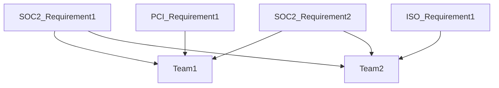
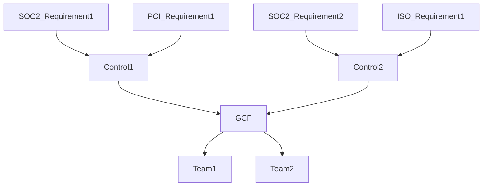

Security controls are a way to state our company's position on a variety of security topics. It's not enough to simply say "We encrypt data" since our customers and teams will naturally want to know "what data do we encrypt?" and "how do we encrypt that data?". When all of our established security controls are operating effectively this creates a security program greater than the sum of its parts. It demonstrates to our stakeholders that GitLab has a mature and comprehensive security program that will provide assurance that data within GitLab is reasonably protected.

## GitLab Control Framework (GCF)

We have tried to take a comprehensive approach to our immediate and future security compliance needs. Older and larger companies tend to treat each security compliance requirement individually which results in independent security compliance teams going out to internal teams with multiple overlapping requests. For example, at such a company you might have one database engineer that is asked to provide evidence of how a particular database is encrypted based on SOC2 requirements, then again for ISO requirements, then again for PCI requirements. This approach can be visualized as follows:

Given our [efficiency value](/handbook/values/#efficiency) here at GitLab we wanted to create a set of security controls that would address multiple underlying requirements with a single security control which would allow us to make fewer requests of our internal teams and efficiently collect all evidence we would need for a variety of audits at once. This approach can be visualized as follows:

As our security compliance goals and requirements have evolved so have our requirements and constraints related to our security control framework. Our GCF is currently based on NIST SP 800-53 and is in the process of being iterated into a custom proprietary framework that aligns to GitLab's needs and security posture. This transformation is necessary due to the fact that not all NIST 800-53 controls map directly to the requirements and standards we maintain. 

The custom framework will maintain mappings to all our compliance requirements (SOC2, ISO, PCI, etc.) while eliminating irrelevant controls and adding GitLab-specific controls where needed. This new framework is scheduled to be implemented starting in Q3 FY26, providing us with a more streamlined and relevant security control structure.

## Security Control Lifecycle

The lifecycle of our security controls can be found at [this handbook page](/handbook/security/security-assurance/security-compliance/security-control-lifecycle/). As part of the security control lifecycle, GCF security controls are monitored or tested based on risk or as required by regulation.

GCF security controls are assessed at the entity, shared process, or system level depending upon the nature of the control.

[Risk-based Control Testing](/content/handbook/security/security-assurance/security-compliance/risk-based-control-testing.md) is our methodology for determining the appropriate frequency and depth of control testing based on the criticality and risk profile of a system. This approach allows us to allocate testing resources more efficiently and expand testing beyond what's in-scope for external audits by focusing more on higher risk systems while maintaining appropriate coverage across all systems. Controls associated with systems are evaluated based upon the system's [critical system tiering](/handbook/security/security-assurance/security-risk/storm-program/critical-systems/). 

## Control Ownership

Control Owner - Ensures that the design of the control and the control activities operate effectively and is responsible for remediation of any control activities that are required to bring that control into a state of audit-readiness.

Process Owner - Supports the operation of the control and carries out the process designed by the control owner. The process owner is most likely to be interviewed by an auditor to determine whether or not the process is operating as intended.

## References

<a href="../security-compliance/" class="btn bg-primary text-white btn-lg">Return to the Security Compliance</a>
