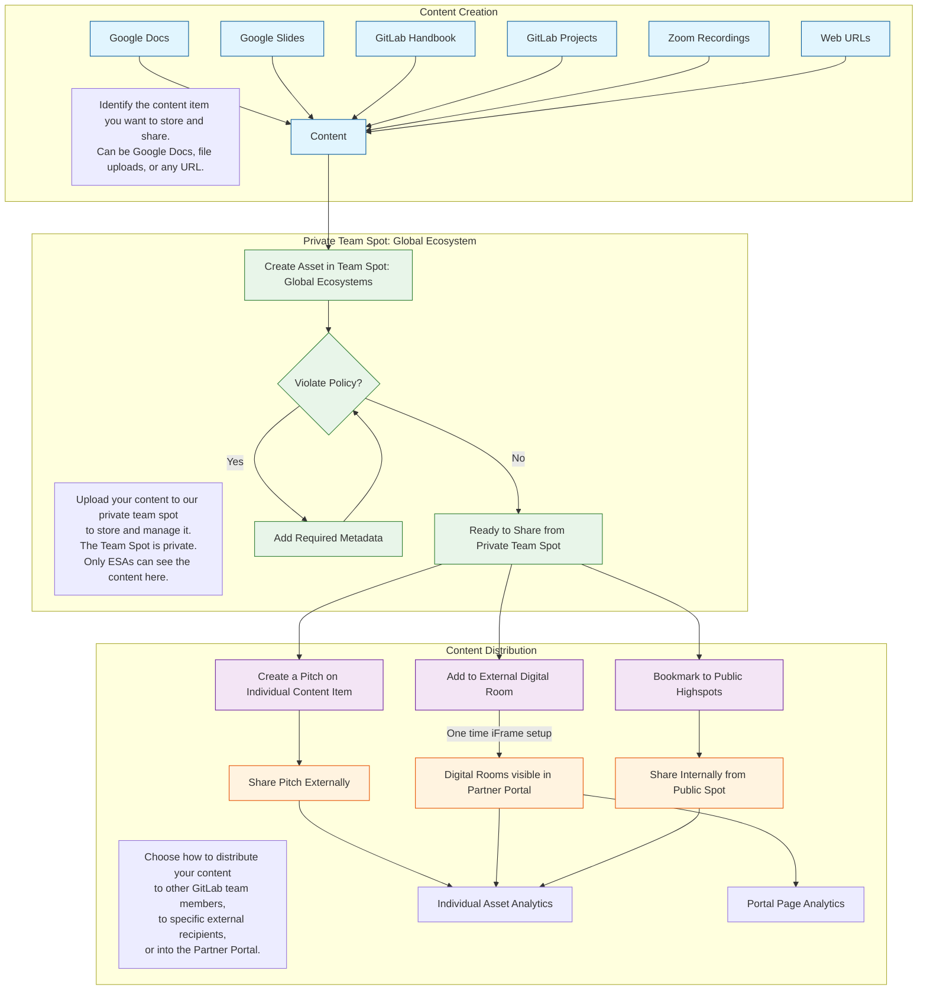

To get help from an ESA, reach out to the team in the **\#ecosystem-solutions-architects** Slack channel. You can mention any team member to start a one-on-one thread. Using this single work queue helps the team cover for each other and allows us to create tracking issues directly from the channel. Direct Messages (DMs) might be moved to this public channel.

For issues, the ESA team uses the following labels: `~Partner-SA`, `~Partner Region-AMER|APAC|EMEA`, and `Partner-Acct-`.

Most engagement for opportunities should start with the Ecosystem Sales Manager (ESM), who will identify the right ESA to involve. You can find the ESM for every account in the Salesforce (SFDC) customer account record. The ESA for a partner account is listed in the SFDC partner account record. If no ESA is listed, ask the ESM for help. More details on how to engage an Ecosystem SA are on the Ecosystem Solutions Architect Engagement Model handbook page.

The Ecosystem SA team is global. Ecosystem SAs are aligned with global and regional partners of all types, based on the team member's experience and the needs of the region.

---

## Ecosystem Solutions Architect: Role & Responsibilities

The ESA's goal is to increase partner contributions to revenue, enhance the value of services capabilities, and encourage partners to invest in GitLab. We achieve this through "**Partner Activation**," which focuses on measurable outcomes that benefit GitLab, partners, and customers.

The main activation pillars are:

* **Contribution Activation**: This involves identifying valuable use cases for GitLab, effectively pitching our value propositions, giving compelling demos, and explaining the return on investment. The goal is to turn partner relationships into qualified sales opportunities and closed deals.
* **Commitment Activation**: This focuses on helping partners create unique service offerings, develop joint Go-To-Market (GTM) materials and events, and co-create solutions. This transforms technical knowledge into tangible results that show partners' investment in GitLab.
* **Capability Activation**: This involves expanding GitLab Professional Services, helping customers adopt use cases, and serving specific industry markets. The aim is to improve partners' service capabilities so they can successfully implement solutions for customers.

We activate partners using various methods, including self-serve resources, technical selling workshops, joint account planning, partner-led demos, Champions programs, service and solution development, certifications, and hands-on labs. We track our success using metrics such as deal registrations, win rates, revenue growth, the number of technical artifacts generated, service attach registrations, customer health scores, and expansion rates.

An ESA-driven **Partner Activation Plan (PAP)** is a key part of the overall business plan managed by the Ecosystem Sales Manager (ESM). This plan outlines the technical partnership's summary, current and future capabilities, the partner's organizational structure, activation strategies, and timelines.

Overall, Ecosystem SAs aim to move partners from simply being aware of GitLab to actively participating and eventually leading high-value activities like partner-sourced revenue, deal registrations, and solution development. Success is measured by engagement outcomes, ranging from low-value activities like attending enablement sessions to high-value activities like developing third-party integrations and contributing code to GitLab.

When **working with Strategic Alliance Partners**, the Ecosystem SA acts as a key technical representative from GitLab. This includes pre-sales activities, driving partner solutions, and joint GTM initiatives. Core responsibilities involve Partner GTM activities like identifying market demand, engaging business leaders for proposal development, and collaborating with partners to develop joint solutions and enablement. ESAs are Subject Matter Experts with both soft skills and deep technical knowledge. They are involved in **Internal and External Evangelism** of partner technology, success stories, and market trends. They also contribute to GitLab's **Strategy formulation** for both business and technical considerations and assist with **Content Curation** with the Partner Enablement team.

---

## ESA Opportunity Responsibility

For **GitLab Sourced Opportunities**, which are new opportunities initiated by a direct account team where a partner might be involved, the direct account SA is technically responsible. The ESA supports the deal's progress by enabling the aligned Partner account team to collaborate technically with the GitLab SA.

For **Partner Sourced Opportunities**, where a partner initiates a new opportunity, the Ecosystem SA is responsible for enabling the partner if they need help progressing the opportunity. This even includes speaking directly with prospects to guide the partner on Discovery and Demo best practices. The Ecosystem team encourages partners to submit a Deal Registration. Ecosystem SAs participate in direct customer engagements when the Partner needs support in the sales cycle and their account team isn't ready to involve GitLab sales teams.

ESAs aim to document all customer interactions and quickly hand off partner-aligned opportunities to Field SAs as early in the sales cycle as possible to drive the opportunity with the partner and customer. The ESA will not retain primary opportunity responsibility beyond GitLab deal Stage 2 unless approved by both the Global Ecosystem SA Manager and the Regional SA Manager. This handoff process is a key point of integration with the Field SA team. ESAs can also provide backup to the Field SA community in support of partner-aligned opportunities.

---

## MBO Guidelines

The Global Ecosystem Team's mission is to develop a partner ecosystem that can **scale the number and size of GitLab opportunities**, engage with customers for quick and widespread adoption, and create GTM solutions that drive mutual revenue growth. This indirect path to GitLab revenue requires an objectives-based compensation model for the team, including ESAs.

**25% of the variable Bonus component** of ESA compensation is awarded based on completing quarterly SMART Objectives. Each Ecosystem team member receives about four quarterly SMART Objectives from their Ecosystem SA Manager. These objectives change each quarter to align with evolving business needs. Payout is a single payment after the quarter ends. The MBO payout evaluation is comprehensive, with different percentages awarded based on whether the team member does not meet (0%), meets some (75%), meets most (100%), or exceeds most (110%) expectations.

**MBO Categories for FY26** have been set. These include:

* **Partner Activation**: Develop and implement Partner Activation Plans to systematically advance partner capability maturity. This focuses on structured approaches aligned with Partner Business Plans from Ecosystem Sales Managers and directly supports revenue and growth objectives.
* **Technical Sales Readiness**: Improve partner technical sales capabilities through a structured program, aiming to generate qualified pipeline and revenue. This involves creating standardized enablement materials, tracking how enablement leads to partner-led opportunities, and helping partners succeed with Ultimate + Duo and Premium offers.
* **Partner Services Capability**: Speed up customer onboarding and adoption by integrating partner services offerings into customer account relationships. Key areas include partner attach rates, CAPs Program participation, subcontracting, better coordination with GitLab Professional Services, and enabling partners to deliver high-quality implementation services.
* **Champions Program**: Use the GitLab Champions program to drive high-value technical investment and advocacy from partner technical resources. This includes encouraging participation in certification and advocacy programs, cultivating technical champions, and building a network of GitLab experts across the partner ecosystem.

---

## Partner Activation

### Partner Activation Planning

The primary content we use to activate partner team members so they can effectively pitch and demo GitLab is the [Partner Onboarding Workflow & Enablement Resource (POWER) guide](https://content.gitlab.com/viewer/0ed393608b135917d713d8ddeedf1398).

We're developing a 30-60-90 day plan for partner onboarding in this [Onboarding Blueprint](https://www.google.com/search?q=https://content.gitlab.com/viewer/c6d3f88165b404d5093e4bba266c4e6c4). It provides a concise way to use the content from the POWER guide mentioned above.

### DRIVE the Champions Program

The GitLab Partner Champions program is detailed on [its own handbook page](https://www.google.com/search?q=/handbook/resellers/partner-champions-program/). This page includes the program's overall vision and the onboarding process for new Champions. A collaboration group and project have been set up in a [public group here](https://gitlab.com/gitlab-partners-public/gitlab-champions/champions).

To maintain the program over time, we generally aim to:

1. Distribute Champions call responsibilities.
2. Optimize the active Champions participants.
3. Implement clear expectations for Champions.
4. Validate the program's value to GitLab.
5. Enable Champions collaboration and define call session topics.

---

## ESA Processes

### Ideal ESA Weekly Activity Breakdown (3-1-1 Philosophy)

This framework suggests how an ESA should proportionally allocate their time across three key areas each week. It emphasizes balancing immediate deal support, contributions to the wider GitLab organization, and personal growth.

### 3/5 Time: Role-Based Objectives (\~3 Days)

This part of the week is dedicated to an ESA's main responsibilities. The focus is on increasing partner contributions to revenue, boosting the value of services, and encouraging partners to invest in GitLab. Key activities include directly engaging with partners and internal sales teams on opportunities, enabling partners on GitLab capabilities, and supporting joint go-to-market efforts.

#### Pipeline & Opportunity Engagement

* Engage with internal sales teams (Account Executives, Channel Account Managers, Ecosystem Sales Managers) on specific opportunities to identify how partners can help. This is especially important in Mid-Market, Small and Medium Business, Enterprise Growth, and Latin America territories, and where GitLab may not have a local Solutions Architect presence.
* Participate in joint discovery calls with partners and customers to qualify leads, understand technical requirements, and identify potential services engagements.
* Help partners present GitLab's value proposition and demonstrate the platform's features through custom demos and workshops.
* Work with partners on the technical aspects of opportunities, including solution design, competitive positioning, and creating Statements of Work (SOWs).
* Track influence on opportunities by logging activities in Rattle against specific Opportunity numbers, directly contributing to revenue. Aim for at least one Rattle entry per day on average.
* Support strategic initiatives like CodeCommit migrations, Duo with Q positioning, and modernization efforts.
* Engage with partners on strategic or "focus" accounts to strengthen the relationship and drive joint business.

#### Partner Enablement & Activation

* Deliver technical enablement sessions or webinars for partner sales and technical teams on GitLab features, solutions, and use cases.
* Work with partners to build unique service offerings and joint Go-To-Market collateral based on GitLab capabilities.
* Support partners in delivering migration services (e.g., CodeCommit to GitLab).
* Ensure partners are brought into the pre-sales process by Stage 3 of an opportunity.
* Collaborate with partners on First Order generation activities and campaigns.
* Support partner involvement in marketing events, ideally through co-delivery rather than solely presenting on their behalf. Review Solutions Architect Requests for Marketing Events for partner involvement.

#### Relationship Management & Planning

* Conduct regular check-ins or strategy sessions with key managed partners to review business plans, pipeline, and activation progress.
* Develop or contribute to Partner Activation Plans, documenting technical relationships, capabilities, and required engagement cadences.
* Collaborate with Partner Account Managers (PAMs) and Partner Territory Managers (PTMs) on account planning and Go-To-Market activities.

### 1/5 Time: Improving GitLab, Inc. (\~1 Day)

This time is dedicated to activities that benefit the broader GitLab organization and its partner ecosystem beyond immediate deal support. This includes creating scalable resources, improving processes, and sharing knowledge internally.

#### Content Creation & Knowledge Sharing

* Create or contribute to internal documentation such as Handbook pages related to partner engagement, technical processes, or solution architectures.
* Develop reusable technical content for internal teams or partners, such as demo videos, workshop blueprints, or solution briefs.
* Contribute to internal Highspot content, uploading partner collateral or documenting internal information summaries for managed partners.
* Curate and organize valuable resources (e.g., webinar registration lists, successful demo recordings, competitive intelligence) for sharing across the Solutions Architect and Ecosystem teams.
* Participate in or lead internal enablement sessions, such as "Building Pipelines" webinars, Tech Chats, or team calls, to share insights and best practices.

#### Process Improvement & Initiatives

* Contribute to the SA Initiatives GitLab project, working on Objectives and Key Results (OKRs) or initiatives aimed at improving processes, tools, or strategies for the Solutions Architect/Ecosystem teams.
* Provide structured feedback to Product, Engineering, Marketing, or Sales Operations teams based on field experiences and partner/customer input. This could involve contributing to feedback issues or participating in relevant meetings.
* Work on initiatives to improve reporting and tracking mechanisms (e.g., Rattle usage, Salesforce reporting, dashboarding).
* Contribute to the evolution of the Partner Program or specific partner plays (e.g., CodeCommit takeout play evolution).
* Participate in the Partner Champions program by recruiting new champions or engaging with the champion community.
* Assist in the Solutions Architect hiring process by conducting interviews or contributing to process iteration.
* Support cross-functional initiatives, such as the Subject Matter Expert (SME) Program, Co-Creation initiative with customers, or efforts to improve Cloud Service Provider (CSP)/Technology Partner Program (TPP) processes.
* Explore and advocate for new tools or platforms to improve collaboration or efficiency.

#### Internal Evangelism & Collaboration

* Engage with Field SAs and other internal teams to champion the value of partners and how to effectively work with them.
* Participate in internal team meetings (Ecosystem SA team calls, regional SA calls) to stay aligned and share updates.
* Contribute to internal communications channels (Slack, newsletters) to share partner successes and relevant information.

### 1/5 Time: Personal Development (\~1 Day)

This time is dedicated to enhancing the ESA's personal skills, technical knowledge, and overall effectiveness in their role and career growth.

#### Training & Certification

* Pursue relevant technical certifications (e.g., GitLab certifications like Git Associate, CI/CD Associate, Security Specialist, Project Management; Cloud certifications like AWS or Google Cloud Platform).
* Complete mandatory internal training modules and knowledge checks (e.g., GitLab 17 launch, Duo Accreditation).
* Attend internal enablement sessions, workshops, or "bootcamps" focused on technical skills, sales methodologies, or product updates (e.g., Virtual Solutions Architect training, Demo Excellence, Whiteboarding workshops, Discovery training, AI enablement).
* Utilize resources like GitLab University or Highspot for self-paced learning.

#### Skill Practice & Refinement

* Practice and refine core skills such as giving demos, whiteboarding solutions, conducting technical discovery, and pitching value propositions. This might involve recording practice sessions or participating in internal skill exchanges.
* Work on developing expertise in a specific solution area, potentially aligning with the SME program.

#### Industry & Product Learning

* Stay up-to-date with new GitLab features, product roadmaps, and the competitive landscape (especially regarding hyperscalers like AWS/GCP, GitHub, and Harness).
* Learn about relevant industry trends, customer use cases, and partner technologies.
* Read books, articles, or participate in book clubs focused on professional skills (e.g., "Doing Discovery," "The Culture Map").
* Engage with the technical community or partners on broader technical topics to deepen understanding (e.g., attending community meetups, engaging partners on specific tech stacks).

#### Career & Effectiveness

* Work on Individual Growth Plans (IGPs) and discuss career goals with managers.
* Seek mentorship or coaching from senior SAs or leaders.
* Improve personal efficiency and time management (e.g., learning new tools like Claude/Perplexity, refining workflow processes).
* Review performance feedback and identify areas for growth.

### Integrating Activities Throughout the Week

While this framework suggests blocks of time, in reality, activities within each category can be spread throughout the week. For example:

* Quick Rattle updates can happen daily as activities occur.
* Brief check-ins with internal sales teams might happen every morning.
* Reviewing internal content or contributing to a shared document might fill gaps between meetings.
* Listening to a training recording could happen during travel or downtime.

The key is to maintain the **proportion** of time spent across these categories over the course of the week. An "ideal" week is one where the ESA successfully balances immediate deal support, contributions to the team and company, and investment in their own growth, adhering to the 3-1-1 philosophy.

This structured approach ensures that while driving immediate revenue and partner success (the '3'), the ESA also contributes to the long-term health and scalability of the ecosystem program and GitLab as a whole (the '1'), and maintains their personal expertise and career progression (the final '1').

---

### The Streamlined Portal for ESA Authored Content (SPEAC)

Highspot is GitLab's content management system. Each major team at GitLab has access to two "spots." For the Global Ecosystems team, we control "Team Spot: Global Ecosystems" and "Global Ecosystems." The "Global Ecosystems" spot is internally public-facing at GitLab and is curated by Partner Enablement and other leadership. The "Team Spot Global Ecosystems" is the spot the Ecosystem SA team can use.

For a video walkthrough on how to add content to Highspot, [watch this short 7.5-minute video](https://gitlab.highspot.com/items/67f00eaa1e91c735f53e920b?lfrm=shp.0).

Highspot's strength is its ability to remix content at any time. We can also decide as a team what content to share through the Partner Portal.

So, while an initial upload of a content piece might be for GitLab Internal Only (bookmarked to the Global Ecosystem Spot page), we might later decide to share it with a wider audience by reapplying the mermaid workflow to that content piece.

We've created Digital Rooms in Highspot with the Partner Enablement team that are shared securely through the Partner Portal. These include:

* GitLab Duo
* Duo with Q
* GitLab Dedicated
* Partner Enablement
* Building Pipelines Webinar
* Champions Program
* GitLab Platform (suggested to host free to Premium to Ultimate value messaging)

---

### Activity Tracking with Rattle

Ecosystem SAs, like all Solutions Architects at GitLab, will record their partner and customer-facing activities using Rattle each week. [Here's the main landing page](https://www.google.com/search?q=/handbook/solutions-architects/processes/activity-capture/activity-logging). Scroll down to the "Ecosystem SA Activities" section for activity types and general guidance on using the tool. A [video supplement](https://gitlab.highspot.com/items/67be46c991e055ef7c36de79?lfrm=shp.0) is also available.
