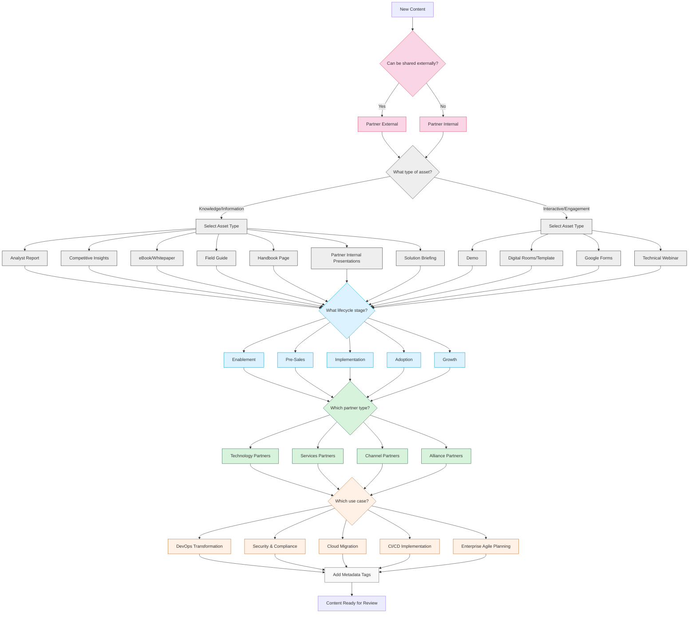

## GitLab Partners Content Categorisation & Governance

This document outlines the comprehensive content categorisation framework and governance model for GitLab Partners content management in HighSpot.

## Table of Contents

* [Content Categorisation Framework](#content-categorisation-framework)
  * [Content Privacy Classification](#content-privacy-classification)
  * [Asset Types](#asset-types)
  * [Additional Classification Dimensions](#additional-classification-dimensions)
* [Content Governance Model](#content-governance-model)
  * [Roles & Responsibilities](#1-roles--responsibilities)
  * [Compliance Requirements](#3-compliance-requirements)
  * [Categorisation Decision Guidelines](#4-categorisation-decision-guidelines)
  * [Content Quality Standards](#5-content-quality-standards)
* [Content Categorisation Decision Tree](#content-categorisation-decision-tree)
* [Example Content Categorisation](#example-content-categorisation)
---

## Content Categorisation Framework

### Content Privacy Classification

* **Ecosystems Internal:** Content restricted to GitLab team
* **Ecosystems External:** Content approved for external distribution and public sharing on the partner portal

### Asset Types

#### Standard Assets

* Analyst Report
* Competitive Insights
* Demo (includes former Product Tours)
* Digital Rooms/Template
* eBook/Whitepaper
* Field Guide
* Google Forms
* Handbook Pages
* Ecosystems Internal Presentations (formerly "Internal-facing slide/Presentations")
* Solution Briefing by Region (formerly "Success Story")
* Technical Webinar
  * Security
  * Governance and Compliance
  * Analytics
  * GitOps
  * Premium
  * Ultimate
  * Duo Enterprise/Pro
  * Duo with Amazon Q
  * Duo Workflow
  * Other product subcategories

### Additional Classification Dimensions

#### By Lifecycle Stage

* **Enablement** - Training materials, onboarding guides
* **Pre-Sales** - Discovery templates, proposal frameworks
* **Implementation** - Technical guides, integration documentation
* **Adoption** - Best practices, optimisation guides
* **Growth** - Upsell/cross-sell materials, expansion playbooks

#### By Partner Type

* Technology Partners
* Services Partners
* Channel Partners
* Alliance Partners

#### By Use Case

* DevOps Transformation
* Security & Compliance
* Cloud Migration
* CI/CD Implementation
* Enterprise Agile Planning

#### Metadata Tags

* Product Version
* Publish Date
* Target Audience
* Associated Partner Programme Tier
* Language/Locale
  * English
  * Japanese
  * Korean
* Region
  * US
  * EMEA
  * APAC

---

## Content Governance Model

### 1. Roles & Responsibilities

<table>
<tr>
<th>Role</th>
<th>Responsibilities</th>
</tr>
<tr>
<td>

**Content Owner**
</td>
<td>

• Creates/updates content

• Applies initial categorisation

• Ensures adherence to privacy policies
</td>
</tr>
<tr>
<td>

**Content Reviewer**
</td>
<td>

• Validates categorisation accuracy

• Checks metadata completeness

• Approves content for distribution
</td>
</tr>
<tr>
<td>

**Platform Administrator**
</td>
<td>

• Maintains categorisation structure

• Conducts periodic audits

• Enforces governance policies
</td>
</tr>
</table>

### 3. Compliance Requirements

* All Partner External content must be approved by legal before sharing
* Content with GitLab roadmap information must be classified as Partner Internal
* Customer-specific information requires explicit sharing permission

### 4. Categorisation Decision Guidelines

* When content fits multiple categories, prioritise by primary audience need
* Use minimum necessary categories to avoid over-classification
* When in doubt, default to more restrictive privacy settings

### 5. Content Quality Standards

* All content must have a clear target audience
* Content should include a "last updated" date
* Technical accuracy must be validated before publication
* External content should follow GitLab brand guidelines

---

## Content Categorisation Decision Tree

For full visualisation, please use a Mermaid-compatible renderer. Here's the code to generate the decision tree:

---

## Example Content Categorisation

This section provides examples of properly categorised content to serve as a reference for content creators and reviewers.

### Example 1: Technical Webinar

| Category | Selection |
|----------|-----------|
| **Content Privacy** | Partner External |
| **Asset Type** | Technical Webinar \> Ultimate |
| **Lifecycle Stage** | Implementation |
| **Partner Type** | Services Partners |
| **Use Case** | CI/CD Implementation |
| **Metadata Tags** | GitLab 16.5, June 2024, Technical Audience, Premier Tier, English |

**Description**: "GitLab Ultimate CI/CD Pipeline Optimisation Webinar"

### Example 2: Partner Playbook

| Category | Selection |
|----------|-----------|
| **Content Privacy** | Partner Internal |
| **Asset Type** | Partner Internal Presentations |
| **Lifecycle Stage** | Pre-Sales |
| **Partner Type** | Channel Partners |
| **Use Case** | DevOps Transformation |
| **Metadata Tags** | GitLab 16.3, April 2024, Sales Audience, All Tiers, English |

**Description**: "GitLab DevOps Assessment Framework and Pricing Strategy"

### Example 3: Customer Solution Briefing

| Category | Selection |
|----------|-----------|
| **Content Privacy** | Partner External |
| **Asset Type** | Solution Briefing \> EMEA |
| **Lifecycle Stage** | Growth |
| **Partner Type** | Technology Partners |
| **Use Case** | Security & Compliance |
| **Metadata Tags** | GitLab 16.4, May 2024, Executive Audience, Select Tier, French |

**Description**: "Financial Services Security Compliance with GitLab & Partner X"

### Example 4: Integration Guide

| Category | Selection |
|----------|-----------|
| **Content Privacy** | Partner External |
| **Asset Type** | Field Guide |
| **Lifecycle Stage** | Implementation |
| **Partner Type** | Technology Partners |
| **Use Case** | Cloud Migration |
| **Metadata Tags** | GitLab 16.6, July 2024, Technical Audience, Premier Tier, English |

**Description**: "GitLab & Cloud Provider X Migration Implementation Guide"

### Example 5: Training Workshop

| Category | Selection |
|----------|-----------|
| **Content Privacy** | Partner Internal |
| **Asset Type** | Digital Rooms/Template |
| **Lifecycle Stage** | Enablement |
| **Partner Type** | Services Partners |
| **Use Case** | Enterprise Agile Planning |
| **Metadata Tags** | GitLab 16.5, June 2024, Technical Audience, Select Tier, English |

**Description**: "GitLab Enterprise Agile Planning Workshop Materials"

---
