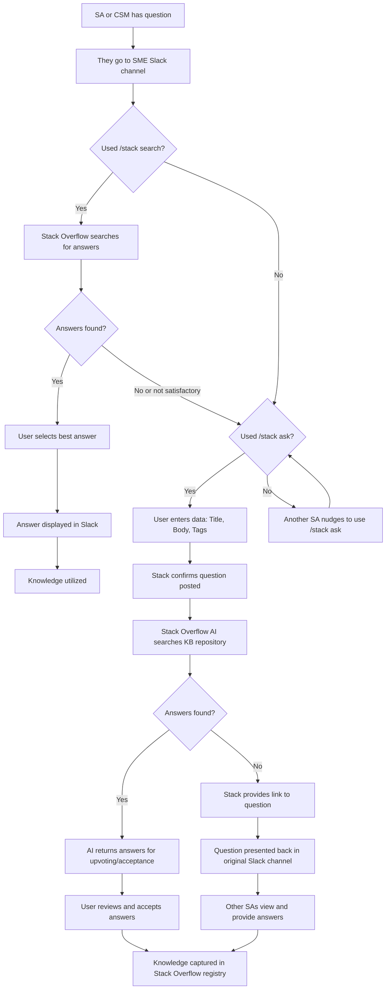

The process to ask a question, provide an answer, write Knowledge Articles/ How to Guides, improving GitLab docs from Stack Overflw content is described here. 

## Asking a Question

Please refer to Stack Overflow training on

- [Slack and Stack Overflow](https://fast.wistia.com/embed/channel/0dp7wdz6v5?wchannelid=0dp7wdz6v5&wmediaid=8enr7931re)
- [Questions and Answers](https://fast.wistia.com/embed/channel/0dp7wdz6v5?wchannelid=0dp7wdz6v5&wmediaid=9am7itotlg)
- [General User Enablement (Stack)](https://fast.wistia.com/embed/channel/0dp7wdz6v5?wchannelid=0dp7wdz6v5&wmediaid=susdknl5lj)

---

1. Anyone with a question should do so in one of the [SME (Subject Matter Expert) Slack channels](/handbook/solutions-architects/sa-practices/subject-matter-experts/sme-operations/sme-channels)
1. Use the `/stack ask` prompt to ask a question 
1. If a question was asked without the prompt `/slack ask`, another SA or CSM can nudge them to ask the question in Slack or select the content in Slack and use the Stack Overflow app to create it as a question. 
1. Stack Overflow prompts the SA or CSM to enter the required data (Title, Body, Tags) 
1. Stack confirms the question was posted 
1. Stack Overflow AI searches the Stack Overflow KB repository and returns one or more answers in Slack as a thread to the original question, for upvoting or acceptance by SA
1. Once an SA or CSM accepts and answer it is deisplayed in Slack as a thread under the original question. 
1. If there is no answer found, Stack Overflow presents a link and the original question in the Slack channel.
1. Other SAs can view the link and provide additional answers in StackOverflow 
1. Knowledge is ultimately captured in your Stack Overflow registry

---

## Giving an Answer

## Upvoting an Answer

## Writing Knowledge Articles/ How to Guides

## Creating Collections
