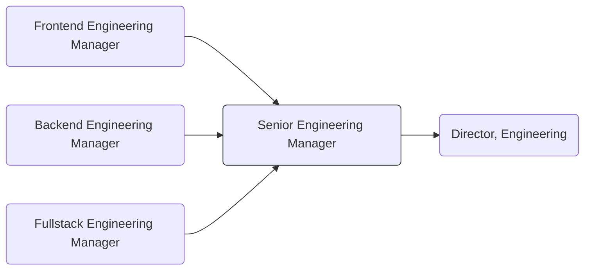

At GitLab, [Senior Engineering Manager](/job-families/engineering/development/management/senior-manager) are strategic leaders who drive exceptional
results by fostering high-performing teams, ensuring delivery of customer value, and
effectively translating company objectives into actionable execution plans.
While technically credible, they excel through empowering others, coaching for growth,
and creating environments where engineering excellence thrives.
They own product delivery commitments and continually drive productivity improvements while coordinating cross-departmental goals.

As experienced people managers, Senior Engineering Managers are expected to have greater self-sufficiency,
strategic foresight, and bias for action by proactively identifying future challenges and opportunities
for themselves. A senior manager’s impact can extend beyond their immediate teams to influence the
broader engineering organization and company direction. They are expected to lead complex
cross-departmental initiatives, effectively drive execution during critical situations, and
transform challenges into opportunities for organizational improvement.

## Responsibilities

- Build a globally-distributed, [high-performing](/handbook/people-group/learning-and-development/manager-development/high-performing-teams/) team through strategic hiring, retention, and organizational design
- Create staffing plans that ensure teams have the right skills and capacity to meet current and future demands
- Plan and execute long-term strategies that align teams with business objectives and data-driven decisions
- Drive accountability for results empowering their teams to success, while maintaining the appropriate oversight
- Establish and track meaningful productivity metrics to continually improve team performance
- Implement effective processes to track progress, remove obstacles, and course-correct when necessary
- Hold regular 1:1s with direct reports, stable counterparts and skip-levels, where applicable
- Mentor and coach their teams of [Engineering Managers](/job-families/engineering/development/management/engineering-manager/) and/or Individual Contributors by growing their leadership capabilities
- Broker consensus among diverse stakeholders even in ambiguous situations
- Foster an inclusive environment where team members thrive and deliver results for customers in alignment with [our company values](/handbook/values/)
- Provide decisive leadership during escalations, coordinating cross-functionally to deliver timely resolutions, balancing technical requirements with business priorities, and managing  transparent communication with executives and stakeholders
- Effectively evaluate engineering tradeoffs given a strong technical foundation or through their teams
- Participate in the [Incident Management on-call rotation](/handbook/engineering/infrastructure/incident-management/#incident-manager-responsibilities) to help diagnose/troubleshoot incidents by working with reliability engineers and development team members

## Requirements

- Professional experience as an engineer
- 3-5 years of management experience with demonstrated success developing direct reports in Engineering
- Ability to influence quality and strategy across an organization
- Exceptional written and verbal communication targeted to the appropriate audience
- Strong track record building and leading high-performing engineering teams
- Demonstrated successful partnership with cross-functional counterparts
- Proven ability to drive strategic vision while managing day-to-day execution
- Experience with systems at scale and understanding of technical challenges
- Experience establishing and measuring team productivity metrics
- Understanding of modern software development practices and tools

## Nice-to-haves

- Experience in a high-growth, high-performance technology organization
- Domain knowledge relevant to the product stage you're applying for
- Experience with customer escalations, incident management and response process
- Computer science education or equivalent experience
- Experience contributing to open source software
- Knowledge of GitLab's technology stack is a plus (Ruby on Rails, Golang, PostgreSQL, REST/GraphQL)

## Job Grade

The Senior Engineering Manager is a [grade 9](/handbook/total-rewards/compensation/compensation-calculator/#gitlab-job-grades).

## Performance Indicators

- [Development Hiring Actual vs. Plan](/handbook/engineering/development/performance-indicators/#development-hiring-actual-vs-plan)
- [Team/Group MR Rate](/handbook/engineering/development/performance-indicators/#development-department-member-mr-rate)
- [Development Handbook Update Frequency](/handbook/engineering/development/performance-indicators/#development-handbook-update-frequency)

## Career Ladder

### Promotion Guidance

- When justifying a Senior Engineering Manager role, provide a comprehensive analysis that includes before-and-after org charts, specific responsibilities, and the impact on existing leadership. Demonstrate how this addition will enhance team efficiency, project delivery, and organizational goals. This approach will illustrate that an SEM is a strategic investment in innovation and long-term success, not just a staffing increase.
- Promotion to Senior Engineering Manager is based on a combination of individual readiness and organizational need. While personal growth and skill development are highly valued, advancement to this role is contingent upon business requirements and capacity within the existing SEM structure. Promotions are considered when:
  1. The candidate demonstrates readiness for increased responsibilities
  2. There is a clear business need for an additional SEM
  3. Existing SEMs are at full capacity in their current roles
- Because existing SEM capacity would be a factor in new promotions, it is likely that a business need will occur outside of the promotion cycle, requiring an existing engineering manager to take the SEM role in an acting, interim, or temporary capacity in order to alleviate pressure quickly from other SEMs and Directors. For this reason, SEM promotions might occur [outside of the promotion cycle](/handbook/people-group/promotions-transfers/#twice-per-year-promotion-calibration-process--timeline).

### Career Matrix

The Senior Engineering Manager (SEM) role accommodates managers who have a broad span of control (multiple teams) and/or a broad sphere of influence (multiple initiatives). We want to ensure that both dimensions are considered when assessing readiness so that these two organizationally different roles have equitable opportunities to advance. To do this, we are [trialing this rubric](https://docs.google.com/spreadsheets/d/1Qo2pdkLuzcodFVojQgQXOhmK4VOBFbg0VOIKav-Fpyw/edit?gid=0#gid=0) as a guideline to help us visualize the differences while maintaining core competencies overall. It is aligned to the roles job family (this page) and [job framework](https://docs.google.com/spreadsheets/d/1FX4NBwF099uMBm7mGBtf1orIJZuHEjtiEa3jSbg9jJs/edit?gid=0#gid=0), and can be used by Engineering Managers, Directors, or mentors who are interested in an Engineering Manager achieving the next level or when reviewing promotion documents themselves. However, it should be used as a guideline only, and the results of this rubric are not meant to be exact at this stage.

**How to use:**

- Scores range from 1 (no examples of this behavior) to 5 (strong and frequent examples of this behavior)
- Span of control and Sphere of influence sections have required minimums
- Competencies have weighted percentages in the top right corner of each section to allow equitability in Senior Managers who have different strengths. These percentages are meant to indicate the weight each section has on the overall score and cannot be used as a career development indicator.
- While demonstrating competencies at level 3 is acceptable, exceptional candidates should consistently aim to perform at levels 4 and 5, showcasing strong and frequent application of skills
- Use this rubric loosely to allow for nuances, and as a career development discussion starter
- Consider organizational readiness to accommodate a new SEM, and seek out other opportunities within the organization that might have these capabilities

## Hiring Process

Candidates for this position can generally expect the hiring process to follow the order below. Note that as candidates indicate preference or aptitude for one or more specialties, the hiring process will be adjusted to suit. Please keep in mind that candidates can be declined from the position at any stage of the process. To learn more about someone who may be conducting the interview, find their job title on our [team page](/handbook/company/team/).

1. Selected candidates will be invited to schedule a 30 minute [screening call](/handbook/hiring/candidate-faq/#screening-call) with one of our Technical Recruiters
1. Candidates will be invited to schedule a 60 minute first interview with a VP of Development
1. Candidates will be invited to schedule a 45 minute second interview with a Director of Engineering
1. Candidates will be invited to schedule a 45 minute third interview with another member of the Engineering team
1. Candidates will be invited to schedule a 45 minute fourth interview with a member of the Product team
1. Candidates will be invited to schedule a 45 minute fifth interview with a VP of Engineering
1. Candidates may be asked to schedule a 50 minute final interview with our CEO
1. Successful candidates will subsequently be made an offer via email

Additional details about our process can be found on our [hiring page](/handbook/hiring/).
